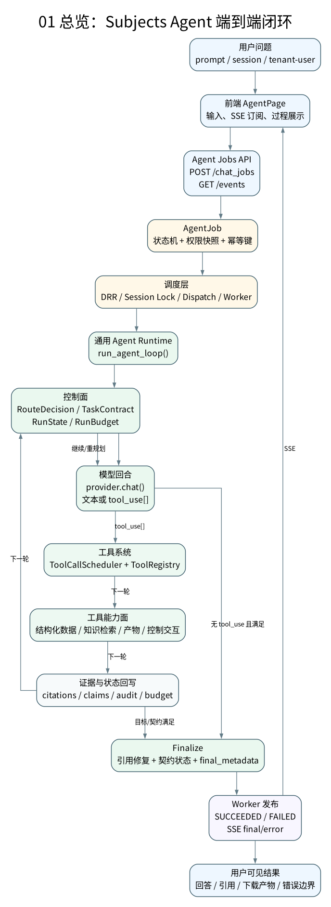
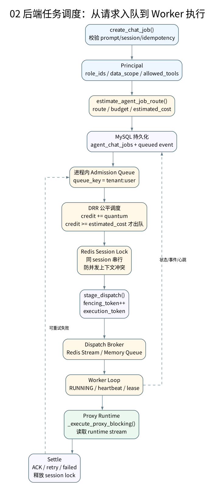
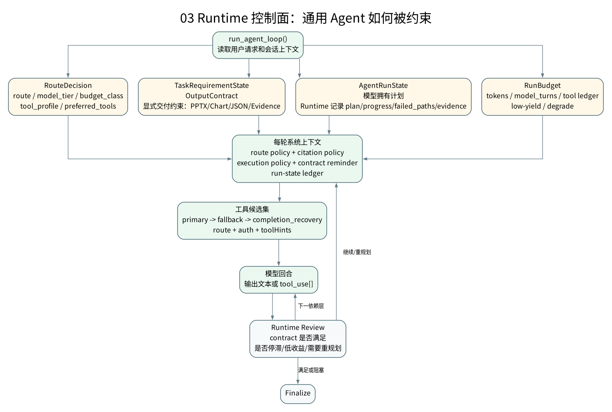
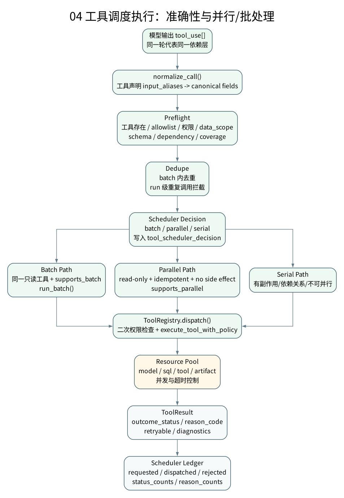
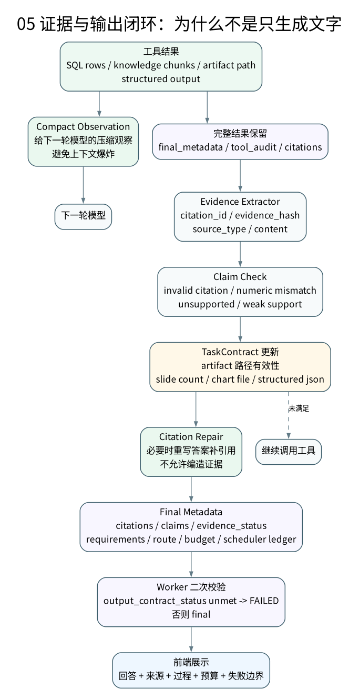
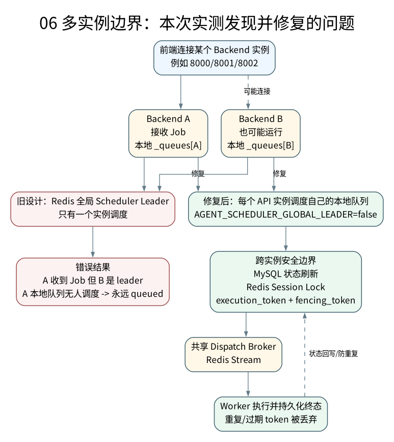

# Subjects Agent 架构图索引

这组图用于说明 Subjects Agent 的真实运行架构。核心定位不是“报告生成工具”，而是一个受控任务执行型通用 Agent Runtime：把用户问题转成可路由、可调度、可控成本、可并行执行、可证据校验、可持久化审计的任务闭环。

## 图 01：端到端闭环

说明从用户问题进入前端开始，到后端 Job、调度、Runtime、工具系统、证据回写、Finalize、SSE 返回的完整主链路。

关键点：
- `run_agent_loop()` 是通用 Agent 主循环。
- `RouteDecision / TaskContract / RunState / RunBudget` 是 Runtime 控制面。
- 工具调用结果既回到模型，也进入 `citations / claims / tool_audit / final_metadata`。
- PPT/Chart 只属于工具能力面中的 artifact 分支，不是 Agent 的主定义。

## 图 02：后端 Job 调度

说明 `POST /api/agent/chat_jobs` 之后，任务如何入队、准入、派发和执行。

关键点：
- `estimate_agent_job_route()` 在 Job 创建前给出成本估算。
- DRR 根据 `estimated_cost` 做公平调度。
- Session Lock 保证同一会话不并发污染上下文。
- Redis Stream/Memory Queue 只负责 dispatch；Job 状态以 MySQL 持久化为准。

## 图 03：Runtime 控制面

说明通用 Agent Loop 内部如何被约束，而不是放任模型自由调用工具。

关键点：
- `RouteDecision` 控制 route、模型档位、预算类别和候选工具面。
- `TaskRequirementState` 控制显式输出契约，例如 PPTX、Chart、Structured JSON。
- `AgentRunState` 记录模型自有计划、失败路径、证据账本、重规划信号。
- `RunBudget` 记录 token、模型轮次、工具请求/执行/拒绝和低收益调用。

## 图 04：工具调度执行

说明工具调用如何保证准确性、并行效率和可审计性。

关键点：
- `ToolCallScheduler` 先做 normalize、preflight、dedupe，再决定 batch/parallel/serial。
- `ToolRegistry` 二次执行 schema、权限、allowlist、data scope 和结果大小限制。
- 只有 read-only、idempotent、无副作用且声明支持并行的工具才进入 parallel。
- 同类只读工具支持 batch 时优先走 batch。

实测验证：
- 字段目录请求触发 `SubjectsAttributeLookup` 双调用。
- 审计中出现 `tool_scheduler_decision batch=true`、`batch_size=2`、`tool_batch_dispatch_completed`。

## 图 05：证据与输出契约

说明为什么 Agent 不是“只输出文字”：工具结果需要变成证据、引用、契约状态和最终审计。

关键点：
- 模型只拿 compact observation，完整工具结果进入 metadata。
- 引用由 Runtime 管理 `citation_id / evidence_hash`。
- claims 会做 citation 和数值一致性检查。
- Worker 会根据 `output_contract_status` 二次判定任务成功或失败。

## 图 06：多实例调度边界

这是本次真实前端测试发现的问题和修复。

问题：
- 宿主机同时跑了多个后端实例。
- Redis 全局 scheduler leader 被其中一个实例持有。
- 前端连接另一个实例时，该实例接收到的 Job 留在本地 `_queues`，但因为不是 leader，不会调度，任务一直 `queued`。

修复：
- 当前 admission queue 仍是进程内队列，所以默认关闭全局 scheduler leader。
- 每个 API 实例调度自己的本地队列。
- 跨实例安全性由 MySQL 状态刷新、Redis Session Lock、execution token 和 fencing token 兜底。

## 对应代码路径

- 前端入口：`frontend/src/pages/AgentPage.tsx`
- Job API：`backend/app/routers/agent_jobs.py`
- Job 调度：`backend/app/services/agent_jobs.py`
- 路由估算：`backend/app/services/agent_routing.py`
- Runtime 路由：`agent_runtime/src/routing_decision.py`
- Agent Loop：`agent_runtime/src/tool_system/agent_loop.py`
- 工具调度：`agent_runtime/src/tool_system/scheduler.py`
- 工具注册与 Preflight：`agent_runtime/src/tool_system/registry.py`
- RunState：`agent_runtime/src/tool_system/run_state.py`
- RunBudget：`agent_runtime/src/tool_system/run_budget.py`
- 输出契约：`agent_runtime/src/tool_system/task_contract.py`

## 实测用例

用例一：`查询小鹏X9的轴距`

- 前端触发成功。
- SSE：`queued -> admitted -> running -> tool_use -> final`
- route：`single_vehicle_attribute_query`
- tool：`SubjectsAttributeLookup`
- final：`小鹏X9 轴距 3160 mm`
- status：`succeeded`

用例二：`平台字段目录里轴距和整备质量的定义和覆盖情况`

- 前端触发成功。
- route：`field_catalog_query`
- scheduler ledger：`requested=3, dispatched=3, rejected=0`
- batch 审计：`batch=true`、`batch_size=2`
- status：`succeeded`

