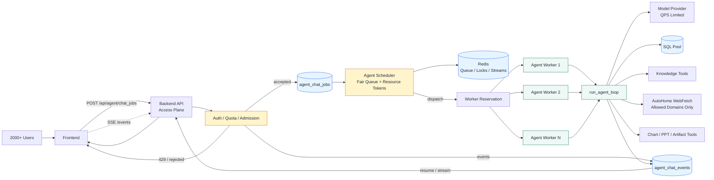
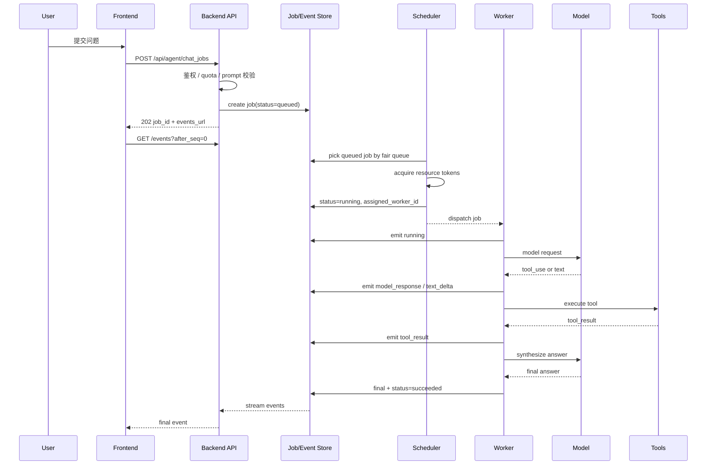
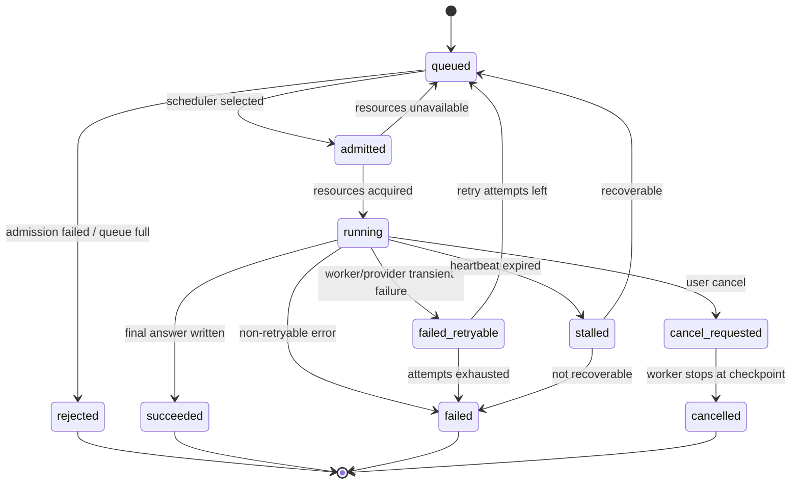
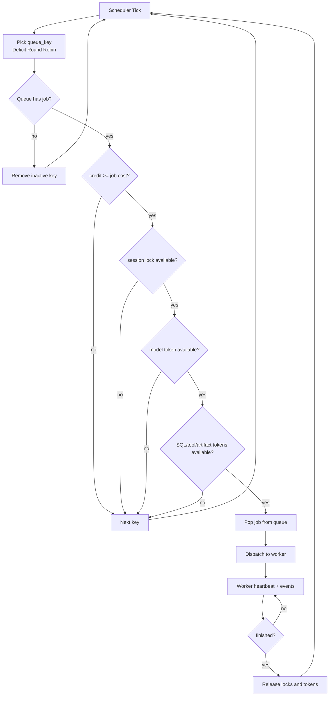
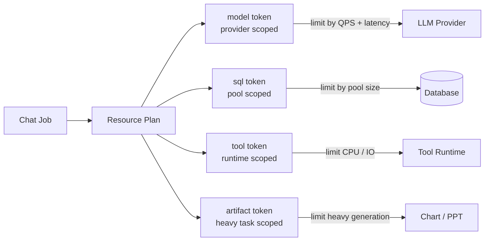

# Agent 高并发框架图

## 1. 总体架构

```mermaid
flowchart LR
  U[2000+ Users] --> FE[Frontend]
  FE -->|POST /api/agent/chat_jobs| API[Backend API<br/>Access Plane]
  FE -.->|SSE /events| API

  API --> AUTH[Auth / Quota / Admission]
  AUTH -->|accepted| JOB[(agent_chat_jobs)]
  AUTH -->|events| EVT[(agent_chat_events)]
  AUTH -->|429 / rejected| FE

  JOB --> SCH[Agent Scheduler<br/>Fair Queue + Resource Tokens]
  SCH --> REDIS[(Redis<br/>Queue / Locks / Streams)]
  SCH -->|dispatch| WQ[Worker Reservation]

  WQ --> W1[Agent Worker 1]
  WQ --> W2[Agent Worker 2]
  WQ --> WN[Agent Worker N]

  W1 --> LOOP[run_agent_loop]
  W2 --> LOOP
  WN --> LOOP

  LOOP --> LLM[Model Provider<br/>QPS Limited]
  LOOP --> SQL[(SQL Pool)]
  LOOP --> KB[Knowledge Tools]
  LOOP --> AH[AutoHome WebFetch<br/>Allowed Domains Only]
  LOOP --> GEN[Chart / PPT / Artifact Tools]

  LOOP --> EVT
  EVT -->|resume / stream| API
  API --> FE

  classDef hot fill:#fff4cc,stroke:#b7791f,color:#1f2937;
  classDef store fill:#e6f4ff,stroke:#2563eb,color:#1f2937;
  classDef worker fill:#eef8f5,stroke:#0f766e,color:#1f2937;
  class SCH,AUTH hot;
  class JOB,EVT,REDIS,SQL store;
  class W1,W2,WN,LOOP worker;
```

## 2. 请求生命周期

```mermaid
sequenceDiagram
  participant User as User
  participant FE as Frontend
  participant API as Backend API
  participant DB as Job/Event Store
  participant SCH as Scheduler
  participant W as Worker
  participant LLM as Model
  participant Tool as Tools

  User->>FE: 提交问题
  FE->>API: POST /api/agent/chat_jobs
  API->>API: 鉴权 / quota / prompt 校验
  API->>DB: create job(status=queued)
  API-->>FE: 202 job_id + events_url
  FE->>API: GET /events?after_seq=0

  SCH->>DB: pick queued job by fair queue
  SCH->>SCH: acquire resource tokens
  SCH->>DB: status=running, assigned_worker_id
  SCH-->>W: dispatch job

  W->>DB: emit running
  W->>LLM: model request
  LLM-->>W: tool_use or text
  W->>DB: emit model_response / text_delta
  W->>Tool: execute tool
  Tool-->>W: tool_result
  W->>DB: emit tool_result
  W->>LLM: synthesize answer
  LLM-->>W: final answer
  W->>DB: final + status=succeeded
  DB-->>API: stream events
  API-->>FE: final event
```

## 3. Job 状态机

```mermaid
stateDiagram-v2
  [*] --> queued
  queued --> rejected: admission failed / queue full
  queued --> admitted: scheduler selected
  admitted --> running: resources acquired
  admitted --> queued: resources unavailable
  running --> succeeded: final answer written
  running --> failed: non-retryable error
  running --> failed_retryable: worker/provider transient failure
  failed_retryable --> queued: retry attempts left
  failed_retryable --> failed: attempts exhausted
  running --> cancel_requested: user cancel
  cancel_requested --> cancelled: worker stops at checkpoint
  running --> stalled: heartbeat expired
  stalled --> queued: recoverable
  stalled --> failed: not recoverable
  rejected --> [*]
  succeeded --> [*]
  failed --> [*]
  cancelled --> [*]
```

## 4. 调度器内部

```mermaid
flowchart TD
  T[Scheduler Tick] --> K[Pick queue_key<br/>Deficit Round Robin]
  K --> J{Queue has job?}
  J -- no --> R1[Remove inactive key]
  J -- yes --> C{credit >= job cost?}
  C -- no --> NEXT[Next key]
  C -- yes --> S{session lock available?}
  S -- no --> NEXT
  S -- yes --> M{model token available?}
  M -- no --> NEXT
  M -- yes --> Q{SQL/tool/artifact tokens available?}
  Q -- no --> NEXT
  Q -- yes --> POP[Pop job from queue]
  POP --> RUN[Dispatch to worker]
  RUN --> HB[Worker heartbeat + events]
  HB --> DONE{finished?}
  DONE -- no --> HB
  DONE -- yes --> REL[Release locks and tokens]
  REL --> T
  NEXT --> T
  R1 --> T
```

## 5. 资源令牌

```mermaid
flowchart LR
  JOB[Chat Job] --> PLAN[Resource Plan]
  PLAN --> MT[model token<br/>provider scoped]
  PLAN --> ST[sql token<br/>pool scoped]
  PLAN --> TT[tool token<br/>runtime scoped]
  PLAN --> AT[artifact token<br/>heavy task scoped]

  MT -->|limit by QPS + latency| LLM[LLM Provider]
  ST -->|limit by pool size| SQL[(Database)]
  TT -->|limit CPU / IO| TOOL[Tool Runtime]
  AT -->|limit heavy generation| ART[Chart / PPT]
```

