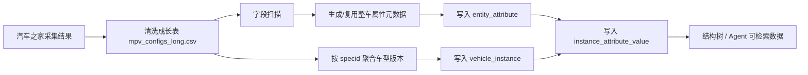

# 汽车之家数据接入与元数据生成

## 目标

汽车之家配置数据进入平台时，必须区分两类数据：

- 元数据：属性定义，例如 `轴距(mm)`、`整备质量(kg)`、`前悬架类型`、`驱动方式`。
- 实例数据：某个具体车型版本的属性值，例如 `AUTOHOME_SPEC_75600` 的轴距、价格、续航、悬架类型。

平台不把“小鹏 X9”这类车系当作唯一实例。车型实例细化到汽车之家 `specid`：

- `seriesid`：车系 ID，例如小鹏 X9。
- `specid`：车型版本 ID，例如某年款、某配置版本。
- `vehicle_code`：平台实例编码，格式为 `AUTOHOME_SPEC_{specid}`。

## 数据流

## 字段映射

汽车之家原始 `字段ID/titleid` 只在单个配置接口内可靠，不适合作为全站元数据编码。平台使用 `分组 + 字段名称` 生成稳定属性编码：

- `ah_field_xxx`：车身::轴距(mm)
- `ah_field_xxx`：底盘转向::前悬架类型
- `ah_field_xxx`：底盘转向::助力类型

固定来源字段也会生成属性：

- `ah_series_id`
- `ah_series_name`
- `ah_spec_id`
- `ah_spec_name`
- `ah_config_url`

字段类型采用保守推断：

- 大多数非空值可稳定解析为数字时，创建 `number` 属性。
- 存在“暂无/选装/标配/区间/文本说明”的字段保留为 `text`，避免丢失原始含义。

## 平台功能

后端接口：

- `POST /api/autohome/scan`：扫描清洗后的长表，返回车系数、车型版本数、字段数、字段样例。
- `POST /api/autohome/import`：创建/复用元数据，按 `specid` 创建或更新整车实例，并写入属性值。

前端入口：

- 数据运营 -> 汽车之家数据源

导入具备幂等性：

- 重复导入不会重复创建同一 `AUTOHOME_SPEC_{specid}`。
- 重复导入会复用 `ah_*` 属性元数据。
- 同一批 `ah_*` 属性值会先删除再写入，避免重复堆积。

## 当前验证结果

基于 `/home/zhaoyunpeng/Projects/汽车之家/output_audited` 的已有清洗结果，已验证并按修正后的字段编码重导：

- 194 个车系
- 1302 个车型版本实例
- 320 个汽车之家配置字段
- 327 个 `ah_*` 元数据属性
- 217173 条车型版本属性值

这条数据流用于验证平台的动态元数据、导入、实例数据、结构化检索和 Agent 数据底座是否跑通。
