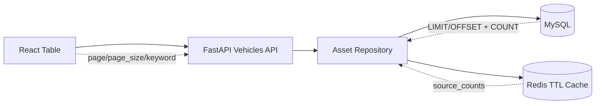

# 数据响应性能架构

## 问题根因

汽车之家这类成熟站点不会在列表页一次返回所有车型、所有配置字段和所有属性值。它们通常采用：

- 列表接口只返回摘要字段。
- 分页、筛选、排序都在服务端执行。
- 配置详情按车型版本懒加载。
- 热门聚合结果走缓存。
- 搜索走专门的倒排索引或搜索服务。
- 静态资源和公共配置走 CDN/边缘缓存。

平台之前慢的根因不是 1300 个车型版本太多，而是接口设计不对：

- `/api/assets/vehicles` 一次返回全量车型。
- 每个车型还带完整动态属性值。
- 前端再做分页和搜索。
- 结果是 1300 个车型携带 22 万多条属性值进入浏览器。

## 当前落地方案

### 接口分层

- 列表接口：`GET /api/assets/vehicles`
  - 参数：`page`、`page_size`、`keyword`、`source_type`、`include_values`
  - 默认：`include_values=false`
  - 返回：`items`、`total`、`page`、`page_size`、`source_counts`

- 详情接口：后续应补 `GET /api/assets/vehicles/{id}`
  - 只在用户点进某个车型版本时返回完整属性值。

- 结构树接口：后续应补懒加载模式
  - 首屏只加载车型节点。
  - 展开车型时加载四大系统。
  - 展开系统时加载零部件。

### 数据库策略

当前已添加索引：

- `idx_vehicle_status_id(status, id)`
- `idx_vehicle_source_status_id(source_type, status, id)`
- 已有唯一索引：`vehicle_code`
- 已有普通索引：`vehicle_name`

当前列表页 SQL 采用：

- `COUNT(*)` 获取总数。
- `LIMIT/OFFSET` 获取当前页。
- `source_type/status/id` 索引支撑来源筛选和稳定排序。

### 缓存策略

当前 Redis 已接入：

- `assets:vehicles:source_counts:v1`
- TTL：60 秒
- 用途：缓存车型来源统计，例如 `autohome=1302`、`manual=1`

后续适合继续缓存：

- 首页统计指标。
- 元数据字典。
- 热门车型列表第一页。
- Agent 查询中间结果。
- 异步导入任务状态。

不应该缓存：

- 正在编辑的实例详情。
- 权限敏感的用户私有视图。
- 尚未确认入库的导入预览结果。

## 后续升级方向

### 搜索

现在 `keyword` 用 MySQL `LIKE`，适合当前 1300 级别数据。数据上到几十万车型/配置记录后，应升级：

- MySQL FULLTEXT/ngram：适合轻量中文搜索。
- OpenSearch/Elasticsearch：适合车型、配置、证据、文档统一检索。
- 向量库：适合语义检索，可作为后续搜索增强，不替代结构化筛选。

### 分析查询

动态属性值在 `instance_attribute_value` 中是 EAV 模型，适合动态元数据，但不适合所有高频分析直接扫表。后续要加：

- 车型配置宽表物化视图。
- 按 `attribute_id` 的筛选索引。
- 对高频字段如轴距、价格、驱动方式、悬架类型建立派生列或宽表。

### 前端渲染

当前已改为服务端分页。后续对于结构树和大表格：

- Tree 懒加载。
- Table 虚拟滚动。
- Select 远程搜索。
- 详情页按 Tab 分区加载。

## 当前状态

已落地：

- 车型列表服务端分页。
- 车型搜索服务端执行。
- 列表默认不返回动态属性值。
- 来源统计 Redis 缓存。
- MySQL 查询索引。
- 前端车型页显示总数和汽车之家版本数。

## 性能指标定义

平台后续按这些指标衡量数据响应：

- `API P95 Latency`：列表接口 95 分位响应时间，目标小于 300ms。
- `Payload Size`：列表接口响应体大小，目标控制在 100KB 以内。
- `Rows Scanned`：MySQL 实际扫描行数，目标接近 `page_size`，避免全表扫描。
- `Cache Hit Ratio`：Redis 热点统计缓存命中率，目标大于 80%。
- `Frontend TTI`：页面可交互时间，目标小于 2s。
- `Query Error Rate`：查询接口错误率，目标小于 0.1%。
- `Import Throughput`：导入属性值写入速度，用于衡量批量采集入库能力。
- `Data Freshness`：汽车之家导入数据更新时间，后续用于调度增量更新。

待补：

- 车型详情接口。
- 结构树懒加载。
- 元数据字典缓存。
- 导入任务异步化和进度查询。
- 结构化搜索服务。
