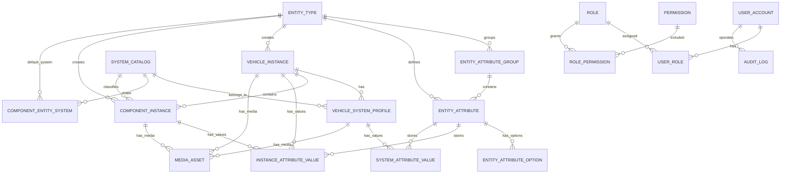

# 汽车底盘竞品数据平台 ER 设计

## 设计目标

平台管理汽车底盘竞品数据，要求用户可以动态维护整车和零部件的数据结构，但不能因为新增业务字段而频繁修改数据库表结构。

本版采用：

```text
实体类型 + 虚拟系统维度 + 实例数据 + 动态属性值
```

关键定义：

- 实体类型：有独立业务含义和属性模板，例如整车、左前上摆臂、制动盘、转向节。
- 虚拟系统：内置结构维度，例如悬架、制动、转向、动力。系统用于组织和统计，不作为普通实体类型让用户随意创建。
- 实例：某个实体类型下的一条真实数据，例如小鹏 X9、小鹏 X9 的左前上摆臂。
- 动态属性：挂在实体类型下，实例填写属性值。新增属性不改表。

内部关联全部使用 ID 外键；code 用于导入导出和业务识别，name 用于展示。

## 核心 ER 图



## 元数据层

### entity_type

实体类型表。这里存“整车”和每一种具体零部件，不存具体车型实例。

示例：

```text
整车
左前上摆臂
右前上摆臂
前副车架
制动盘
制动钳
转向节
半轴
电机
减速器
```

字段重点：

- `id`: 内部主键
- `category`: `vehicle` 或 `component`
- `code`: 业务编码
- `name`: 展示名称
- `is_builtin`: 是否平台内置

### system_catalog

虚拟系统维度表。第一阶段内置四大系统：

```text
suspension  悬架
braking     制动
steering    转向
powertrain  动力
```

系统不是普通实体类型，但可以作为结构树节点、筛选维度和统计维度。

### component_entity_system

零部件实体类型与默认系统的映射。

例如：

```text
左前上摆臂 -> 悬架
制动盘 -> 制动
转向节 -> 转向
半轴 -> 动力
```

### entity_attribute_group

实体属性分组，用于动态表单展示，例如：

- 基本信息
- 尺寸参数
- 材料与工艺
- 图片资料
- 数据来源

### entity_attribute

动态属性定义表。新增“材料牌号”“衬套硬度”“焊点数量”等字段，只新增这里的记录，不修改实例表结构。

常用字段类型：

- `text`
- `long_text`
- `number`
- `integer`
- `enum`
- `multi_enum`
- `date`
- `datetime`
- `boolean`
- `image`
- `file`
- `json`
- `relation`

### entity_attribute_option

枚举属性选项表。

## 实例层

### vehicle_instance

整车实例表，例如：

```text
小鹏 X9
理想 MEGA
腾势 D9
```

### vehicle_system_profile

某个整车实例下的系统级数据。系统是虚拟节点，但系统级属性可以存在这里。

示例：

```text
小鹏 X9 / 悬架系统
小鹏 X9 / 制动系统
```

可存系统重量、布置说明、供应商等系统级属性。

### component_instance

零部件实例表。每条记录必须关联：

- 一个整车实例 `vehicle_instance_id`
- 一个虚拟系统 `system_id`
- 一个零部件实体类型 `entity_type_id`

示例：

```text
小鹏 X9 / 悬架系统 / 左前上摆臂
小鹏 X9 / 制动系统 / 左前制动盘
```

## 属性值层

### instance_attribute_value

整车实例和零部件实例的动态属性值表。

通过：

- `target_type`: `vehicle` 或 `component`
- `target_id`: 对应实例 ID
- `attribute_id`: 属性定义 ID

关联具体值。

### system_attribute_value

系统虚拟节点的属性值表。系统不是实体类型，但每台车的系统可以有系统级数据。

通过：

- `vehicle_system_profile_id`
- `attribute_id`

关联具体值。

## 图片与文件

### media_asset

图片和文件统一存这里，可挂到：

- 整车实例
- 零部件实例
- 系统虚拟节点 profile

通过 `owner_type` + `owner_id` 关联。

## 结构树查询

结构树不是通过字符串拼接得到，而是由 ID 关系组合：

```text
vehicle_instance.id
  -> vehicle_system_profile.vehicle_instance_id
  -> component_instance.vehicle_instance_id + component_instance.system_id
```

展示为：

```text
小鹏 X9
  ├─ 悬架系统
  │   ├─ 左前上摆臂
  │   └─ 前副车架
  ├─ 制动系统
  ├─ 转向系统
  └─ 动力系统
```

## 设计收益

- 新增零部件类型不改表。
- 新增属性不改表。
- 系统作为标准维度，避免实体模型被固定结构污染。
- 所有关联通过 ID 完成，符合数据库规范。
- code/name 变更不会破坏外键关系。
- 支持系统级数据、零部件级数据、整车级数据。
- 后续可自然扩展导入、可视化、AI Agent 检索和报告生成。
