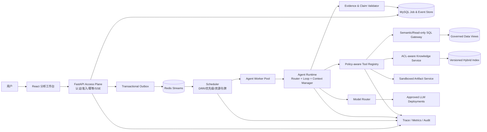

# 竞品数据分析 Agent 生产化改造 PRD

## 1. 文档信息

| 项目 | 内容 |
|---|---|
| 文档类型 | 产品需求文档 / 技术需求规格 |
| 目标产品 | 汽车底盘竞品数据智能管理平台 |
| 目标用户 | 底盘研发工程师、系统负责人/数据维护员、平台管理员 |
| 当前基线 | 现有 FastAPI + Agent Runtime + MySQL + 可选 Redis Streams 实现 |
| 目标 | 将当前“可用的工具型分析 Agent”补齐为可安全上线、可持续运营、可度量迭代的生产级系统 |

## 2. 背景与问题定义

平台已经具备一条真实的分析 Agent 主链路：用户问题先被创建为异步任务，Worker 调用 Agent Runtime；Runtime 在多轮 Loop 中完成工具选择、执行、结果回写和答案生成。系统已经具备结构化属性查询、只读 SQL、知识检索、Harness 侧引用编号、重复调用保护、会话锁、任务租约、SSE 事件和部分持久化能力。

当前问题不在于“有没有 Agent Loop”，而在于若直接面向研发组织推广，仍缺少生产系统必须具备的端到端安全边界、一致性保证、上下文自动治理、证据忠实度验证、分布式资源隔离、运行可观测性和版本质量门禁。

生产化改造必须满足以下原则：

1. Agent 继承用户权限，不能因为调用工具而扩大数据访问范围。
2. 模型输出不是事实来源，所有关键结论必须可回溯至受控数据或文档证据。
3. 所有长任务必须可排队、取消、恢复、审计，进程重启不能造成重复执行或最终结果丢失。
4. 并发能力依赖明确的资源预算和背压，而不是无限增加线程或协程。
5. 每次 Prompt、模型、工具或检索策略变更都必须经过离线评测和灰度验证。

## 3. 用户与核心场景

### 3.1 用户角色

| 角色 | 主要需求 | 数据边界 |
|---|---|---|
| 普通用户 | 参数查询、车型对比、文档问答、专题分析 | 已发布竞品数据及本人有权访问的业务库 |
| 系统负责人 / 数据维护员 | 维护所属系统数据、分析数据质量、核验回答 | 所负责底盘系统及被授权业务库 |
| 管理员 | 权限配置、知识库发布、审计、运行治理 | 按管理职责授权，敏感操作全量审计 |

### 3.2 核心任务

- 查询某车型、系统或零部件的单项/多项参数。
- 对多个车型进行筛选、聚合、对比和差异解释。
- 结合结构化参数与拆解报告、调研报告、用户手册给出技术分析。
- 生成带数据来源、引用位置、限制条件的专题结论或提案。
- 对证据不足、数据冲突或无权限访问的请求给出可解释的拒绝或降级回答。

## 4. 当前能力基线（As-Is）

| 领域 | 已有能力 | 当前限制 |
|---|---|---|
| Agent Loop | 模型调用—工具执行—结果回写—继续推理；工具预算、重复调用与低收益保护 | 缺少统一的任务状态模型、自动上下文预算和基于风险的执行策略 |
| 工具路由 | 按参数查询、手册问答、趋势分析等信号收敛 Tool Schema | 规则较轻，尚无真实模型路由、健康度路由和统一策略配置中心 |
| SQL | 仅允许 SELECT/SHOW/DESCRIBE/EXPLAIN、单语句、自动 LIMIT | 主要依赖正则；未形成只读账号、AST、表/字段数据范围、成本治理的纵深防御 |
| RAG | BM25 + 字符 TF-IDF + RRF；Search/Fetch 两阶段；有 Recall/MRR 接口 | 文档版本、ACL、OCR质量、删除同步、证据忠实度和线上漂移治理不足 |
| 引用 | Harness 从 SQL/RAG/Web 结果提取证据并分配 citation_id；缺失引用可修复一次 | 能验证编号存在，但不能充分验证每个结论确实被对应证据支持 |
| 上下文 | Token 分析器、microcompact 和手工 `/compact` | Web 主链路未自动触发；固定历史截断可能破坏工具调用配对或丢失关键约束 |
| 任务系统 | 异步 Job、DRR、公平队列、会话锁、心跳/租约、取消、SSE、可选 Redis Streams | 幂等键未生效；资源级 semaphore 未完整接入；事件与状态原子性、跨实例恢复仍需加强 |
| 可观测性 | 部分事件、Token、工具调用与最终答案记录 | 缺少统一 Trace、指标、SLO、告警、日志脱敏和端到端审计检索 |
| 评测 | RAG Recall@K/MRR 与部分单元测试 | 缺少真实业务黄金集、SQL/工具/引用/完整任务评测和发布门禁 |

## 5. 产品目标与非目标

### 5.1 产品目标

1. 在用户权限范围内稳定完成结构化查询、知识检索和多源综合分析。
2. 关键事实具备可点击、可复核的来源；证据不足时主动说明，不生成伪确定结论。
3. 支持约 1,400 人组织的内部推广，按容量模型承载峰值在线、排队和流式连接。
4. 支持水平扩容、故障恢复、版本灰度和问题追踪。
5. 用可量化评测证明系统改进，而不是仅凭演示效果判断质量。

### 5.2 非目标

- 不承诺 1,400 个完整 Agent Loop 同时执行；在线连接数、排队任务数和实际模型并发是三个不同指标。
- 不允许 Agent 直接修改主数据。写操作必须走独立、可审批的业务 API，不向通用 SQL 工具开放。
- 不以替代工程师决策为目标；系统输出是带证据的分析辅助，最终工程结论由责任人确认。
- 首期不建设无限制通用电脑操作 Agent，不默认开放 Bash、任意文件写入和任意公网访问。

## 6. 容量假设与服务指标

以下是首期容量规划基线，上线前应以试点日志校准：

| 指标 | 首期目标 |
|---|---|
| 注册/潜在用户 | 1,400 |
| 峰值 SSE 在线连接 | 300 |
| 峰值提交速率 | 70 job/min，允许短时突发 |
| 实际并行 Agent Run | 可配置，初始 16–32，以模型配额和数据库压测结果为准 |
| 创建任务 API | p95 < 300 ms，成功入队后 1 s 内返回 job_id |
| 简单属性查询端到端 | p95 < 15 s（模型供应商正常时） |
| 复杂分析任务 | 展示排队和执行阶段，不用同步 HTTP 超时作为失败判据 |
| 平台月可用性 | 99.9%（排除模型供应商已公告故障时需单独统计依赖可用性） |
| 任务恢复 | Worker 异常后 60 s 内识别并恢复或明确失败 |
| 数据越权 | 0 容忍；任何越权用例均阻断发布 |

## 7. 生产化需求总览

| 编号 | Epic | 优先级 | 解决的核心问题 |
|---|---|---|---|
| E1 | 身份、权限与租户/数据范围贯通 | P0 | Agent 工具可能绕过平台权限 |
| E2 | 工具与 SQL 纵深安全 | P0 | 正则只读校验不足，通用工具攻击面过大 |
| E3 | 自动上下文工程 | P0 | 长会话可能超窗、丢约束或破坏 tool pair |
| E4 | 证据与引用可信闭环 | P0 | 引用编号正确不代表结论被证据支持 |
| E5 | 持久化任务一致性与故障恢复 | P0 | 重复提交、跨实例状态竞争、断线恢复不完整 |
| E6 | 分布式资源治理与高并发 | P0 | 仅限制模型并发，SQL/工具/制品资源未真正隔离 |
| E7 | 模型与工具路由 | P1 | 成本、质量、健康度和场景策略尚未统一 |
| E8 | RAG 数据治理 | P1 | 文档版本、ACL、解析质量和索引一致性不足 |
| E9 | 可观测性、SLO 与审计 | P0 | 出错后难以快速定位，无法量化服务质量 |
| E10 | 评测、灰度与发布门禁 | P0 | 变更可能静默降低正确率或安全性 |
| E11 | 运营控制台与反馈闭环 | P1 | 管理员无法高效处理失败、差评和知识缺口 |

## 8. 详细需求

### E1. 身份、权限与数据范围贯通（P0）

#### 需求

1. 平台 Backend 在创建 Job 时写入不可由前端伪造的 `tenant_id/user_id/role_ids/data_scope_snapshot`，禁止信任请求体中的身份字段。
2. Backend 调用 Agent Runtime 时签发短时 Runtime Token，包含 job、session、用户、角色、数据范围、允许工具集和过期时间；Runtime 校验签名、受众和重放。
3. Tool Registry 在每次调用前执行授权判断，不能只在前端隐藏功能。
4. SQL、Knowledge、业务库查询必须自动附加相同的数据范围条件；知识文档和 chunk 也必须带 ACL 标签。
5. 权限变更后，新任务立即采用新权限；运行中任务按高风险操作再次校验，避免快照长期有效。
6. 审计日志记录“谁在何时通过哪个 Agent Job 访问了哪些数据资源”，但不得记录明文密钥或无需留存的敏感正文。

#### 验收标准

- 普通用户无法通过 Prompt、工具参数、伪造 HTTP 字段或直接调用 Runtime 获取未授权系统数据。
- 同一问题由不同数据范围用户执行时，结果集和可用文档严格符合各自权限。
- 100% 工具调用带 `user_id/job_id/trace_id/authorization_decision` 审计字段。
- 权限矩阵自动化用例全部通过；任一越权用例失败即阻断发布。

### E2. 工具与 SQL 纵深安全（P0）

#### 需求

1. 建立生产工具 Profile：参数问答、知识问答、综合分析、制品生成分别拥有独立最小工具集；默认禁用 Bash、任意文件读写和任意 Web 访问。
2. 数据库使用独立只读账号，只授予指定视图或表的 SELECT 权限；生产连接串不得包含 DDL/DML 权限。
3. SQL 从正则校验升级为 AST 解析，限制为单条只读查询；校验表、字段、函数、子查询、系统库、注释和危险构造。
4. 在 SQL 执行前执行 `EXPLAIN` 或成本估计，限制扫描行数、执行时长、返回行数和结果字节数；超限时提示 Agent 缩小范围。
5. 在数据库层或语义查询层强制注入数据范围，禁止模型自行拼接授权条件。
6. 对敏感字段实施列级屏蔽/脱敏；原始本品数据默认不进入模型上下文，只允许返回完成任务所需的最小聚合结果。
7. Web Fetch 仅允许 HTTPS 和域名白名单，阻断内网地址、环回地址、云元数据地址、重定向逃逸和大文件下载，防止 SSRF。
8. 文件生成工具只能访问 Job 专属工作目录，限制扩展名、大小、数量和生命周期。
9. 将知识文档中的指令视为不可信数据，工具结果与系统指令使用结构化边界；检测“忽略系统规则、泄露密钥、调用高风险工具”等 Prompt Injection 模式。

#### 验收标准

- DDL/DML、堆叠语句、注释绕过、系统库访问、超时查询、越权字段和未授权表均被阻断。
- 使用只读账号直接执行写语句时由数据库拒绝，而非仅由应用拒绝。
- SSRF、路径穿越、Prompt Injection 和工具参数注入安全用例通过率 100%。
- 每个路由暴露给模型的工具数量符合 Profile 配置，未配置工具默认不可用。

### E3. 自动上下文工程（P0）

#### 需求

1. 在每次模型调用前计算完整 Token 预算，包括系统 Prompt、Tool Schema、历史消息、当前工具结果和预留输出。
2. 设定软阈值和硬阈值：达到软阈值触发 microcompact/摘要，达到硬阈值禁止继续堆叠并执行强制压缩或明确终止。
3. 上下文分层保存：
   - 不可压缩：用户目标、权限/安全规则、当前任务状态、关键约束；
   - 可摘要：早期对话、已完成步骤、解释性文本；
   - 可外置：大体量 SQL 结果、文档片段、文件内容，只在上下文保存引用句柄；
   - 可丢弃：重复、失败且无诊断价值的旧工具输出。
4. 压缩必须以完整的 assistant tool_call + tool_result 为原子单元，禁止截断配对关系。
5. 摘要采用固定 Schema，至少保留任务目标、已确认事实、未决问题、工具执行状态、证据 ID 和用户约束。
6. 压缩前后执行一致性检查；若关键实体、数值、单位、引用或待办步骤丢失，则回滚摘要并采用更保守策略。
7. 会话历史持久化到统一存储，Runtime 实例不再依赖单机本地目录作为唯一事实来源。

#### 验收标准

- 连续 50 轮工具对话不中断、无孤立 tool_result、无上下文超限。
- 压缩后关键事实、数值、单位、车型、用户约束和 citation_id 保留率 ≥ 99%。
- 在黄金长会话集上，压缩前后任务成功率下降不超过 2 个百分点，平均输入 Token 降低 ≥ 30%。
- 任意 Runtime 实例可继续同一会话，实例重启不丢失已确认状态。

### E4. 证据与引用可信闭环（P0）

#### 需求

1. 所有 SQL 证据保存查询模板、参数、数据范围、结果快照摘要、执行时间、数据版本和内容哈希；引用不能只保存可变的行预览。
2. 文档证据保存 dataset/document/version/chunk/page 或章节定位、原文片段及 ACL，不允许引用已撤回或无权访问版本。
3. 将最终答案拆分为原子事实声明，建立 `claim -> citation_ids` 映射，并执行：
   - 引用编号有效性；
   - 证据是否包含或蕴含该事实；
   - 数值、单位、车型和零部件是否一致；
   - SQL 与文档证据是否相互冲突。
4. 对数值型结论优先使用结构化数据证据；文档仅作解释或补充，除非平台无对应字段。
5. 证据不足时使用明确的“不足以判断”；证据冲突时并列展示来源、数据时间和差异，不自动挑选有利结论。
6. 引用修复不得新增事实；若修复仍失败，删除无证据事实或将答案降级为待核验状态。
7. 前端支持点击引用查看受权限控制的 SQL 摘要或文档页/片段，并显示数据更新时间。

#### 验收标准

- 引用有效率 ≥ 99%，关键事实引用覆盖率 ≥ 95%。
- 黄金集上的引用忠实度/证据支持率 ≥ 95%，数值和单位一致率 ≥ 99%。
- 无证据问题的正确拒答率 ≥ 90%，不得生成不存在的文档、页码、SQL 行或引用编号。
- 撤回文档或权限变化后，旧答案引用仍保留审计快照，但用户不可越权查看原文。

### E5. 持久化任务一致性与故障恢复（P0）

#### 需求

1. 正式启用 `idempotency_key`：以 tenant + user + key 建立唯一约束；重复请求返回原 job，不重复计费或执行。
2. Job 状态迁移采用数据库条件更新或事务，非法迁移必须拒绝；Scheduler Claim、execution token 和 lease 写入保持原子性。
3. 任务投递采用 Outbox/Inbox 或等价机制，解决“数据库已写但 Redis 未投递”和“消息已消费但状态未落库”的双写不一致。
4. 每次执行携带 fencing token；过期 Worker 即使恢复也不能覆盖新 Worker 的结果。
5. 会话锁使用分布式存储并校验 owner；续租失败时 Worker 停止产生副作用并进入可恢复状态。
6. Retry 只用于明确可重试错误，采用指数退避和抖动；达到上限进入死信队列，保留失败上下文供运维处理。
7. 取消请求贯穿模型 HTTP、SQL、检索和制品生成；各工具提供安全检查点和超时。
8. 关键事件与最终答案持久化；SSE 支持 `Last-Event-ID` 断线续传。文本增量可批量落盘或周期性生成快照，避免逐 Token 写放大。
9. Runtime 会话消息、Job、事件和最终答案使用统一 ID 关联，避免本地会话与 MySQL Job 状态割裂。

#### 验收标准

- 同一幂等键并发提交 100 次只产生 1 个 Job 和 1 次实际执行。
- 在任务各阶段随机杀死 API/Scheduler/Worker/Redis 连接，任务最终只能成功一次，或以明确可恢复/失败状态结束。
- SSE 断开重连后关键事件有序、无缺失；`seq` 在多实例下唯一且单调。
- 取消请求在 5 s 内被执行链感知；已取消任务不能随后写入 succeeded。

### E6. 分布式资源治理与高并发（P0）

#### 需求

1. 分离接入面、调度面和执行面；API 只负责鉴权、准入、任务创建与事件订阅，不同步执行完整 Loop。
2. 将模型、SQL、Knowledge、Web、制品生成分别接入资源池，而非只使用模型 Semaphore。
3. 单机 Semaphore 用于进程内保护，Redis Token Bucket/租约用于跨实例全局配额；资源令牌带 TTL，Worker 异常后可回收。
4. 调度器保留按 tenant/user 的成本感知 DRR，加入优先级上限、老化机制和单用户并发限制，防止大任务或脚本独占资源。
5. 建立三级背压：用户待处理上限、系统队列上限、下游资源配额；超限返回明确的 429/预计等待信息。
6. 模型供应商、RAG 和数据库调用具备超时、重试、熔断和隔离舱；重试必须计入资源和成本预算。
7. 根据实际 Token、工具耗时和扫描量回写任务成本，校准当前基于关键词的静态成本估计。
8. 建立容量压测脚本，分别测量 API/SSE 连接、任务入队、调度公平性、模型并发、SQL 并发和故障恢复，不用 Mock Loop 结果代替真实链路容量结论。

#### 验收标准

- 300 个 SSE 连接和 70 job/min 突发下，API p95、错误率和内存保持在目标范围。
- SQL、模型、知识检索或制品生成任一资源饱和时，其他资源不会发生级联耗尽。
- 单用户持续提交时，其他用户任务仍可在公平性阈值内获得执行机会。
- 压测报告明确硬件、模型配额、数据规模、并发配置、p50/p95/p99、吞吐、错误率和资源使用率。

### E7. 模型与工具路由（P1）

#### 需求

1. 路由输入包括任务类型、复杂度、上下文长度、是否需要工具、数据敏感等级、模型健康度、延迟和成本预算。
2. 路由输出包括模型、Tool Profile、最大轮次、最大工具调用数、超时、输出格式和降级策略。
3. 简单属性查询优先走确定性属性工具，可在不需要解释时跳过多轮规划；复杂分析才进入完整 Loop。
4. 高敏任务只使用被批准的模型部署；禁止将敏感原始数据发送至不满足数据策略的外部模型。
5. 模型故障时按兼容能力降级，禁止在工具调用格式或上下文能力不匹配时盲目切换。
6. 路由规则版本化，记录每个 Job 的路由原因并支持灰度。

#### 验收标准

- 黄金集工具路由准确率 ≥ 95%，简单参数问题无不必要工具调用比例 ≥ 95%。
- 在质量下降不超过 2 个百分点的条件下，平均单任务 Token/成本较固定高规格模型方案下降 ≥ 20%。
- 模型故障演练中任务按策略降级或明确失败，不出现静默错误答案。

### E8. RAG 数据治理（P1）

#### 需求

1. 建立文档接入状态机：上传、解析、质检、待发布、已发布、撤回、删除；仅已发布版本可供生产 Agent 使用。
2. 保存文档版本、来源、车型/系统/零部件、发布日期、保密等级、ACL、解析器版本和索引版本。
3. 针对 PDF、扫描件、表格和图文混排建立解析/OCR 质量检查；低质量页面进入人工复核或明确标记。
4. Chunk 优先按标题、章节、表格和语义结构切分，固定字符切分作为降级方案；表头和单位不得与数据行分离。
5. 保留 BM25 + 字符 TF-IDF + RRF 基线，以离线评测决定是否启用 Dense/Reranker，不能把可选模型描述为默认能力。
6. 索引构建采用版本化与原子切换；文档撤回、权限变化和删除必须同步至检索层，提供一致性校验任务。
7. 对检索无结果、低置信、跨车型串线和同一文档片段过度占比设置诊断指标。

#### 验收标准

- 文档发布/撤回后 5 min 内检索状态一致，ACL 越权检索结果为 0。
- 业务黄金集 Recall@5 ≥ 90%、MRR@5 ≥ 0.75；不同文档类型分别统计，不用平均值掩盖扫描件问题。
- 车型/系统过滤准确率 ≥ 98%，表格数值与单位抽取准确率 ≥ 95%。

### E9. 可观测性、SLO 与审计（P0）

#### 需求

1. 为 HTTP 请求、Job、Agent Turn、模型调用、工具调用、SQL、RAG 和 SSE 建立统一 `trace_id/job_id/session_id`。
2. 接入 OpenTelemetry 或等价方案，采集分布式 Trace、结构化日志和指标。
3. 核心指标包括队列长度/等待时间、各资源并发与饱和度、模型首 Token/总延迟、工具成功率、SQL 扫描量、Token/成本、压缩次数、引用校验失败率、任务成功率和取消恢复率。
4. 日志默认脱敏 Prompt、SQL 参数、文档正文、用户标识和密钥；Debug 采样必须走审批并有自动过期。
5. 建立 SLO Dashboard 和告警：可用性、错误率、排队时间、任务停滞、租约续租失败、Redis 消费积压、数据库池耗尽、引用质量下降。
6. 审计日志防篡改、可按用户/Job/资源检索，并根据公司制度配置留存和删除周期。

#### 验收标准

- 任一失败 Job 可在 10 min 内从单一 Trace 定位至模型、工具、SQL、RAG、权限或调度环节。
- 告警演练覆盖模型不可用、Redis 积压、数据库慢查询、Worker 停滞和引用质量下降。
- 日志扫描不出现数据库密码、API Key 或未脱敏的敏感业务数据。

### E10. 评测、灰度与发布门禁（P0）

#### 需求

1. 建设真实业务黄金集，覆盖参数直查、EAV 组合查询、多车型对比、聚合统计、手册问答、多源综合、证据不足、数据冲突、越权和攻击输入。
2. 分层评测：
   - 路由：任务分类、模型选择、工具选择；
   - SQL：语法执行率、结果正确率、数据范围正确率；
   - RAG：Recall@K、MRR、过滤准确率；
   - 引用：覆盖率、有效率、忠实度、数值一致性；
   - Loop：任务完成率、无效轮次、重复调用率、平均成本和时延；
   - 安全：越权、Prompt Injection、SSRF、SQL 绕过；
   - 端到端：专家评分和关键结论正确率。
3. Prompt、路由规则、Tool Schema、模型和索引均版本化；评测结果关联具体版本组合。
4. CI 执行快速回归，发布前执行完整离线集；核心指标低于基线或安全用例失败时自动阻断。
5. 生产采用小流量灰度，比较成功率、用户纠错、延迟、成本和引用质量；异常自动回滚。
6. 收集用户“正确/不正确/引用无关/数据过期/缺少数据”反馈，并进入可复现问题集，避免只收点赞率。

#### 验收标准

- P0 用例覆盖率 100%，安全用例通过率 100%。
- 核心业务端到端任务成功率 ≥ 90%，SQL 结果正确率 ≥ 95%，重复/无效工具调用率 ≤ 5%。
- 任一版本可还原其 Prompt、模型、路由、工具和索引配置，并可一键回滚到上一稳定版本。

### E11. 运营控制台与反馈闭环（P1）

#### 需求

1. 管理员查看任务状态、队列、失败原因、模型/工具耗时、引用校验和资源饱和度。
2. 支持在不查看无权正文的前提下重试失败任务、终止异常任务、处理死信和下线问题知识源。
3. 系统负责人查看所属专业域的低置信问题、缺失字段、冲突数据和用户纠错，转化为数据治理任务。
4. 前端展示排队、执行、检索、分析、生成、降级等阶段，明确答案限制，不用“模型正在思考”掩盖真实状态。
5. 支持导出带答案、引用、数据时间、模型/工具版本和审核人的分析报告。

#### 验收标准

- 运营人员可从差评问题定位到具体数据、文档、路由或模型原因，并生成治理工单。
- 用户可区分“无数据、无权限、检索失败、模型失败、系统繁忙”五类结果。

## 9. 目标架构

## 10. 核心数据模型增量

### 10.1 Job

新增或确保存在：

- `idempotency_key`：用户范围内唯一。
- `auth_snapshot_id`：权限快照引用。
- `route_version/model_route/tool_profile`：路由可追溯。
- `execution_token/fencing_token/lease_expires_at`：防止过期 Worker 覆盖。
- `prompt_version/tool_schema_version/index_version`：版本还原。
- `retry_count/error_code/dead_letter_reason`：故障治理。
- `input_tokens/output_tokens/estimated_cost/actual_cost`：容量与成本分析。

### 10.2 Evidence

- `evidence_id/type/source_id/source_version`。
- `job_id/tool_call_id/user_scope_hash`。
- SQL：`query_template/parameters/result_digest/row_count/executed_at/data_version`。
- 文档：`document_id/chunk_id/page_or_section/excerpt/content_hash`。
- `reliability/status/acl_snapshot_id`。

### 10.3 Claim

- `claim_id/answer_id/text/claim_type`。
- `citation_ids/validation_status/validation_score`。
- `numeric_value/unit/entity_ids`。
- `conflict_status/review_status`。

### 10.4 Context Snapshot

- `session_id/version/summary_schema_version`。
- `goal/constraints/confirmed_facts/open_questions/completed_steps`。
- `evidence_handles/token_count/content_hash`。

## 11. 关键异常与降级策略

| 异常 | 系统行为 |
|---|---|
| 模型超时/限流 | 指数退避；满足兼容条件时切换批准模型；否则保留 Job 并明确失败原因 |
| SQL 超成本 | 不执行原查询，要求缩小车型/字段/时间范围或使用受控聚合接口 |
| RAG 无结果 | 不虚构文档答案；可仅依据结构化数据回答并声明缺少解释证据 |
| SQL 与文档冲突 | 并列展示数据版本和来源，标记待系统负责人核验 |
| 引用验证失败 | 进行一次不新增事实的修复；仍失败则删除无证据结论或降级为待核验 |
| 上下文接近上限 | 自动外置大结果并压缩旧历史；验证失败则回滚并终止当前扩展步骤 |
| Redis 不可用 | API 可按策略拒绝新任务；已落库任务不丢失，恢复后通过 Outbox 重投 |
| Worker 崩溃 | lease 过期后由新 Worker 接管，旧 Worker 受 fencing token 限制无法提交结果 |
| 用户取消 | 中断下游请求，在安全点释放资源，状态只能进入 cancelled |
| 权限撤销 | 新调用即时拒绝；已缓存结果再次访问时重新鉴权 |

## 12. 分阶段实施计划

### Phase 0：基线冻结与可测量化

- 固定当前 Prompt、工具、模型、RAG 索引和测试环境版本。
- 建立首批真实业务黄金集和端到端 Trace。
- 输出当前任务成功率、SQL 正确率、引用忠实度、时延和成本基线。

**退出条件：** 能稳定复现当前主要问题，后续改造都有对照基线。

### Phase 1：安全与一致性底座（P0）

- 完成 E1、E2、E5 的核心能力。
- 启用身份贯通、生产 Tool Profile、只读数据库账号、SQL AST 与数据范围。
- 完成幂等、原子状态迁移、Outbox、fencing token 和 SSE 恢复。

**退出条件：** 权限/攻击测试 100% 通过，故障注入无重复完成或越权。

### Phase 2：上下文、证据和质量门禁（P0）

- 完成 E3、E4、E10。
- 自动压缩接入 Web 主链路，落地 Claim-Evidence 校验。
- 建设 CI 回归、版本化和灰度发布。

**退出条件：** 长会话、引用忠实度、SQL 正确率和端到端指标达到目标。

### Phase 3：分布式容量与可观测（P0）

- 完成 E6、E9。
- 资源级分布式限流、背压、熔断、全链路 Trace、SLO 与告警上线。
- 执行真实依赖参与的容量压测与故障演练。

**退出条件：** 达到容量/SLO 目标，饱和场景无级联故障。

### Phase 4：路由、RAG 与运营优化（P1）

- 完成 E7、E8、E11。
- 基于评测数据优化模型/工具路由、文档治理和反馈闭环。

**退出条件：** 在质量不下降的前提下降低成本与延迟，运营问题可闭环进入数据治理。

## 13. 上线门禁（Definition of Done）

生产上线前必须同时满足：

1. P0 功能和自动化用例全部完成，无未处置的高危安全问题。
2. 数据越权、SQL 绕过、SSRF、Prompt Injection 用例通过率 100%。
3. 核心业务任务、SQL、RAG、引用和长会话指标达到本 PRD 阈值。
4. 完成 API/SSE、真实 Agent 链路、资源饱和和故障注入四类压测。
5. Dashboard、告警、审计、备份恢复、回滚和应急手册经过演练。
6. 用户界面明确显示数据时间、证据、权限/数据不足及 AI 生成内容边界。
7. 试点系统负责人完成验收，并对高频错误形成数据治理责任人和处理 SLA。

## 14. 风险与产品决策

| 风险 | 决策 |
|---|---|
| 为追求“自主性”开放过多工具 | 生产默认最小工具集，高风险能力拆为受审批服务 |
| 把在线人数等同于模型并发 | 分开规划 SSE、队列和实际 Run，并以配额/压测校准 |
| 引用看似完整但证据不支持结论 | 引入原子 Claim-Evidence 校验和拒答策略 |
| 自动摘要造成事实漂移 | 固定摘要 Schema、保留证据句柄、压缩后校验和回滚 |
| 仅依赖 Prompt 保证安全 | 权限、只读账号、AST、ACL、沙箱和网络策略多层强制 |
| 可选 Dense/Reranker 被误认为默认能力 | 所有检索配置版本化，以评测结果决定是否启用 |
| Mock 压测被当成真实容量 | Mock 只测调度；上线结论必须包含真实模型/SQL/RAG 链路 |

## 15. 与简历表述的对应关系

简历目标态中的能力必须满足以下启用条件：

| 简历表述 | 可启用条件 |
|---|---|
| 模型与工具路由 | E7 验收完成且有路由评测结果 |
| 自动上下文压缩 | E3 接入 Web 主链路并通过长会话评测 |
| SQL AST、白名单与敏感数据控制 | E1/E2 安全验收完成 |
| 幂等、分布式锁、故障恢复、断线续传 | E5 故障注入验收完成 |
| 分级限流与高并发框架 | E6 真实链路压测完成；数字只能引用压测报告 |
| 结论—证据映射与证据忠实度 | E4 指标达到阈值 |
| SLO、灰度和自动回滚 | E9/E10 上线并完成演练 |
