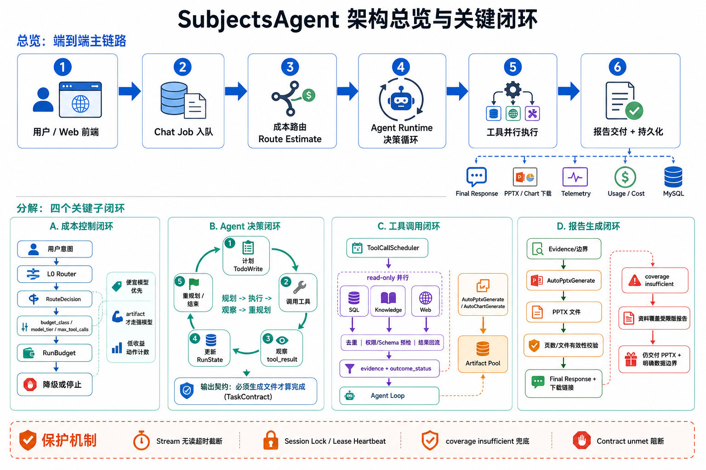

# SubjectsAgent 架构总览与关键闭环

本文结合架构图说明 SubjectsAgent 从用户请求到报告交付的完整链路，并重点解释当前 Agent 部分如何支撑两个核心目标：

- 成本控制：通过路由、预算、模型分层和低收益停止实现。
- 高效工具调用：通过工具预检、并行调度、结果回流和输出契约校验实现。



## 1. 总览：端到端主链路

SubjectsAgent 的主链路可以拆成 6 个连续阶段。

| 阶段 | 模块 | 关键职责 |
|---|---|---|
| 1 | 用户 / Web 前端 | 发起自然语言任务，展示任务状态、流式事件、最终回答和下载链接。 |
| 2 | Chat Job 入队 | 将请求封装为异步任务，记录 session、权限、数据范围、允许工具和幂等键。 |
| 3 | 成本路由 Route Estimate | 根据任务类型估算成本，决定预算级别、模型层级、最大轮次和工具策略。 |
| 4 | Agent Runtime 决策循环 | 执行计划、工具调用、结果观察、状态更新、重规划或结束。 |
| 5 | 工具并行执行 | 通过 ToolCallScheduler 并行执行安全的 read-only 工具，并串行隔离产物生成。 |
| 6 | 报告交付 + 持久化 | 输出 Final Response、PPTX/Chart 下载链接、Telemetry、Usage/Cost 和 MySQL 任务记录。 |

这条主链路的核心原则是：任务先被路由和预算约束，再进入 Agent 循环；工具结果必须回流到 Agent 状态；最终交付必须通过输出契约校验，而不是只返回文字。

## 2. A：成本控制闭环

成本控制不是单点限流，而是一条贯穿任务生命周期的闭环。

流程：

```text
用户意图
  -> L0 Router
  -> RouteDecision
  -> budget_class / model_tier / max_tool_calls
  -> RunBudget
  -> 降级或停止
```

关键机制：

- `L0 Router` 先识别任务类型，例如车辆参数查询、统计分析、调研报告、PPT/Chart 产物生成。
- `RouteDecision` 输出路由结果，包括 `route`、`budget_class`、`model_tier`、`preferred_tools`、`fallback_tools`。
- 简单查询优先走便宜模型和确定性工具；只有调研、报告、PPT 等复杂任务才进入 artifact 预算。
- `RunBudget` 持续记录模型轮次、token、工具调用、低收益动作。
- 当工具连续无进展、重复调用或覆盖不足时，Runtime 会触发降级、停止或兜底交付。

实际收益：

- 避免简单查询误走强模型。
- 避免工具空转导致成本失控。
- 对长任务保留 artifact 预算，但通过低收益停止压住无效扩展。

## 3. B：Agent 决策闭环

Agent Runtime 的核心不是一次性生成答案，而是循环执行：

```text
计划 TodoWrite
  -> 调用工具
  -> 观察 tool_result
  -> 更新 RunState
  -> 重规划 / 结束
```

其中几个状态组件各司其职：

| 组件 | 作用 |
|---|---|
| `Agent Loop` | 驱动模型调用、工具调用和最终生成。 |
| `TodoWrite` | 要求模型显式维护多步骤计划，避免无结构探索。 |
| `RunState` | 记录动作是否有进展、失败路径、重复调用和计划完成度。 |
| `RunBudget` | 记录成本和低收益动作，决定是否建议降级。 |
| `TaskContract` | 定义任务完成标准，例如“必须生成 PPTX 文件才算完成”。 |

输出契约是关键边界。对于用户明确要求 “生成 PPTX / Chart / 可下载报告” 的任务，文字回答不能满足任务完成条件。必须由 `AutoPptxGenerate` 或对应产物工具生成文件，并通过文件有效性校验。

## 4. C：工具调用闭环

工具调用由 `ToolCallScheduler` 统一调度。

主流程：

```text
Agent Loop
  -> ToolCallScheduler
  -> 权限 / Schema / 幂等 / 去重预检
  -> 并行 read-only 工具
  -> evidence + outcome_status 回流
  -> Agent Loop
```

工具分为两类执行路径：

| 类型 | 工具 | 调度策略 |
|---|---|---|
| read-only 工具 | SQL、Knowledge、Web 检索 | 可并行执行，结果按原始顺序回写。 |
| artifact 工具 | `AutoPptxGenerate`、`AutoChartGenerate` | 通过 Artifact Pool 控制并发，避免文件生成冲突。 |

工具结果不仅是文本，它会带回稳定的结构化状态：

- `outcome_status`
- `reason_code`
- `evidence`
- `citation_ids`
- `coverage_boundary`
- `retryable`

这些字段用于判断下一步是继续检索、换工具、停止、降级，还是直接生成产物。

## 5. D：报告生成闭环

报告任务的完成条件是“生成可下载文件”，不是“给出报告提纲”。

标准路径：

```text
Evidence / 数据边界
  -> AutoPptxGenerate
  -> PPTX 文件
  -> 页数 / 文件有效性校验
  -> Final Response + 下载链接
```

覆盖不足兜底路径：

```text
coverage insufficient
  -> 资料覆盖受限版报告
  -> 仍交付 PPTX
  -> 明确数据边界
```

这条兜底路径解决了近期失败任务的问题：当知识库或数据目录不能充分覆盖用户要求的调研对象时，系统不能继续空转，也不能只报错。现在会生成“资料覆盖受限版”PPTX，保留用户要求的页面结构，并明确标注哪些内容需要后续补证。

## 6. 保护机制

架构底部的保护机制用于保证闭环不会卡死或误完成。

| 保护机制 | 解决的问题 |
|---|---|
| Stream 无读超时截断 | 长报告任务执行期间，backend 不会因为 240 秒无新事件就提前判失败。 |
| Session Lock / Lease Heartbeat | 防止同一 session 被多个 worker 并发写入，保证任务所有权。 |
| coverage insufficient 兜底 | 资料覆盖不足时，生成边界版报告，而不是无限扩展检索。 |
| Contract unmet 阻断 | 用户要求产物时，未生成有效文件不能假装完成。 |

## 7. 当前已验证结果

本地验证任务：

- job：`job_40c5dcd75b9d405ea1b49eecb435534d`
- 任务：汽车悬架系统配置调研，要求 6 页 PPTX。
- 状态：`succeeded`
- 输出：`agent_runtime/outputs/coverage_limited_report_job_40c5dcd75b9d405ea1b49eecb435534d.pptx`
- 页数校验：`6/6`
- runtime 状态：`pending=0`，`dispatch_worker_errors=0`

相关测试：

- `agent_runtime`: `131 passed`
- 生产基础测试：`21 passed`

## 8. 后续优化方向

当前闭环已经能保证“能生成报告”。下一步重点是提升报告内容质量：

- 提升调研类任务的实体识别，减少无效 KnowledgeSearch。
- 对 artifact 路由限制同质化搜索扇出，优先按研究对象和字段拆分。
- 对 coverage insufficient 区分“完全无资料”和“弱相关资料”，决定生成边界版还是证据版报告。
- 把产物生成前的 evidence manifest 固化，便于复核报告中每页内容来源。
- 在前端展示 coverage boundary、contract status 和下载产物校验状态。
