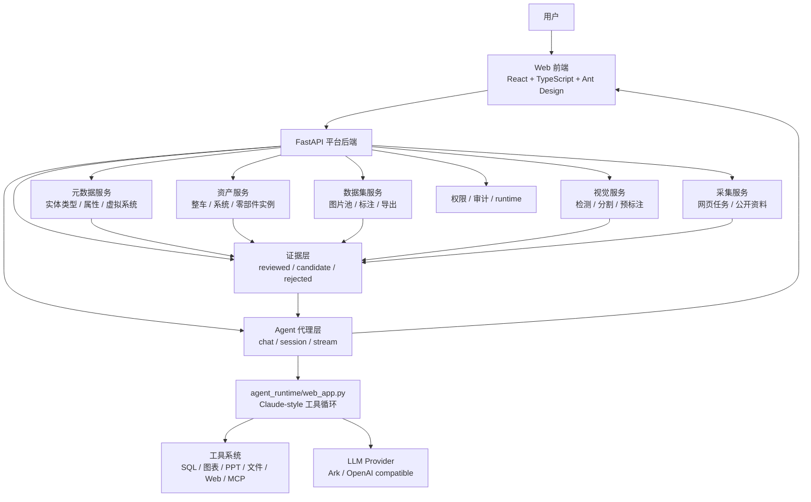
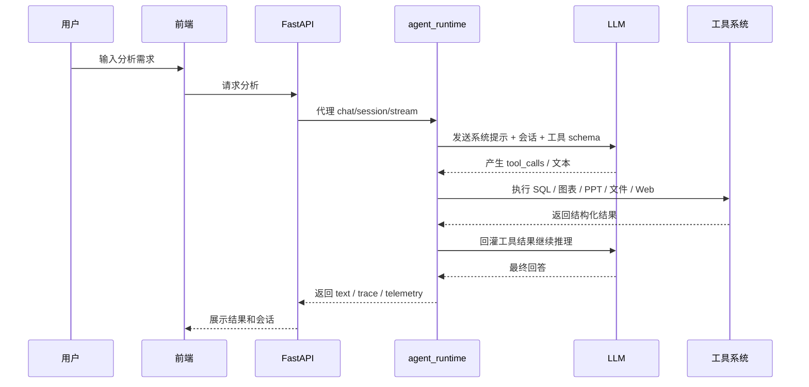

# 目标架构规划

## 最终目标

平台服务于一个核心场景：

```text
用户输入调研分析需求
  -> Agent 理解任务
  -> 从平台结构化数据与证据层取数
  -> 必要时调用视觉、采集、图表和 PPT 工具
  -> 生成分析报告与提案
  -> 保存会话、trace 和输出文件
```

当前平台的主链路是 Claude-style tool loop，不再把独立检索服务作为主架构。

## 总体架构图



## 前端模块

### 1. 数据平台

目标：维护可被 Agent 查询的结构化主数据。

- 动态元数据管理
- 车型与实例维护
- 结构树查询
- 导入导出
- 可视化

### 2. 数据采集与标注中心

目标：把图片和非结构化资料转为可训练、可检索、可引用的数据。

- 图片池
- bbox 标注
- 标注状态管理
- 类别覆盖统计
- YOLO / COCO 数据集导出
- 视觉识别候选结果复核

### 3. 视觉识别工作台

目标：把底盘图片转成候选证据。

- 输入图片
- YOLO / MMDetection / 分割推理
- 标注图预览
- 候选零部件结果
- 置信度和复核状态
- 转入证据池

### 4. Agent 调研分析

目标：用户输入业务问题，系统输出有证据链的分析报告和提案。

- 输入调研需求
- 展示 Agent 计划
- 展示执行进度
- 展示工具调用和 trace
- 生成报告
- 输出提案
- 支持历史会话继续

## Agent 设计原则

当前 Agent 的设计不是“聊天机器人”，而是“面向证据的调研执行器”。

1. **任务理解**
   - 从自然语言问题里识别车型、系统、零部件、指标。
2. **任务规划**
   - 将问题拆成若干可执行步骤。
3. **工具调用**
   - 查询平台主数据、证据层、采集任务，或调用图表/PPT/SQL 等工具。
4. **上下文回流**
   - 工具结果回灌给模型，继续下一轮决策。
5. **报告合成**
   - 输出报告、提案和限制条件。
6. **自检与追溯**
   - 记录 trace、token、内存、工具链路，便于调试和面试解释。

## 后端模块

```text
FastAPI
  ├─ metadata        元数据字典
  ├─ assets          整车/零部件实例
  ├─ datasets        图片池和标注
  ├─ vision          图像识别
  ├─ collectors      线上数据采集
  ├─ evidence        证据层
  ├─ agent           agent_runtime 代理入口
  └─ runtime         能力检查 / 健康状态
```

## 数据流

### 平台数据流

```text
元数据定义
  -> 车型实例
  -> 零部件实例
  -> 动态属性值
  -> 证据层
  -> Agent 上下文
```

### 图片数据流

```text
图片入池
  -> 人工标注
  -> 训练集导出
  -> YOLO / MMDetection 训练
  -> 视觉识别
  -> 候选证据
  -> 人工复核
  -> 正式结构化数据
  -> 证据层
```

### 线上采集流

```text
汽车之家 / 公开资料
  -> 页面采集
  -> 文本抽取
  -> 字段候选
  -> 证据入库
  -> 人工复核
  -> Agent 可用上下文
```

### Agent 调研流



## 技术选择

- 前端：React + TypeScript + Ant Design
- 后端：FastAPI
- 数据库：MySQL
- 缓存/任务：Redis
- Agent：Claude-style tool loop
- LLM：OpenAI / Ark OpenAI 兼容接口
- 视觉：YOLO / YOLO-seg / MMDetection
- 标注：平台内置 bbox 标注，后续可接 CVAT / Label Studio

## 为什么这样设计

- **MySQL**：适合实体、属性、权限和证据的强一致结构化存储。
- **Redis**：适合任务状态、缓存、短生命周期中间结果。
- **FastAPI**：适合高并发 API、类型校验和自动文档。
- **Claude-style loop**：适合需要多轮取证、工具调用、trace 输出的 agent。
- **证据层**：适合把“已确认事实”和“待复核线索”分开治理。

## Agent 参数规范

默认配置：

```text
OPENAI_MODEL=gpt-4.1-mini
AGENT_TEMPERATURE=0.2
AGENT_MAX_OUTPUT_TOKENS=2500
```

参数理由：

- `temperature=0.2`：调研报告需要稳定、少发散。
- `max_output_tokens=2500`：控制最终输出长度，避免报告发散。
