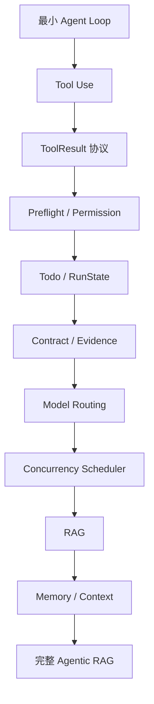

# 00-阅读路线

## 这一层解决什么问题

面试时最怕的是只会背“我们用了 Agentic RAG、Milvus、Rerank”，但面试官一追问 Agent Loop、工具调度、Memory、完成判断，就讲不出系统真实机制。

这套文档按“搭积木”的方式组织：每一篇只增加一个机制，从最小 Agent Loop 一直叠到完整 Agentic RAG Harness。

## 最小模式

## 怎么读

第一遍：只看每篇的“这一层解决什么问题”和图，先建立全局链路。

第二遍：看“我们项目里的真实源码”，把每个概念对应到代码文件。

第三遍：看“面试官可能怎么问”，按 30 秒回答、2 分钟展开、源码级细节训练。

## 我们项目里的真实源码

本项目不是一个纯 RAG demo，也不是简单的 Prompt Chain。它至少包括这些真实模块：

| 模块 | 代码位置 | 作用 |
|---|---|---|
| Agent Loop | `agent_runtime/src/tool_system/agent_loop.py` | 模型-工具-观察-再推理的主循环 |
| Tool System | `agent_runtime/src/tool_system/` | 工具 schema、权限、调度、结果协议 |
| Model Routing | `agent_runtime/src/routing_decision.py` | 路由、预算、模型 tier、工具候选集 |
| Backend Job Scheduler | `backend/app/services/agent_jobs.py` | 多用户任务排队、会话锁、租约、并发控制 |
| RAG | `backend/app/services/rag.py` | LlamaIndex + Milvus + OpenSearch + RRF + Rerank |
| Memory / Context | `agent_runtime/src/context_system/`, `run_state.py` | 上下文压缩、运行状态、证据记忆 |

## 面试官可能怎么问

### 问：你这个项目到底是 RAG 项目，还是 Agent 项目？

30 秒回答：

> 它是一个 Agentic RAG 项目。RAG 不是单独的问答接口，而是作为 `KnowledgeSearch` 和 `KnowledgeFetch` 两个工具接入 Agent Loop。模型可以根据任务需要调用 RAG、SQL、Web、图表、PPT 等工具，Runtime 负责工具执行、权限、调度、证据和完成判断。

2 分钟展开：

> 核心是 Agent Harness。模型负责推理和决定下一步动作，Harness 提供工具、知识、权限边界、并发调度、状态管理和证据闭环。简单车辆参数查询可以走 deterministic workflow；复杂任务进入 Agent Loop，由模型基于工具 observation 逐步完成。RAG 在这里是 Knowledge 工具层，不是每次把检索内容硬塞进 prompt。

源码级追问：

> 主循环在 `agent_runtime/src/tool_system/agent_loop.py` 的 `run_agent_loop()`。工具从 `ToolRegistry` 暴露给模型；知识工具在 `tools/knowledge.py`；RAG 服务在 `backend/app/services/rag.py`。

## 本层小结

面试表达要从“我做了 RAG”升级成“我做的是一个汽车领域 Agent Harness，RAG 是其中的知识工具层”。

