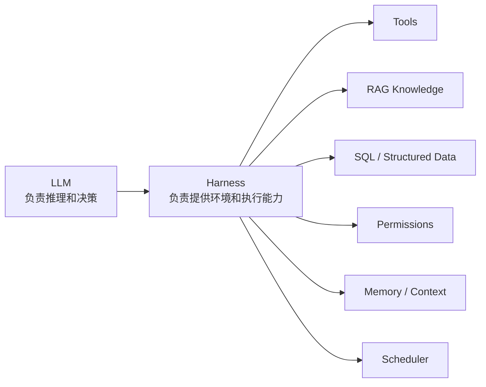

# 01-什么是 Agent Harness

## 这一层解决什么问题

Agent 的智能来自模型本身，但模型要在真实业务里工作，必须有一套 Harness 给它提供环境。

在我们项目里，Harness 不是一个抽象词，它具体包括：工具系统、RAG、SQL 数据工具、权限、调度、Memory、上下文压缩、证据闭环和完成判断。

## 最小模式



## 加上这一层后 Loop 怎么变化

没有 Harness 时：

```text
User -> LLM -> Answer
```

有 Harness 后：

```text
User -> LLM -> 选择行动 -> Harness 执行动作 -> Observation -> LLM -> Final
```

关键变化是：模型不再只能“说”，它可以通过工具“行动”。

## 我们项目里的真实源码

| Harness 能力 | 源码 |
|---|---|
| Agent 主循环 | `agent_runtime/src/tool_system/agent_loop.py` |
| 工具注册和分发 | `agent_runtime/src/tool_system/registry.py` |
| 默认工具集合 | `agent_runtime/src/tool_system/defaults.py` |
| 工具执行策略 | `agent_runtime/src/tool_system/execution.py` |
| RAG 知识工具 | `agent_runtime/src/tool_system/tools/knowledge.py` |
| RAG 服务 | `backend/app/services/rag.py` |
| 作业调度 | `backend/app/services/agent_jobs.py` |
| Memory / Context | `agent_runtime/src/context_system/`, `run_state.py` |

## 关键参数 / 数据结构

我们项目可以抽象成：

```text
SubjectsAgent = LLM
              + Agent Loop
              + Tool Registry
              + KnowledgeSearch / KnowledgeFetch
              + Subjects SQL Tools
              + RouteDecision
              + ToolCallScheduler
              + RunState / RunBudget
              + TaskRequirementState
              + Evidence / Citation
```

## 面试官可能怎么问

### 问：你们为什么说这是 Agent，而不是普通 RAG？

30 秒回答：

> 普通 RAG 通常是“检索 -> 拼 prompt -> 回答”。我们这里是 Agentic RAG：RAG 作为工具挂在 Agent Loop 上，模型可以决定什么时候查知识库、什么时候查 SQL、什么时候生成图表或 PPT。Runtime 还维护权限、调度、状态、证据和完成判断。

2 分钟展开：

> 我们的核心不是单一检索链，而是 Harness。模型每一轮拿到当前 messages、可用工具 schema、route policy、task requirements 和 run state，然后决定下一步。如果需要知识检索，它调用 `KnowledgeSearch`；如果需要结构化车型参数，它调用 SQL/Attribute 工具；如果要产物，它调用图表或 PPT 工具。工具结果会以 observation 回填给模型，直到 contract 满足才结束。

源码级追问：

> 可以看 `run_agent_loop()`。它先 `decide_route()`，再组装 system prompt、citation policy、execution policy 和 requirement prompt，然后循环调用 provider。模型返回 tool_use 后，Runtime 会 preflight、dispatch、注册 evidence、更新 run state，再把 tool_result 放回消息里。

## 如果继续追问到细节

可以强调：

- Agent Loop 不硬编码业务步骤，复杂任务由模型通过工具和 TodoWrite 推进。
- Harness 控制边界：哪些工具能用、数据范围是什么、失败后能不能重试。
- RAG 是 Knowledge 工具，不是整个系统的唯一能力。

## 本层小结

面试时先讲 Harness，会比直接讲 RAG 更高级，也更符合项目真实复杂度。

