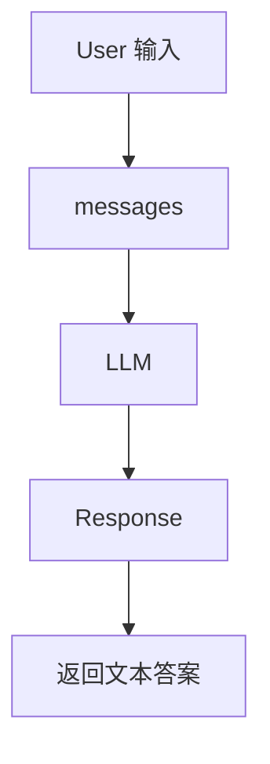

# 02-最小 Agent Loop

## 这一层解决什么问题

最小 Agent Loop 只解决一件事：把用户消息交给模型，让模型返回文本。

这还不是完整 Agent，但它是后续所有机制的基础。

## 最小模式



## 加上这一层后 Loop 怎么变化

这一层没有工具、没有 RAG、没有调度，只有：

```python
while True:
    response = model.chat(messages)
    return response.text
```

它的问题也很明显：

- 不能查实时数据
- 不能查数据库
- 不能读业务文档
- 不能生成文件
- 不能判断产物是否真的完成
- 不能处理多步任务

## 我们项目里的真实源码

最小 Loop 在项目中不是单独文件，而是被包含在 `run_agent_loop()` 的主循环里。

源码入口：

- `agent_runtime/src/tool_system/agent_loop.py`
- `run_agent_loop(conversation, provider, tool_registry, tool_context, ...)`

模型提供方抽象：

- `agent_runtime/src/providers/base.py`
- `agent_runtime/src/providers/openai_compatible.py`
- `agent_runtime/src/providers/ark_responses_provider.py`

对话结构：

- `agent_runtime/src/agent/conversation.py`

## 关键参数 / 数据结构

| 名称 | 作用 |
|---|---|
| `Conversation` | 保存 user/assistant/tool 消息 |
| `provider` | 大模型提供方，例如 Ark/OpenAI-compatible/Anthropic/GLM |
| `ChatResponse` | 模型返回结果，包含文本、usage、finish_reason、tool_uses |
| `messages` | 发给模型的上下文 |

## 面试官可能怎么问

### 问：Agent Loop 最核心的循环是什么？

30 秒回答：

> 最核心就是 messages 进入模型，模型返回 response。如果 response 里没有工具调用，就返回最终文本；如果有工具调用，就执行工具，把 tool_result 加回 messages，再进入下一轮。

2 分钟展开：

> 我们项目的 `run_agent_loop()` 就是在这个循环上扩展出来的。最小 loop 只负责模型调用，但真实项目在模型调用前会加 route policy、context、tool schema 和 requirement prompt；在模型调用后会判断有没有 tool_use，有则执行工具并更新状态，没有则检查任务 contract 是否满足。

源码级追问：

> 在 `agent_loop.py` 中，`turn_count` 控制模型回合数，provider 的 `chat()` 或 streaming 方法负责模型调用。返回的 `ChatResponse` 里如果有 `tool_uses`，就进入工具执行逻辑；如果没有，则进入 completion gate。

## 如果继续追问到细节

可以说：

- `ChatResponse` 是 provider-neutral 的返回结构。
- 不同模型供应商的 tool call 格式不同，但 Runtime 内部统一成 `tool_uses`。
- OpenAI-compatible provider 会把工具 schema 转成 function calling 格式。

## 本层小结

最小 Loop 是一切的骨架，但还不够生产可用。后面每一层都是在这个循环上增加 Harness 能力。

