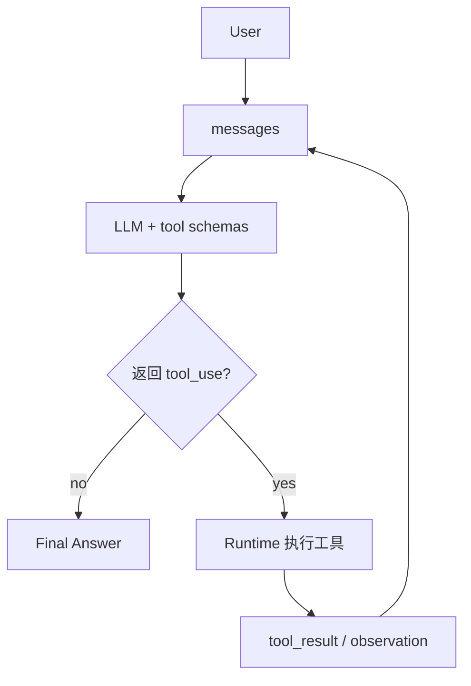

# 03-加入 Tool Use 后的循环

## 这一层解决什么问题

Tool Use 让模型不只是生成文本，而是可以调用外部能力。

在我们项目中，RAG、SQL、WebFetch、图表、PPT 都是工具。模型不直接访问数据库或向量库，而是输出结构化的 tool_use，Runtime 负责执行。

## 最小模式



## 加上这一层后 Loop 怎么变化

没有 Tool Use：

```text
LLM 只能凭已有上下文回答
```

加入 Tool Use：

```text
LLM 决定要调用哪个工具
Runtime 校验并执行
工具结果变成 observation
LLM 基于 observation 继续推理
```

## 我们项目里的真实源码

核心文件：

- `agent_runtime/src/tool_system/agent_loop.py`
- `agent_runtime/src/tool_system/protocol.py`
- `agent_runtime/src/tool_system/registry.py`

关键结构：

```text
ToolCall:
  name
  input
  tool_use_id

ToolResult:
  name
  output
  is_error
  tool_use_id
  outcome_status
  reason_code
  retryable
  diagnostics
```

provider 兼容：

- `OpenAICompatibleProvider` 把工具转成 OpenAI function tools。
- `ArkResponsesProvider` 把工具转成 Responses API function 格式。
- Runtime 内部统一读取 `response.tool_uses`。

## 关键参数 / 数据结构

| 字段 | 说明 |
|---|---|
| `tool_use_id` | 模型发起工具调用的唯一 id，用于把结果对应回去 |
| `tool_name` | 工具名，例如 `KnowledgeSearch` |
| `tool_input` | JSON 参数 |
| `tool_result` | 工具执行后的 observation |

## 面试官可能怎么问

### 问：谁决定调用工具，是你们代码决定还是模型决定？

30 秒回答：

> 复杂任务里是模型决定。Runtime 把候选工具 schema 暴露给模型，模型返回 tool_use。代码不硬编码“先查 RAG 再查 SQL”的固定链路，而是负责校验、执行和把结果回填。

2 分钟展开：

> 我们有路由和工具候选集控制，但那不是固定流程。路由只是决定这轮暴露哪些工具，比如 manual_qa 优先暴露 KnowledgeSearch/KnowledgeFetch，vehicle_spec 优先暴露结构化数据工具。真正每一轮调用哪个工具、什么时候停止，还是模型基于上下文和 observation 决定。

源码级追问：

> `run_agent_loop()` 每轮构造 `active_tool_schemas`，调用 provider。provider 返回 `tool_uses` 后，Runtime 会转成 `ToolCall`，经过 preflight 和 scheduler，再通过 `ToolRegistry.dispatch()` 执行。

### 问：Tool Use 和传统函数调用有什么区别？

30 秒回答：

> 传统函数调用是程序决定什么时候调用函数；Tool Use 是模型根据任务状态决定要不要调用工具。Runtime 是执行环境，不是业务流程编排器。

## 如果继续追问到细节

可以补充：

- 同一轮模型可能返回多个 tool_use。
- Runtime 会判断这些工具能不能并行。
- 工具结果会按原始顺序写回对话，保证 transcript 和 run state 可复现。

## 本层小结

Tool Use 是 Agent 从“会说”变成“能行动”的关键。RAG 在我们项目里就是 Tool Use 的一种。

