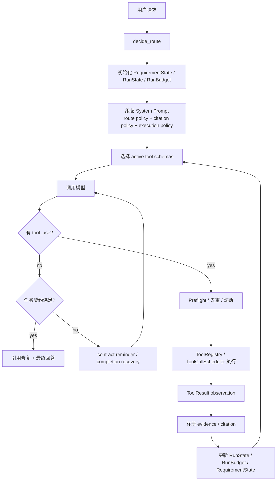

# 04-我们项目的真实 Agent Loop 总览

## 这一层解决什么问题

最小 Tool Use Loop 只讲“模型调用工具”。真实项目还需要路由、权限、上下文、证据、状态、并发、完成判断。

这一篇把真实 `run_agent_loop()` 放到一张图里。

## 最小模式

## 加上这一层后 Loop 怎么变化

真实 Agent Loop 不是裸循环，而是多了 5 个控制面：

| 控制面 | 作用 |
|---|---|
| Route | 判断任务类型，决定工具候选集、预算、模型 tier |
| Context | 组装 system prompt、历史、工具 schema、运行状态 |
| Safety | preflight、权限、数据边界、去重、熔断 |
| State | 记录计划、证据、失败路径、进展 |
| Completion | 判断是否满足 task/output contract |

## 我们项目里的真实源码

主入口：

- `agent_runtime/src/tool_system/agent_loop.py`

关键调用：

- `decide_route()`：来自 `agent_runtime/src/routing_decision.py`
- `TaskRequirementState.from_user_request()`：来自 `task_contract.py`
- `AgentRunState.from_requirements()`：来自 `run_state.py`
- `RunBudget.from_env()`：来自 `run_budget.py`
- `ToolCallScheduler.execute()`：来自 `scheduler.py`

## 关键参数 / 数据结构

| 参数 | 默认值 | 说明 |
|---|---:|---|
| `max_turns` | 后端默认 `24` | Agent 最大模型回合 |
| `CLAWD_TOOL_EXECUTION_FUSE` | `24` | 单次 run 工具执行保险丝 |
| `CLAWD_MAX_PARALLEL_TOOLS` | `4` | 单个模型回合最多并行工具数，最大 16 |
| `RunBudget.max_low_yield_actions` | `3` | 连续低收益工具动作阈值 |

## 面试官可能怎么问

### 问：你们 Agent Loop 里最关键的工程点是什么？

30 秒回答：

> 关键是 Runtime 不只负责调用模型，还负责工具候选集、preflight、工具调度、状态更新、证据注册和完成判断。模型负责决策，Runtime 负责边界和可观测执行。

2 分钟展开：

> 每轮开始时 Runtime 根据 route policy 暴露工具 schema，模型返回 tool_use 后，Runtime 会先做 preflight 和去重，再判断是否可以并行执行。工具结果回来后，会注册 citation、更新 requirement state、run state 和 budget。如果模型直接回答，Runtime 还要检查 output contract，没有满足就提醒模型继续调用工具或进入 fallback。

源码级追问：

> 这些都在 `run_agent_loop()` 里。`tool_uses` 分支处理工具调用；无 tool_use 分支走 completion gate；工具结果后处理会调用 `register_evidence()`、`requirement_state.update_from_tool_result()`、`run_state.record_action()` 和 `run_budget.record_tool_result()`。

## 如果继续追问到细节

可以说：

- 对 artifact 任务，不能只回答文字，必须生成实际文件。
- 对结构化数据任务，SQL citation 优先于知识库 citation。
- 对重复工具调用，Runtime 用 fingerprint 拒绝。

## 本层小结

我们的 Agent Loop 是“模型决策 + Harness 执行控制”的闭环，而不是简单的 RAG Chain。

