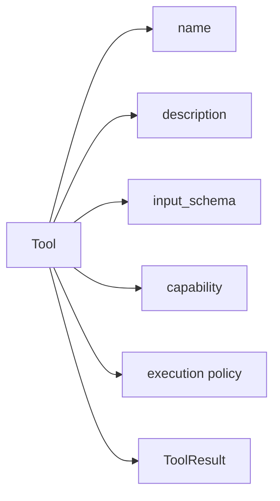

# 05-工具是什么

## 这一层解决什么问题

工具是 Agent 能采取的动作。没有工具，模型只能回答；有了工具，模型可以查询知识库、查数据库、读取文件、生成图表和 PPT。

但生产里的工具不是一个普通函数，它必须有 schema、权限、执行策略和标准化结果。

原因很简单：模型调用工具时，不像程序员调用函数那么可靠。

模型可能：

- 传错参数。
- 调用当前任务不该用的工具。
- 对同一个问题重复调用。
- 把无数据结果当成成功。
- 在副作用工具上制造不可逆动作。

所以工具在 Agent 系统里不是“函数”，而是一个受约束的行动接口。它要同时服务三类对象：

| 对象 | 需要什么 |
|---|---|
| 模型 | 清晰的 name、description、input_schema |
| Runtime | 权限、资源池、超时、并发、幂等性 |
| 观测和恢复逻辑 | 标准化 ToolResult、outcome_status、reason_code |

## 最小模式



## 加上这一层后 Loop 怎么变化

模型看到的不是 Python 函数，而是工具 schema：

```text
name: KnowledgeSearch
description: Search the RAG index
input_schema: {query, top_k}
```

模型输出：

```text
tool_use(name="KnowledgeSearch", input={"query": "...", "top_k": 8})
```

Runtime 执行后返回：

```text
tool_result(content={results, citations, status})
```

真正的工程设计在于：同一个工具定义既要让模型看懂，又要让 Runtime 能控制。

例如 `KnowledgeSearch` 的描述要足够明确，让模型知道它适合查手册、论文和知识库；但它的执行策略也要告诉 Runtime：这是只读工具、可以并行、属于 knowledge 资源池、失败时可以重试。

## 我们项目里的真实源码

| 源码 | 作用 |
|---|---|
| `agent_runtime/src/tool_system/registry.py` | 工具注册、查找、preflight、dispatch |
| `agent_runtime/src/tool_system/registry_types.py` | 工具能力和执行策略视图 |
| `agent_runtime/src/tool_system/protocol.py` | `ToolCall` / `ToolResult` / `ToolOutcomeStatus` |
| `agent_runtime/src/tool_system/defaults.py` | 默认工具集合和 production profile |
| `agent_runtime/src/tool_system/tools/knowledge.py` | RAG 知识工具 |
| `agent_runtime/src/tool_system/tools/subjects_sql.py` | 结构化车辆数据工具 |

## 关键参数 / 数据结构

工具定义通常包含：

| 字段 | 说明 |
|---|---|
| `name` | 工具名，模型调用时使用 |
| `description` | 给模型看的能力说明 |
| `input_schema` | JSON 参数结构 |
| `is_read_only` | 是否只读，影响并行调度 |
| `execution.concurrency_pool` | 所属资源池，如 `sql`、`knowledge`、`artifact` |
| `execution.supports_parallel` | 是否支持并行 |
| `execution.idempotent` | 是否幂等 |
| `execution.side_effect` | 是否有副作用 |

## 面试官可能怎么问

### 问：你们工具系统怎么设计？

30 秒回答：

> 工具不是直接暴露函数，而是通过 ToolRegistry 注册成标准能力。每个工具有 name、description、input schema、capability 和 execution policy。模型只生成 tool_use，Runtime 统一做 schema 校验、权限检查、资源池执行和 ToolResult 标准化。

2 分钟展开：

> 这样做的好处是工具和 Agent Loop 解耦。新增工具时不需要改主循环，只要注册工具并定义 schema 和执行策略。Runtime 根据 route policy 暴露候选工具，模型选择调用哪个。工具执行结果统一成 ToolResult，所以失败、无数据、权限拒绝、依赖异常都可以被 Agent Loop 用同一种方式处理。

源码级追问：

> `ToolRegistry` 负责注册和 dispatch；`ToolExecutionPolicy` 描述并发池、超时、是否幂等；`ToolResult` 在 `protocol.py`。默认工具在 `defaults.py` 里注册，production profile 会限制只暴露安全工具。

## 如果继续追问到细节

可以举例：

- `KnowledgeSearch` 是只读、幂等、可并行，资源池是 `knowledge`。
- `SubjectsSqlQuery` 是只读、幂等、可并行，资源池是 `sql`。
- `AutoPptxGenerate` 有产物副作用，不是只读，资源池是 `artifact`，不能随便并行。

## 本层小结

工具系统的质量决定 Agent 能不能在真实业务里稳定行动。工具不是函数调用，而是受约束的行动接口。
