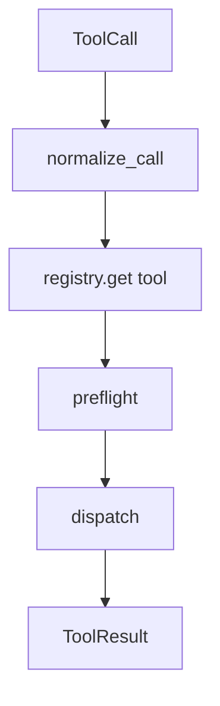

# 06-ToolRegistry 注册与分发

## 这一层解决什么问题

ToolRegistry 解决“工具越来越多后，Agent Loop 不能写一堆 if-else”的问题。

主循环不应该关心每个工具怎么执行，它只需要把 `ToolCall` 交给注册表。

从工程角度看，ToolRegistry 解决的是能力扩展问题。

如果没有注册表，每新增一个工具，就要在 Agent Loop 里加分支。工具多了以后，主循环会变成业务逻辑堆叠：

```text
if KnowledgeSearch
elif SQLQuery
elif WebFetch
elif AutoPptxGenerate
...
```

这会导致两个后果：

- Agent Loop 随工具增长越来越难维护。
- 工具的权限、超时、并发、结果标准化散落在不同分支里。

ToolRegistry 的设计是把“循环”和“能力”解耦：Loop 只懂协议，Registry 负责找到能力并执行。

## 最小模式



## 加上这一层后 Loop 怎么变化

没有 ToolRegistry：

```python
if tool_name == "KnowledgeSearch":
    ...
elif tool_name == "SubjectsSqlQuery":
    ...
```

有 ToolRegistry：

```python
result = tool_registry.dispatch(call, tool_context)
```

这样主循环保持稳定，工具能力可以扩展。

这也是 Agent Harness 的核心设计原则之一：

```text
Loop 尽量稳定
能力通过注册扩展
控制策略通过 policy 注入
```

所以新增工具不是改主循环，而是新增一个符合协议的能力单元。

## 我们项目里的真实源码

主要文件：

- `agent_runtime/src/tool_system/registry.py`
- `agent_runtime/src/tool_system/defaults.py`
- `agent_runtime/src/tool_system/loader.py`

默认工具注册：

- `register_default_tools()`
- production profile 下会移除危险工具，只保留安全业务工具

生产安全工具大致包括：

```text
SendUserMessage
TodoWrite
KnowledgeSearch / KnowledgeFetch
WebSearch / WebFetch
SubjectsAttributeLookup / SubjectsAttributeStats
SubjectsDataCatalogSearch / SubjectsSqlSchema / SubjectsSqlGlob / SubjectsSqlQuery
AutoChartGenerate / AutoPptxGenerate
StructuredOutput
```

## 关键参数 / 数据结构

| 动作 | 说明 |
|---|---|
| `register()` | 注册工具实例 |
| `get()` | 根据工具名取工具 |
| `normalize_call()` | 处理工具名别名和输入格式 |
| `preflight()` | 调用前检查 |
| `dispatch()` | 执行单个工具 |
| `dispatch_batch()` | 执行支持 batch 的工具 |

## 面试官可能怎么问

### 问：新增一个工具要改 Agent Loop 吗？

30 秒回答：

> 不需要。工具通过 ToolRegistry 注册，Agent Loop 只依赖统一的 ToolCall/ToolResult 协议。新增工具主要是实现工具类、schema 和 execution policy，然后注册进去。

2 分钟展开：

> 这和 `learn-claude-code` 的思想一致：循环不变，能力通过工具注册扩展。我们项目进一步加了 preflight、权限、并发池、结果标准化和 production profile，所以新增工具不会破坏主循环。

源码级追问：

> 可以看 `defaults.py` 中的默认工具注册，以及 `registry.py` 里的 `dispatch()`。Agent Loop 在执行工具时只调用 `tool_registry.dispatch(call, tool_context)`。

### 问：工具名写错怎么办？

30 秒回答：

> Registry 会 normalize 和查找工具，找不到会返回标准化错误 ToolResult，而不是让程序崩溃。

## 如果继续追问到细节

可以说：

- 工具调用前会生成 `PreflightDecision`。
- 不能执行的工具不会进入资源池，减少资源浪费。
- 工具拒绝也会写 audit event，方便排查。

## 本层小结

ToolRegistry 是工具系统的分发中心，它让 Agent Loop 保持一个稳定循环，而不是随着工具数量增长变成硬编码流程。
