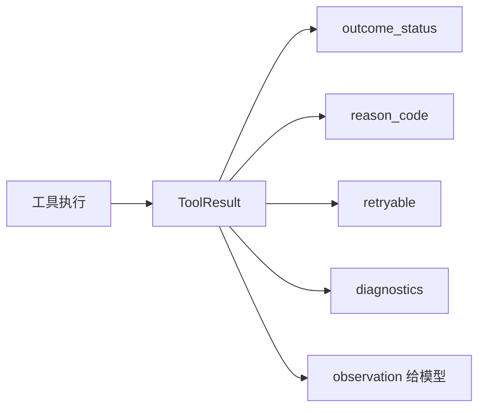

# 07-ToolResult 协议

## 这一层解决什么问题

真实业务里，工具不会只有成功和失败两种状态。可能是没查到数据、参数不合法、权限拒绝、依赖挂了、数据覆盖不足、超时、可重试失败。

ToolResult 协议把这些情况结构化，让 Agent Loop 可以做正确决策。

## 最小模式



## 加上这一层后 Loop 怎么变化

没有结构化结果：

```text
工具失败 -> 模型看到一段错误字符串 -> 很可能重复犯错
```

有 ToolResult：

```text
工具失败 -> Runtime 知道失败类型 -> 禁用/重试/fallback/提醒模型换工具
```

## 我们项目里的真实源码

核心文件：

- `agent_runtime/src/tool_system/protocol.py`
- `agent_runtime/src/tool_system/agent_loop.py`
- `agent_runtime/src/tool_system/execution.py`

ToolResult 关键字段：

```text
name
output
is_error
tool_use_id
outcome_status
reason_code
retryable
diagnostics
```

常见状态：

```text
success
partial_success
no_data
invalid_input
permission_denied
approval_required
capability_mismatch
data_coverage_insufficient
dependency_unhealthy
transient_failure
permanent_failure
timeout
cancelled
```

## 关键参数 / 数据结构

| 字段 | 面试解释 |
|---|---|
| `outcome_status` | 工具结果分类，决定下一步策略 |
| `reason_code` | 更细的原因码，用于审计、fallback、禁用工具 |
| `retryable` | 是否允许重试 |
| `diagnostics` | 调试信息，例如 attempt_count、resource_pool、duration |
| `coverage_boundary` | 数据覆盖边界，避免模型过度推断 |
| `citation_ids` | 工具产生的证据编号 |

## 面试官可能怎么问

### 问：工具失败时你们怎么处理？

30 秒回答：

> 工具失败不会只返回字符串错误，而是标准化成 ToolResult。Runtime 根据 outcome_status、reason_code 和 retryable 判断是重试、fallback、禁用工具，还是让模型基于已有证据回答。

2 分钟展开：

> 比如 SQL 查询如果是数据范围问题，会返回 permission/data scope 类 reason_code，模型可以修改查询；如果是依赖不健康，Runtime 可能把该工具从本轮禁用；如果是 transient failure 且工具幂等，会按策略重试。这样工具失败不会导致 Agent 盲目循环。

源码级追问：

> `execute_tool_with_policy()` 会把异常归一化成 ToolResult，并记录 attempt、duration、resource_pool。Agent Loop 收到结果后会更新 `tool_failures_by_name`、`disabled_tool_names`、`RunBudget` 和 `AgentRunState`。

### 问：为什么不用 exception 直接抛出去？

30 秒回答：

> 因为对 Agent 来说，失败也是 observation。模型需要知道失败原因，Runtime 也需要基于失败类型做恢复策略。

## 如果继续追问到细节

可以说：

- `ToolInputError` -> `INVALID_INPUT`
- `ToolPermissionError` -> `PERMISSION_DENIED`
- timeout/network 类 -> `TRANSIENT_FAILURE` 或 `TIMEOUT`
- 只有幂等且 retryable 的工具才自动重试

## 本层小结

ToolResult 是 Agent Harness 的观察协议。没有标准化 observation，就没有可靠的恢复、调度和证据闭环。

