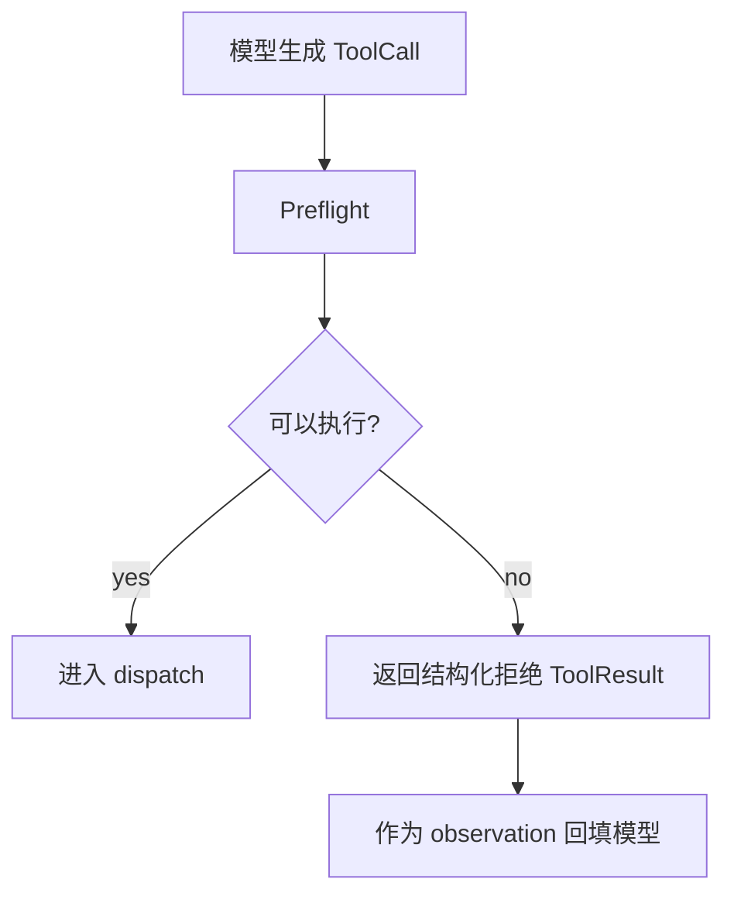

# 08-Preflight 工具前置检查

## 这一层解决什么问题

模型会提出工具调用，但不是所有调用都应该执行。Preflight 在工具真正进入资源池之前做前置检查，避免无效、越权或危险调用。

## 最小模式



## 加上这一层后 Loop 怎么变化

没有 Preflight：

```text
模型想调什么就调什么
风险：越权、参数错误、依赖异常、资源浪费
```

有 Preflight：

```text
模型提出动作
Runtime 判断是否允许
不允许也变成 observation
模型可以换路
```

## 我们项目里的真实源码

核心文件：

- `agent_runtime/src/tool_system/preflight.py`
- `agent_runtime/src/tool_system/registry.py`
- `agent_runtime/src/tool_system/agent_loop.py`

Agent Loop 中的前置检查包括：

- 工具是否存在
- 工具是否被 allowed_tools 允许
- 参数 schema 是否可接受
- 权限是否满足
- 数据范围是否满足
- 依赖是否健康
- 是否需要用户审批
- 是否已经被本轮禁用
- 是否重复调用

## 关键参数 / 数据结构

Preflight 决策通常包括：

| 字段 | 说明 |
|---|---|
| `status` | eligible / needs approval / rejected |
| `reason_code` | 拒绝原因 |
| `message` | 给模型看的说明 |
| `retryable` | 是否可以重试 |
| `alternative_capabilities` | 可替代能力 |
| `disable_tool_for_run` | 是否本轮禁用工具 |

## 面试官可能怎么问

### 问：模型想调用一个不该调用的工具怎么办？

30 秒回答：

> Runtime 会在执行前做 Preflight。检查不通过时不会执行工具，而是返回一个结构化 ToolResult，里面有 reason_code、retryable 和替代能力提示。模型看到 observation 后可以换工具或调整输入。

2 分钟展开：

> 这层很重要，因为模型输出只是意图，不代表可以执行。比如 SQL 可能不满足数据范围，WebFetch 可能访问非允许域名，artifact 工具可能缺少必要输入。Preflight 可以把这些问题挡在资源池之前，同时把拒绝原因写入 audit。

源码级追问：

> Agent Loop 会创建 `ToolCall`，调用 `tool_registry.preflight(call, tool_context)`。如果 `preflight.can_execute` 为 false，就构造 ToolResult，设置 `preflight_rejected=True`、`reason_code` 和 `outcome_status`，再作为 tool_result 回填给模型。

### 问：Preflight 拒绝后会不会直接失败？

30 秒回答：

> 不一定。拒绝本身是 observation。Runtime 可能进入 fallback 工具阶段，模型也可以根据 reason_code 改参数或换工具。

## 如果继续追问到细节

可以说：

- `approval_required` 是一种状态，不等同于失败。
- `permission_denied` 通常不可重试。
- `dependency_unhealthy` 可能导致本轮禁用该工具。
- `data_coverage_insufficient` 会触发 fallback 或边界说明。

## 本层小结

Preflight 是“先划边界，再给自由”。模型可以决策，但 Runtime 必须负责安全和可执行性。

