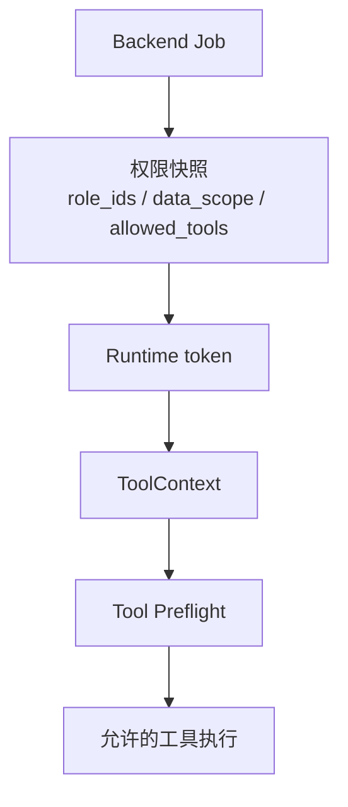

# 09-权限和数据边界

## 这一层解决什么问题

Agent 能调用工具之后，必须限制它能调用什么、能访问哪些数据、能不能执行有副作用动作。权限和数据边界解决的是生产环境的信任问题。

## 最小模式



## 加上这一层后 Loop 怎么变化

没有权限边界：

```text
模型可以尝试任何工具和数据
```

有权限边界：

```text
后端在 job 入队时快照身份和数据范围
Runtime 按 allowed_tools 和 data_scope 执行
工具内部继续做细粒度检查
```

## 我们项目里的真实源码

后端身份和权限快照：

- `backend/app/services/agent_jobs.py`
- `backend/app/security.py`

Runtime 上下文：

- `agent_runtime/src/tool_system/context.py`
- `ToolContext.allowed_tools`
- `ToolContext.data_scope`
- `ToolContext.role_ids`

生产工具 profile：

- `agent_runtime/src/tool_system/defaults.py`

SQL / Web 安全边界：

- `agent_runtime/src/tool_system/tools/subjects_sql.py`
- `agent_runtime/src/tool_system/tools/web_fetch.py`

## 关键参数 / 数据结构

| 字段 | 说明 |
|---|---|
| `tenant_id` | 租户 |
| `user_id` | 用户 |
| `role_ids` | 角色快照 |
| `data_scope` | 数据范围快照 |
| `allowed_tools` | 本次任务允许的工具集合 |
| `auth_context_version` | 权限上下文版本 |
| `runtime_authorization` | 后端发给 Runtime 的执行 token |

production profile 中保留的是业务安全工具，例如：

```text
KnowledgeSearch / KnowledgeFetch
SubjectsAttributeLookup / SubjectsAttributeStats
SubjectsSql*
AutoChartGenerate / AutoPptxGenerate
WebFetch / WebSearch
TodoWrite / StructuredOutput
```

## 面试官可能怎么问

### 问：Agent 调 SQL 怎么保证不会查越权数据？

30 秒回答：

> 后端创建 job 时会快照用户身份、角色、data_scope 和 allowed_tools，并签发 runtime token。Runtime 的 ToolContext 带着这些边界，SQL 工具执行前会做 preflight 和 SQL 安全检查，不满足范围就返回结构化拒绝。

2 分钟展开：

> 我们不是把权限判断交给模型。模型只能提出 tool_use，真正执行在 Runtime。Runtime 会基于 ToolContext 判断工具是否允许，SQL 工具还会做表范围、语句类型、active 数据范围等检查。越权不是 exception 乱抛，而是 ToolResult，模型可以看到边界并调整。

源码级追问：

> `AgentJobService` 在入队时保存 `role_ids_snapshot`、`data_scope_snapshot`、`allowed_tools_snapshot`。执行时 `_execute_proxy_blocking()` 会把这些传给 Runtime。Runtime 中的 `ToolContext` 保存这些字段，工具 preflight 和执行时读取。

### 问：模型能不能绕过 allowed_tools？

30 秒回答：

> 不能。模型只输出工具名，Runtime 只有在 registry 和 allowed_tools 都允许时才执行。否则返回 preflight rejection。

## 如果继续追问到细节

可以补充：

- 危险开发工具在 production profile 下不会暴露。
- WebFetch 有 HTTPS、allowlist、私有 IP、重定向和大小限制。
- SQL 是只读查询路径，不允许任意写操作。

## 本层小结

权限边界不是 prompt 约束，而是 Runtime 执行前的硬边界。模型负责建议动作，系统负责决定能不能执行。

