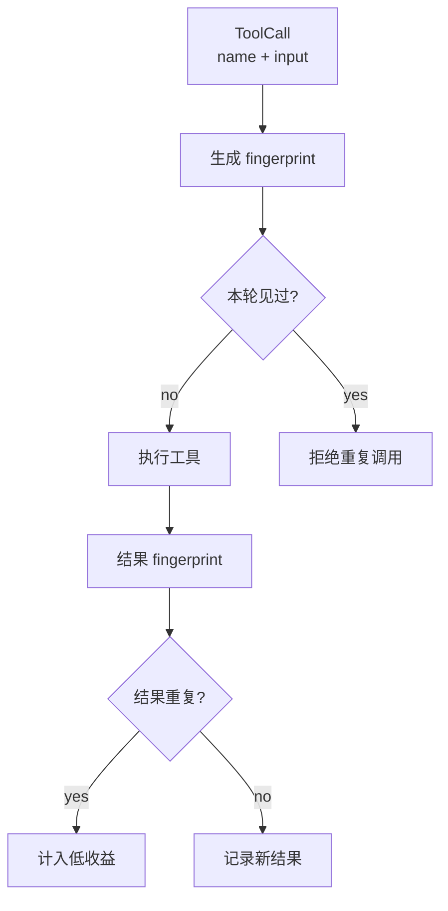

# 10-工具去重与 Fingerprint

## 这一层解决什么问题

Agent Loop 中模型可能重复调用同一个工具，尤其是在工具无数据、网络失败、或者模型没有意识到刚刚查过时。Fingerprint 用来识别重复动作，防止无效循环。

## 最小模式



## 加上这一层后 Loop 怎么变化

没有去重：

```text
同一个 query 连续查多次
同一个 URL 连续 fetch
同一个 SQL 反复执行
```

有去重：

```text
name + input 生成稳定 hash
重复调用直接返回 ToolResult
重复结果计入低收益
```

## 我们项目里的真实源码

工具调用去重：

- `agent_runtime/src/tool_system/scheduler.py`
- `_fingerprint(call)`
- `ToolCallScheduler._prepare()`

Agent Loop 级别去重：

- `agent_runtime/src/tool_system/agent_loop.py`
- `tool_call_fingerprints`
- `result_fingerprints`
- `preflight_rejection_fingerprints`
- `fetched_urls`

## 关键参数 / 数据结构

| 结构 | 说明 |
|---|---|
| `call_fingerprints` | 记录已经执行过的工具调用 |
| `tool_call_fingerprints` | Agent Loop 本轮工具调用去重 |
| `result_fingerprints` | 工具结果去重 |
| `fetched_urls` | WebFetch URL 去重 |
| `duplicate_tool_calls` | 重复工具调用次数 |
| `duplicate_tool_results` | 重复工具结果次数 |

fingerprint 逻辑本质：

```text
sha256(json.dumps({"name": tool_name.lower(), "input": tool_input}, sort_keys=True))
```

## 面试官可能怎么问

### 问：怎么防止 Agent 一直重复调用同一个工具？

30 秒回答：

> Runtime 会对工具名和输入生成 fingerprint。相同调用在同一 batch 或 run 中会被拒绝；相同结果也会被记录为低收益，达到阈值后触发重新规划或强制合成。

2 分钟展开：

> 去重分两层：ToolCallScheduler 在 batch/run 级别做调用去重；Agent Loop 还维护 tool_call_fingerprints、result_fingerprints 和 fetched_urls。比如同一个 WebFetch URL 已经取过，再取会被拒绝。这样能防止模型在失败路径上反复浪费工具调用。

源码级追问：

> `scheduler.py` 的 `_fingerprint()` 对 `{name, input}` 做 sha256。`agent_loop.py` 里还会在执行前检查 `tool_call_fingerprints`，执行后检查 `result_fingerprints`，重复则增加 `duplicate_tool_results` 和低收益计数。

### 问：如果确实需要重新查一次怎么办？

30 秒回答：

> 需要输入有实质差异，比如 query、filter、URL 或检索范围不同。完全相同的调用在同一任务里一般没有价值。

## 如果继续追问到细节

可以说：

- TodoWrite 这类 plan control action 不按外部工具重复逻辑处理。
- dedupe 可以按 batch 或 run scope。
- 并行调度前也会检查 batch 内 fingerprint，避免同一批里重复。

## 本层小结

Fingerprint 是 Agent Loop 稳定性的基础机制之一。它不是业务能力，但能显著减少死循环和无效工具调用。

