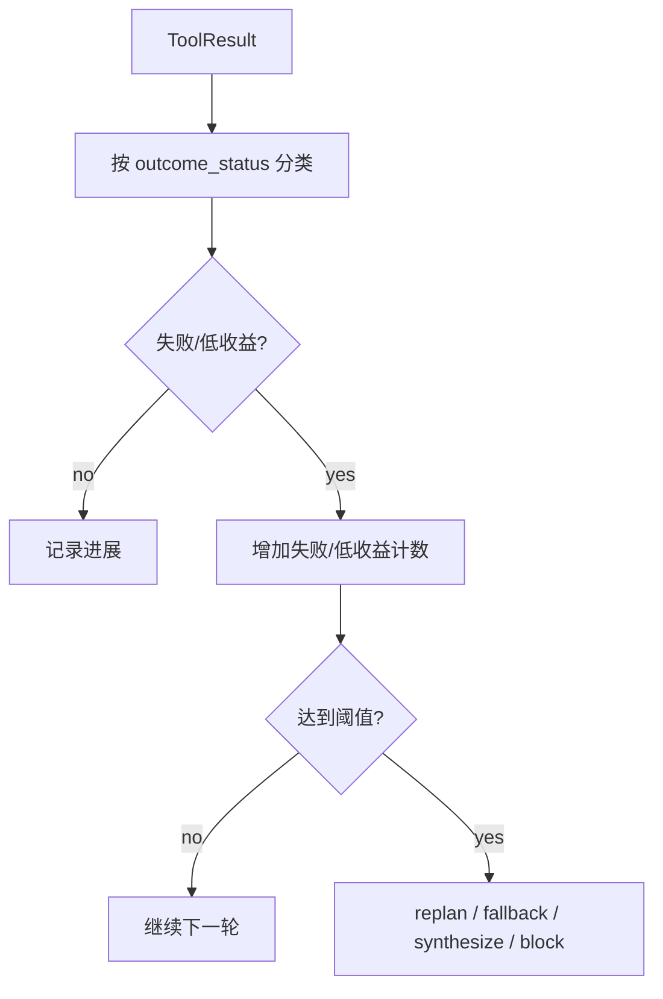

# 11-工具失败与熔断

## 这一层解决什么问题

Agent 可能遇到工具失败、依赖异常、无数据、权限拒绝、重复调用。如果没有熔断机制，模型可能一直尝试低收益动作。

这一层让 Agent 能“换路”或“带边界结束”，而不是无限循环。

## 最小模式



## 加上这一层后 Loop 怎么变化

没有熔断：

```text
工具失败 -> 模型可能继续重复调用 -> 死循环
```

有熔断：

```text
工具失败 -> 记录失败路径 -> 判断是否低收益 -> 禁用工具或换 fallback -> 必要时合成已有证据
```

## 我们项目里的真实源码

核心文件：

- `agent_runtime/src/tool_system/agent_loop.py`
- `agent_runtime/src/tool_system/run_budget.py`
- `agent_runtime/src/tool_system/run_state.py`
- `agent_runtime/src/tool_system/execution.py`

关键机制：

- `CLAWD_TOOL_EXECUTION_FUSE`
- `tool_failures_by_name`
- `disabled_tool_names`
- `consecutive_no_progress`
- `duplicate_tool_calls`
- `duplicate_tool_results`
- `RunBudget.low_yield_actions`
- `AgentRunState.should_request_replan()`
- `AgentRunState.should_stop_for_stagnation()`

## 关键参数 / 数据结构

| 参数 | 默认值 | 说明 |
|---|---:|---|
| `CLAWD_TOOL_EXECUTION_FUSE` | `24` | 单次 run 最多工具执行数 |
| `RunBudget.max_low_yield_actions` | `3` | 连续低收益工具动作阈值 |
| repeated tool failures | `2` | 同类工具连续失败后可能禁用 |
| `consecutive_failures` stop | `4` | 连续失败过多停止 |
| `consecutive_without_goal_progress` | `4/6` | 触发 replan 或停滞停止 |

低收益状态包括：

```text
no_data
invalid_input
capability_mismatch
data_coverage_insufficient
permission_denied
approval_required
dependency_unhealthy
transient_failure
permanent_failure
timeout
```

## 面试官可能怎么问

### 问：Agent 如果一直查不到数据怎么办？

30 秒回答：

> Runtime 会把 no_data、coverage insufficient、permission denied、dependency unhealthy 等状态计入低收益。连续低收益会触发 replan、fallback，或者基于已有证据合成带边界的回答，避免无限循环。

2 分钟展开：

> 每个工具结果都会进入 RunBudget 和 RunState。RunBudget 记录低收益动作数量，RunState 记录 failed_paths、连续失败和连续无进展。如果某个工具连续失败，Runtime 会禁用该工具；如果 primary 工具无法满足需求，会扩展到 fallback；如果 artifact/output contract 仍未满足，则可能阻塞或触发 deterministic fallback。

源码级追问：

> `RunBudget.record_tool_result()` 会根据 outcome_status 判断 low_yield；`AgentRunState.record_action()` 会更新 failed_paths 和 no-progress counters；`agent_loop.py` 根据这些状态决定 replan、disable tool、fallback 或 synthesize。

### 问：熔断会不会导致任务过早失败？

30 秒回答：

> 熔断不是直接失败，而是先换路或要求模型重新规划。只有 output contract 无法满足、没有可用工具或停滞严重时，才会阻塞或边界化结束。

## 如果继续追问到细节

可以说：

- WebSearch 连续网络失败后，会要求不要再调用 WebSearch。
- WebFetch 同 URL 重复抓取会被拒绝。
- 工具依赖不健康可能导致该工具本轮禁用。
- 对 artifact 任务，如果契约未满足，不能简单文本结束。

## 本层小结

熔断机制的目的不是限制 Agent，而是避免模型在无效路径上消耗资源，同时给它换路径的机会。

