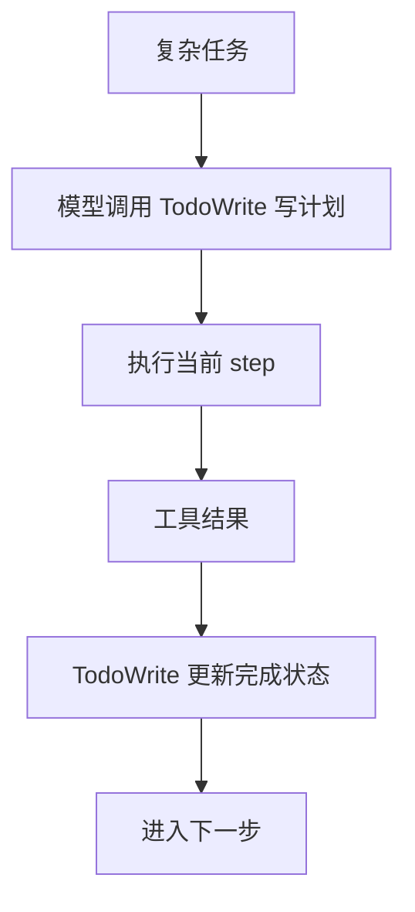

# 12-TodoWrite 计划机制

## 这一层解决什么问题

多步骤任务如果没有计划，模型容易“走一步看一步”，忘记目标或漏掉产物要求。TodoWrite 让模型显式维护计划，Runtime 记录计划进展。

## 最小模式



## 加上这一层后 Loop 怎么变化

没有 Todo：

```text
模型自己隐式记计划，容易漏步骤
```

有 Todo：

```text
模型写出计划
Runtime 保存 plan 和 plan_revision
完成某步必须有工具结果或产物支撑
```

## 我们项目里的真实源码

核心文件：

- `agent_runtime/src/tool_system/tools/todo_write.py`
- `agent_runtime/src/tool_system/run_state.py`
- `agent_runtime/src/tool_system/agent_loop.py`

Agent Loop 中相关变量：

- `plan_required`
- `plan_checkpoint_required`
- `planning_checkpoint`
- `run_state.update_plan()`
- `requirement_state.update_plan_completion()`

## 关键参数 / 数据结构

Todo item 结构：

```text
content
status: pending / in_progress / completed
activeForm
expectedOutcome
toolHints
```

RunState 记录：

```text
plan
plan_revision
progress_events
active_step
plan_complete
active_tool_hints
```

## 面试官可能怎么问

### 问：你们 Agent 是固定工作流，还是自己规划？

30 秒回答：

> 简单高置信任务可以走 deterministic workflow；复杂任务由模型通过 TodoWrite 自己维护计划。Runtime 不硬编码业务步骤，只记录计划状态、检查进展和完成条件。

2 分钟展开：

> 比如生成 PPT 这种任务，模型需要先确定资料、查 SQL 或 RAG、生成图表、再生成 PPT。我们会要求模型用 TodoWrite 建立计划。每次工具结果回来后，模型可以更新 Todo 状态。Runtime 会记录 plan_revision 和 progress_events，并要求不能在没有结果或产物的情况下把步骤标成完成。

源码级追问：

> `run_state.update_plan()` 会规范化 TodoWrite 的 `newTodos`，只接受 pending/in_progress/completed 三种状态。完成步骤发生变化时会记录 progress_event，并重置 no-progress counter。

### 问：TodoWrite 是不是你们代码在规划？

30 秒回答：

> 不是。计划内容由模型生成，Runtime 只是保存和检查。

## 如果继续追问到细节

可以说：

- `toolHints` 可以影响下一轮工具候选集。
- `plan_checkpoint_required` 会在复杂任务中要求模型先建立或更新计划。
- 计划 churn 不算真实进展，只有步骤完成或 requirement 改变才算进展。

## 本层小结

TodoWrite 让复杂任务从隐式推理变成显式计划，但计划仍属于模型，Runtime 只负责状态和约束。

