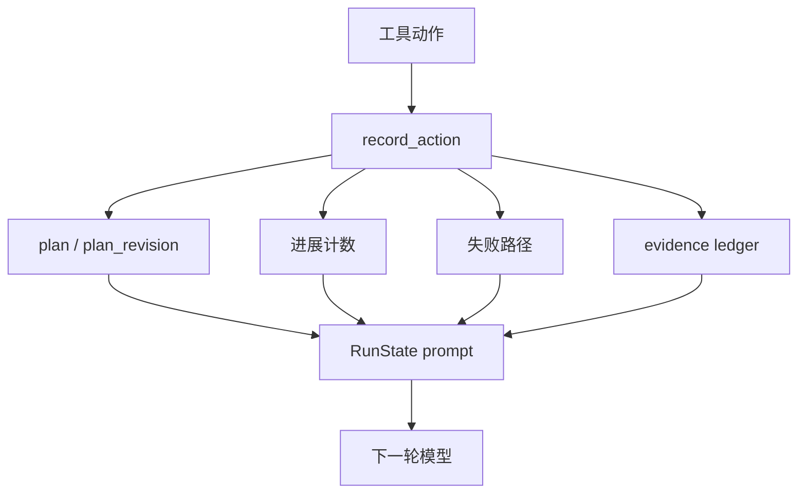

# 13-RunState 运行状态

## 这一层解决什么问题

Agent Loop 是多轮的，Runtime 必须记住这次任务已经做过什么、哪些路径失败了、有没有进展、收集了哪些证据。

RunState 就是单次 Agent run 的运行期记忆。

## 最小模式



## 加上这一层后 Loop 怎么变化

没有 RunState：

```text
模型只能靠上下文消息记住进展
上下文一长就容易丢失
```

有 RunState：

```text
Runtime 维护结构化进展账本
每轮把摘要注入模型
可触发 replan / stop
```

## 我们项目里的真实源码

核心文件：

- `agent_runtime/src/tool_system/run_state.py`
- `agent_runtime/src/tool_system/agent_loop.py`

创建：

```text
AgentRunState.from_requirements(user_request, requirement_state.as_dict()["requirements"])
```

更新：

```text
run_state.update_plan()
run_state.record_action()
run_state.add_evidence()
run_state.should_request_replan()
run_state.should_stop_for_stagnation()
```

## 关键参数 / 数据结构

`AgentRunState` 关键字段：

| 字段 | 说明 |
|---|---|
| `goal` | 用户目标 |
| `obligations` | 任务完成义务 |
| `plan` | 模型写的 Todo 计划 |
| `plan_revision` | 计划版本 |
| `action_count` | 工具动作数 |
| `evidence_count` | 证据数量 |
| `consecutive_without_goal_progress` | 连续无目标进展 |
| `consecutive_failures` | 连续失败 |
| `failed_paths` | 失败的工具+输入指纹 |
| `evidence_ledger` | 压缩证据账本，最多 40 条 |

## 面试官可能怎么问

### 问：Agent 怎么知道自己已经做过什么？

30 秒回答：

> Runtime 用 AgentRunState 记录单次任务的运行状态，包括计划、动作数、失败路径、进展事件和证据账本。每轮模型调用前，这些状态会被整理进上下文，帮助模型避免重复和重新规划。

2 分钟展开：

> RunState 不是长期用户记忆，而是任务级 operational memory。它记录模型当前计划、已完成步骤、哪些工具输入失败过、连续几次没有进展、有哪些证据。这样 Runtime 可以判断是否需要 replan，也能把压缩后的状态提供给模型。

源码级追问：

> `record_action()` 会生成 path_key，失败时写入 `failed_paths`；如果 requirement 或 plan 有进展，就重置 no-progress counter；否则增加 `consecutive_without_goal_progress`。`prompt()` 会把这些状态格式化后放进下一轮上下文。

### 问：RunState 和 Conversation 有什么区别？

30 秒回答：

> Conversation 是消息历史，RunState 是结构化运行账本。Conversation 给模型看过程，RunState 给 Runtime 和模型看状态。

## 如果继续追问到细节

可以说：

- `evidence_ledger` 只保留摘要，完整证据在 final metadata 和持久化层。
- `failed_paths` 用工具名和输入 fingerprint 表示。
- 连续无进展达到阈值会触发 replan。

## 本层小结

RunState 是 Agent Loop 的任务级记忆，保证多轮工具调用不是无状态乱跑。

