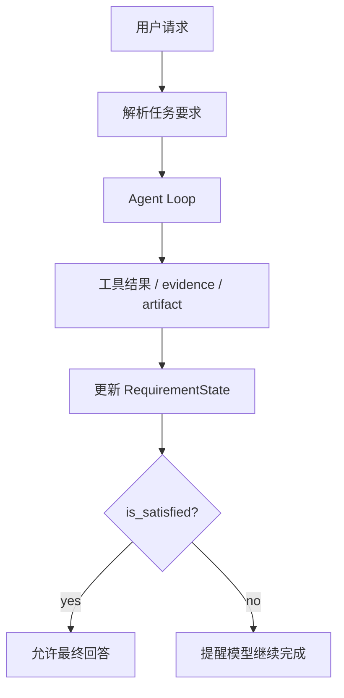

# 14-TaskRequirementState 完成判断

## 这一层解决什么问题

模型说“完成了”不代表任务真的完成。尤其是用户要求生成 PPT、图表、结构化 JSON 或证据支撑回答时，Runtime 必须有完成判断。

TaskRequirementState 解决的是“什么才算完成”。

这是 Agent 工程里非常核心的一层：把自然语言目标变成可检查的完成条件。

用户说“帮我做一个 6 页 PPT”，模型可能理解成“给你 6 页内容大纲”。但系统真正要交付的是一个可打开的 `.pptx` 文件。用户说“对比车型参数”，模型可能直接凭经验回答，但系统应该要求结构化数据或可追溯证据。

TaskRequirementState 做的就是这件事：

```text
从用户请求中抽取硬需求
在工具结果、证据和产物生成后更新状态
模型想结束时检查 is_satisfied
不满足就把 reminder 放回上下文
```

它让“完成”不再是模型主观说了算。

## 最小模式



## 加上这一层后 Loop 怎么变化

没有 RequirementState：

```text
模型不调工具就直接结束
可能漏证据、漏文件、漏结构化输出
```

有 RequirementState：

```text
模型不调工具时先检查完成条件
未满足则返回 contract reminder
满足才 finalize
```

这一层和 RunState 的区别：

| 模块 | 问题 |
|---|---|
| RunState | 过程有没有进展 |
| TaskRequirementState | 最终要求有没有满足 |

过程有进展不代表最终完成。比如已经查到资料，但还没生成 PPT；或者已经生成图表，但缺 citation。RequirementState 管的是最终验收。

## 我们项目里的真实源码

核心文件：

- `agent_runtime/src/tool_system/task_contract.py`
- `agent_runtime/src/tool_system/agent_loop.py`

关键调用：

```text
TaskRequirementState.from_user_request()
_configure_task_requirements()
requirement_state.update_from_tool_result()
requirement_state.update_from_evidence()
requirement_state.is_satisfied
requirement_state.reminder()
```

## 关键参数 / 数据结构

Requirement 可能包括：

| 类型 | 例子 |
|---|---|
| evidence requirement | 回答事实必须有 SQL/RAG/Web 证据 |
| artifact requirement | 必须生成 pptx/chart |
| structured output requirement | 必须返回结构化 JSON |
| plan requirement | 多步骤任务必须有计划并完成 |

## 面试官可能怎么问

### 问：你们怎么判断 Agent 任务完成？

30 秒回答：

> 不是只看模型有没有停止调用工具。Runtime 会维护 TaskRequirementState 和 OutputContract，检查证据、计划和产物要求是否满足。只有 contract 满足，最终回答才会被接受。

2 分钟展开：

> 比如用户问事实类问题，要求有 evidence；用户要 PPT，就必须生成实际 pptx；用户要图表，就必须有 chart artifact。模型如果直接给了一段文字，但 contract 没满足，Runtime 会把 reminder 加回上下文，让模型继续调用工具或生成产物。

源码级追问：

> 在 `run_agent_loop()` 中，如果 `not tool_uses`，并不会马上 return，而是先判断 `requirement_state.is_satisfied`。如果不满足，会记录 `output_contract_unmet` audit event，并把 `requirement_state.reminder()` 加回 conversation。

### 问：为什么不能让模型自己判断完成？

30 秒回答：

> 因为模型可能漏掉硬性要求。Runtime 必须做客观检查，尤其是文件是否真的生成、引用是否存在、结构化输出是否满足。

## 如果继续追问到细节

可以说：

- `output_contract.required` 为 true 时，不能靠文本合成结束。
- artifact 任务没有文件会标记 unmet。
- evidence 不足时会触发 fallback 或边界说明。

## 本层小结

TaskRequirementState 是 Agent 从 demo 走向生产的关键：最终答案必须满足任务契约，而不是只看模型是否停止。
