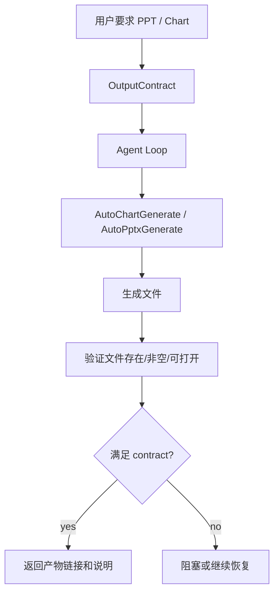

# 15-OutputContract 产物判断

## 这一层解决什么问题

用户要求“生成 PPT”或“生成图表”时，最终结果不能只是一段文字。OutputContract 用来验证真实产物是否存在、是否有效。

## 最小模式



## 加上这一层后 Loop 怎么变化

没有 OutputContract：

```text
用户要 PPT
模型回答“已生成 PPT”
但实际文件可能不存在
```

有 OutputContract：

```text
用户要 PPT
Runtime 要求 artifact:pptx
工具必须生成真实文件
验证通过才算完成
```

## 我们项目里的真实源码

核心文件：

- `agent_runtime/src/tool_system/task_contract.py`
- `agent_runtime/src/tool_system/tools/auto_visuals.py`
- `agent_runtime/src/tool_system/agent_loop.py`

相关对象：

- `OutputContract`
- `ArtifactRequirement`
- `TaskRequirementState`
- `artifact_paths`
- `_validate_pptx_artifact`

## 关键参数 / 数据结构

OutputContract 会识别：

| 用户请求 | Contract |
|---|---|
| PPT / pptx / 幻灯片 | `artifact:pptx` |
| 图表 / 可视化 | `artifact:chart` |
| JSON / 结构化输出 | `structured_json_required` |

PPT 验证关注：

- 文件路径是否存在
- 文件是否非空
- pptx 是否能打开
- 是否满足页数要求
- 是否每页表格/来源要求满足

## 面试官可能怎么问

### 问：用户要生成 PPT，你们怎么保证真的生成了？

30 秒回答：

> 我们用 OutputContract 做完成判断。用户请求命中 PPT 后，会产生 `artifact:pptx` requirement。只有 AutoPptxGenerate 生成真实 pptx 文件，并且 Runtime 验证文件存在、非空、可打开，任务才算成功。

2 分钟展开：

> 这避免了模型“嘴上说生成了”的问题。Agent Loop 在 final 前会检查 requirement_state，如果 pptx contract 没满足，模型不能直接文本结束。Runtime 会继续提醒模型生成产物，或者在覆盖不足场景下生成边界版 PPT。

源码级追问：

> `task_contract.py` 里会从用户请求解析 `OutputContract`。`update_from_tool_result()` 会根据工具输出记录 artifact path。PPT 文件校验逻辑会检查路径、大小和能否作为 pptx 打开。

### 问：如果资料不足但用户一定要 PPT 怎么办？

30 秒回答：

> 系统可以生成资料覆盖受限版，并在内容里明确数据边界；不能伪造数据。

## 如果继续追问到细节

可以说：

- `AutoChartGenerate` 和 `AutoPptxGenerate` 都属于 artifact pool。
- PPT 工具有副作用，不按普通只读工具并行。
- 产物路径会进入 final metadata 和 job persistence。

## 本层小结

OutputContract 是产物型 Agent 的硬完成门。没有真实文件，不算完成。

