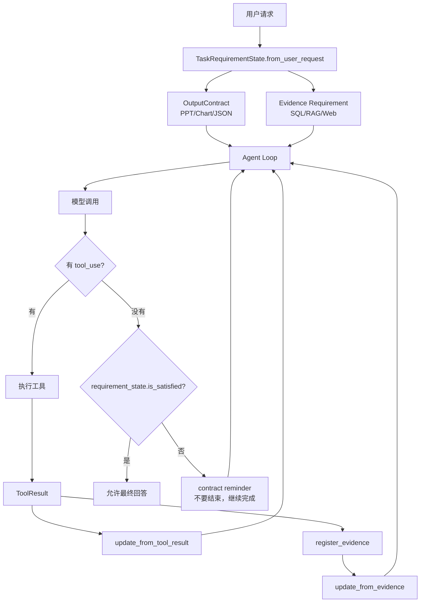

# 17-错误恢复、Fallback 和 Contract

## 这一层解决什么问题

真实 Agent 不可能每次都一次成功。它可能遇到：

- RAG 没检索到
- SQL 查不到数据
- SQL 被数据权限拒绝
- WebSearch 网络失败
- 工具能力不匹配
- 依赖服务不健康
- 模型想提前结束，但用户要求的 PPT/图表/结构化输出还没生成

如果没有错误恢复，Agent 就会变成一条脆弱的单链路：首选工具失败，任务就失败；或者模型反复调用同一个失败工具，直到超时。

这一章要讲清楚两个概念：

1. **Fallback**：首选路径不够时，展开备用工具或换路径。
2. **Contract**：Runtime 对“任务是否真的完成”的硬判断，不是模型说完成就完成。

## Contract 到底是什么

这里的 contract 不是法律合同，也不是普通 prompt 约束。它是 Runtime 维护的一组**任务完成条件**。

源码在：

- `agent_runtime/src/tool_system/task_contract.py`
- `agent_runtime/src/tool_system/agent_loop.py`

核心结构是：

```text
TaskRequirementState
  output_contract: OutputContract
  requirements: dict[str, Requirement]
```

其中 `OutputContract` 表示用户明确要求的输出形态：

```text
required_artifacts: pptx / chart
structured_json_required: true / false
```

如果用户说：

```text
生成 6 页 PPT
```

Runtime 会生成 requirement：

```text
artifact:pptx
description = Generate a valid pptx artifact with exactly 6 slides.
status = open
```

如果用户说：

```text
输出结构化 JSON
```

Runtime 会生成：

```text
output:structured_json
```

如果是事实问答类任务，路由配置还会追加 evidence requirement，例如需要 SQL、knowledge 或 web evidence。

## 为什么必须有 Contract

没有 contract 时，模型很容易“嘴上完成”：

```text
用户：生成一份 PPT
模型：好的，PPT 已生成，内容如下……
```

但实际没有文件。

或者：

```text
用户：给我一份带引用的手册依据
模型：根据资料可以得出……
```

但没有任何 citation。

所以 Runtime 必须把“完成”变成可检查的状态：

| 用户要求 | Runtime 检查 |
|---|---|
| 生成 PPT | 是否真的有 pptx 文件，且非空、可打开、页数正确 |
| 生成图表 | 是否真的有 chart 文件 |
| 结构化 JSON | 是否通过 StructuredOutput |
| 事实回答 | 是否有满足类型和数量的 evidence |
| 多步骤计划 | TodoWrite 计划是否完成或被明确修订 |

这就是 contract 的意义：**防止模型把未完成任务说成完成。**

## 最小模式



## Fallback 和 Contract 的关系

Fallback 解决的是：

```text
当前路径不够，换工具或换证据来源
```

Contract 解决的是：

```text
换了路径之后，任务到底有没有完成
```

两者经常一起出现：

```text
模型尝试直接回答
-> Runtime 发现 contract 未满足
-> discovery_stage 从 primary 切到 fallback
-> 给模型 contract reminder
-> 模型改用 fallback tools
-> 工具结果回来后更新 requirement
-> contract 满足后才能 final
```

源码位置在 `agent_loop.py`：

```text
if not tool_uses:
    if not requirement_state.is_satisfied:
        if discovery_stage == "primary" and route_policy.fallback_tools:
            discovery_stage = "fallback"
            discovery_expansion_reasons.append("output_contract_unmet")
        contract_reminder_count += 1
        reminder = requirement_state.reminder()
        ...
        continue
```

这段逻辑的意思是：**模型没有继续调工具，并不等于可以结束；Runtime 先检查 contract。**

## Contract 如何被更新

### 1. 工具结果更新产物要求

源码：

```text
TaskRequirementState.update_from_tool_result()
```

如果工具是 `AutoPptxGenerate`，Runtime 会检查：

- output 里是否有 `file_path`
- 路径是否在允许 workspace 内
- 文件是否存在
- 文件是否非空
- 文件是否能作为 zip/pptx 打开
- slide 数是否满足用户要求
- 如果要求每页表格/来源，slide_manifest 是否可验证

只有全部通过，`artifact:pptx` 才会变成：

```text
status = satisfied
```

### 2. Evidence 更新事实要求

源码：

```text
TaskRequirementState.update_from_evidence(citations)
```

如果某个 requirement 要求：

```text
evidence_kinds = ("knowledge", "web_fetch")
minimum_evidence_count = 1
```

那么当 `register_evidence()` 注册出对应类型 citation 后，这个 requirement 才会 satisfied。

### 3. TodoWrite 更新计划完成要求

源码：

```text
update_plan_completion(has_plan=True, plan_complete=...)
```

如果复杂任务用了 TodoWrite，Runtime 会要求模型不要留下 pending/in_progress step 就结束。

## Fallback 什么时候触发

典型触发条件：

```text
NO_DATA
CAPABILITY_MISMATCH
DATA_COVERAGE_INSUFFICIENT
DEPENDENCY_UNHEALTHY
PERMISSION_DENIED
output_contract_unmet
```

源码中，工具结果如果属于这些状态，并且当前还在 primary 阶段，就会：

```text
discovery_stage = "fallback"
discovery_expansion_reasons.append(...)
audit event = tool_discovery_expanded
```

这不是让模型乱用工具，而是把 route 中预定义的 `fallback_tools` 加入候选集。

## 举例 1：RAG 没检索到

用户问：

```text
遥控泊车有哪些注意事项？
```

路由：

```text
manual_qa
preferred_tools = KnowledgeSearch, KnowledgeFetch
fallback_tools = SubjectsSqlSchema, SubjectsSqlQuery, WebSearch, WebFetch, StructuredOutput, SendUserMessage
```

如果 `KnowledgeSearch` 返回 `NO_DATA` 或 `DATA_COVERAGE_INSUFFICIENT`：

```text
primary 工具不足
-> discovery_stage = fallback
-> 模型可选择 WebFetch 或说明知识库覆盖边界
```

注意：这时 final 不是必须失败。因为手册问答没有硬性产物 contract，如果已有证据足够，可以合成答案；证据不足则必须说明边界。

## 举例 2：用户要求 PPT，但模型只回答文字

用户：

```text
生成 6 页悬架系统调研 PPT
```

Runtime 生成：

```text
artifact:pptx open
```

如果模型没有调用 `AutoPptxGenerate`，而是直接输出：

```text
我已经为你整理了 6 页内容……
```

Agent Loop 会检查：

```text
requirement_state.is_satisfied == False
output_contract.required == True
```

然后：

```text
不允许 final
发送 reminder
如果没有 eligible tool，则 finalize_blocked
```

这就是 contract 的硬约束。

## 举例 3：资料覆盖不足但仍要交付 PPT

源码里还有一个特殊恢复路径：

```text
coverage_insufficient_results >= 4
and requirement_state.output_contract.required
-> try_generate_coverage_limited_pptx()
```

意思是：如果用户要 PPT，系统反复发现资料覆盖不足，不能无限空转，也不能编造。可以生成“资料覆盖受限版”PPT，并在每页或说明中标注缺口。

这比“失败”更好，也比“瞎编完整报告”安全。

## 面试官可能怎么问

### 问：你刚才说 contract，这个 contract 到底是什么？

30 秒回答：

> Contract 是 Runtime 维护的任务完成条件。比如用户要 PPT，就生成 `artifact:pptx` requirement；用户要结构化 JSON，就生成 `output:structured_json`；事实问答会有 evidence requirement。模型停止调用工具不代表完成，Runtime 必须检查这些 requirement 是否 satisfied。

2 分钟展开：

> 它解决的是模型“嘴上完成”的问题。比如 PPT 必须真的有 pptx 文件，且文件存在、非空、能打开、页数符合要求；图表必须有真实 chart 文件；事实回答必须有 citation evidence。只有这些条件满足，Agent Loop 才允许 final。否则会给模型 contract reminder，让它继续调用工具或说明边界。

源码级追问：

> 代码在 `task_contract.py`。`OutputContract.from_user_request()` 从用户文本里识别 PPT、Chart、JSON；`TaskRequirementState.update_from_tool_result()` 校验工具产物；`update_from_evidence()` 根据 citations 满足证据要求；`agent_loop.py` 在 `not tool_uses` 分支检查 `requirement_state.is_satisfied`。

### 问：Fallback 和 Contract 有什么区别？

30 秒回答：

> Fallback 是换路径，Contract 是验收标准。Fallback 解决“当前工具不够用”；Contract 判断“任务是否真的完成”。换了工具以后，也必须满足 contract 才能结束。

### 问：如果没有工具能满足 contract 怎么办？

30 秒回答：

> 如果 output contract required，但没有 eligible tool，Runtime 不能假装成功，会 `finalize_blocked`，说明具体边界。对于覆盖不足的 PPT 场景，可以生成覆盖受限版，但必须标注资料缺口。

### 问：Contract 会不会太死，导致模型不能灵活回答？

30 秒回答：

> Contract 只约束硬需求，比如文件、结构化输出和证据。普通问答没有显式产物要求时，不会强制产物 contract；但事实回答仍要尽量走 evidence 和 citation。

## 容易踩坑

- 不要把 contract 说成 prompt 里的建议。它是 Runtime-enforced 状态。
- 不要说 fallback 等于降级。这里 fallback 是扩大备用工具或换证据来源，不是降低质量。
- 不要说“模型判断完成”。真实逻辑是模型尝试完成，Runtime 做 gate。
- 不要把 coverage-limited PPT 说成编造兜底，它必须明确资料覆盖边界。

## 本层小结

这一章真正要讲的是：Agent 的恢复能力不只是“失败后换工具”，还包括“换工具后仍然要验收”。Fallback 给 Agent 多条路，Contract 保证它不能把没完成的任务说成完成。

