# 17-错误恢复和 Fallback

## 这一层解决什么问题

真实 Agent 不可能每次都一次成功。错误恢复和 Fallback 让系统在工具无数据、权限边界、能力不匹配、依赖异常或 contract 未满足时，能换路径继续，而不是立刻失败。

## 最小模式

```mermaid
flowchart TD
    PRIMARY[Primary tools] --> RESULT[ToolResult]
    RESULT --> BAD{无数据/能力不匹配/权限/依赖问题?}
    BAD -- no --> CONTINUE[继续当前路径]
    BAD -- yes --> FALLBACK[扩展 fallback tools]
    FALLBACK --> LLM[模型重新选择动作]
    LLM --> CONTRACT{contract 满足?}
    CONTRACT -- yes --> FINAL[最终回答]
    CONTRACT -- no --> REMIND[contract reminder / completion recovery]
    REMIND --> LLM
```



## 加上这一层后 Loop 怎么变化

没有 Fallback：

```text
首选工具失败 -> 任务失败
```

有 Fallback：

```text
首选工具失败 -> 暴露备用工具 -> 模型换路
contract 未满足 -> reminder / completion recovery
```

## 我们项目里的真实源码

核心文件：

- `agent_runtime/src/tool_system/agent_loop.py`
- `agent_runtime/src/routing_decision.py`
- `agent_runtime/src/tool_system/run_state.py`
- `agent_runtime/src/tool_system/run_budget.py`

相关变量：

- `discovery_stage`
- `discovery_expansion_reasons`
- `preferred_tools`
- `fallback_tools`
- `contract_reminder_count`
- `completion_recovery`
- `disabled_tool_names`
- `force_synthesis_reason`

## 关键参数 / 数据结构

会触发 fallback 的典型状态：

```text
NO_DATA
CAPABILITY_MISMATCH
DATA_COVERAGE_INSUFFICIENT
DEPENDENCY_UNHEALTHY
PERMISSION_DENIED
output_contract_unmet
```

RouteDecision 中每个 route 都有：

| 字段 | 说明 |
|---|---|
| `preferred_tools` | 第一阶段优先工具 |
| `fallback_tools` | 边界或失败后展开的备用工具 |
| `tool_profile` | 工具 profile |
| `expected_evidence_kinds` | 期望证据类型 |

## 面试官可能怎么问

### 问：如果 RAG 没检索到怎么办？

30 秒回答：

> 如果 KnowledgeSearch 返回 no_data 或 coverage insufficient，Runtime 不会直接失败，而是把结果作为 observation 交给模型，并可能从 primary 阶段扩展到 fallback 工具，例如 SQL、WebFetch 或 StructuredOutput，具体取决于 route。

2 分钟展开：

> 比如 manual_qa 路由优先走 KnowledgeSearch/KnowledgeFetch。如果知识库覆盖不足，会暴露 fallback 工具。模型可以选择 WebFetch 查允许来源，或者基于已有证据说明边界。对于必须生成产物的任务，如果 contract 未满足，Runtime 会提醒模型继续完成，而不是接受一段文字。

源码级追问：

> Agent Loop 中当 result.outcome_status 属于 NO_DATA、CAPABILITY_MISMATCH、DATA_COVERAGE_INSUFFICIENT、DEPENDENCY_UNHEALTHY、PERMISSION_DENIED 时，会把 `discovery_stage` 从 primary 切到 fallback，并记录 `tool_discovery_expanded` audit event。

### 问：Fallback 会不会让模型乱用工具？

30 秒回答：

> 不会。Fallback 只是扩展候选集，工具仍然要经过 allowed_tools、preflight、权限和资源池策略。

## 如果继续追问到细节

可以说：

- `completion_recovery` 用于模型试图提前结束但 contract 未满足的场景。
- provider 支持 tool_choice 时，可以强制指定工具或 required。
- Ark Responses 当前不强制 tool_choice，Runtime 用候选集收窄和提示约束。

## 本层小结

错误恢复和 Fallback 让 Agent 从“单链路失败”变成“有边界的多路径执行”。

