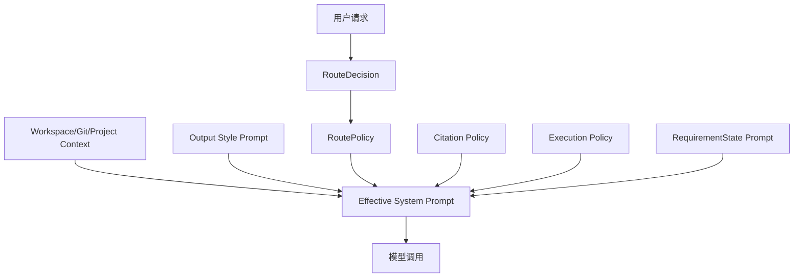

# 18-System Prompt 动态组装

## 这一层解决什么问题

很多 Agent demo 会把 system prompt 写成一段固定文本。但真实项目里，模型每次调用前需要知道的不只是“你是一个助手”，还包括当前任务类型、可用工具、引用规则、执行策略、任务完成条件和工作区上下文。

所以我们项目里的 system prompt 是动态组装的。它不是孤立的 prompt 工程，而是 Agent Harness 的一部分。

## 最小模式



## 加上这一层后 Loop 怎么变化

最小 Agent Loop 中，模型只收到用户消息：

```text
messages -> LLM
```

加入动态 system prompt 后，每一轮模型调用前都会获得运行时策略：

```text
style prompt
+ workspace/git/project context
+ route policy
+ citation policy
+ execution policy
+ task requirement prompt
+ messages
-> LLM
```

这样模型不是凭空决定工具，而是在 Runtime 给出的边界内决策。

## 我们项目里的真实源码

核心源码：

- `agent_runtime/src/tool_system/agent_loop.py`
- `agent_runtime/src/context_system/builder.py`
- `agent_runtime/src/context_system/workspace_snapshot.py`
- `agent_runtime/src/context_system/git_context.py`
- `agent_runtime/src/outputStyles/styles.py`
- `agent_runtime/src/routing_decision.py`
- `agent_runtime/src/tool_system/task_contract.py`

关键代码路径：

```text
run_agent_loop()
-> resolve_output_style(...).prompt
-> _build_effective_system_prompt(style_prompt, tool_context)
-> build_context_prompt(workspace_root, cwd)
-> _format_route_policy(route_policy)
-> citation_policy
-> execution_policy
-> requirement_state.prompt()
```

`_build_effective_system_prompt()` 会尝试收集 workspace context；如果收集失败，不会让任务崩溃，而是退回基础 style prompt。

## Prompt 由哪些部分组成

| 组成 | 来源 | 作用 |
|---|---|---|
| Style Prompt | `resolve_output_style()` | 控制回答风格和基础行为 |
| Workspace Context | `build_context_prompt()` | 当前目录、关键文件、项目结构 |
| Git Context | `collect_git_context()` | 分支、最近提交、工作区状态 |
| Project Instructions | `load_claude_md_context()` | 项目本地说明 |
| Route Policy | `_format_route_policy()` | 当前任务路由、优先工具、fallback 工具 |
| Citation Policy | `agent_loop.py` 中拼接 | 约束引用必须来自 Runtime citation |
| Execution Policy | `agent_loop.py` 中拼接 | 约束工具调用策略、TodoWrite、并行工具提交 |
| Requirement Prompt | `requirement_state.prompt()` | 告诉模型什么才算完成 |

## 关键细节

### Route Policy 不是装饰信息

`RouteDecision` 会变成 `RoutePolicy`，包含：

```text
route
reason
preferred_tools
fallback_tools
guidance
```

其中 guidance 会写入：

```text
execution_path
model_tier
budget_class
tool_profile
```

这让模型知道当前任务是车辆参数、手册问答、趋势分析还是产物生成。

### Citation Policy 是防幻觉约束

项目明确要求：

- factual claim 必须引用 Harness 提供的 citation ids
- 不允许编造 citation id、文档名、URL、SQL 行或页码
- 结构化问题优先引用 SQL citation
- 证据不足必须说明限制，而不是猜

这不是单纯格式要求，而是和 `register_evidence()`、`repair_citations_if_needed()` 形成闭环。

### Execution Policy 会影响工具调用行为

它要求模型：

- 使用最小充分工具集合
- 多步骤任务用 TodoWrite
- 有结果能回答就停止
- 同一依赖层的独立工具一起发出，让 Runtime 并行执行
- 不做 speculative work

这就是为什么我们的并行调度不是 Runtime 自己凭空猜，而是 Prompt 先要求模型把同层独立工具一起提交。

## 面试官可能怎么问

### 问：你们 system prompt 是怎么设计的？

30 秒回答：

> 我们不是一段固定 system prompt，而是运行时动态组装。基础 style prompt 之外，会加入 workspace/git context、route policy、citation policy、execution policy 和 task requirement prompt。这样模型每轮都知道当前任务类型、工具边界、引用规则和完成条件。

2 分钟展开：

> 比如用户问手册问题，route policy 会告诉模型当前是 manual_qa，优先用 KnowledgeSearch/KnowledgeFetch；如果用户要 PPT，route policy 会告诉模型是 artifact_generation，且必须先收集证据再生成产物。Citation policy 约束所有事实要引用 Runtime 分配的 citation id；execution policy 约束模型少调用、并行提交独立工具；requirement prompt 则告诉模型什么才算完成。

源码级追问：

> 在 `agent_loop.py` 里，`run_agent_loop()` 先调用 `resolve_output_style()`，再通过 `_build_effective_system_prompt()` 拼 workspace context，然后拼 `_format_route_policy(route_policy)`、`citation_policy`、`execution_policy` 和 `requirement_state.prompt()`。

### 问：为什么不把所有规则都写死在一个 Prompt 里？

30 秒回答：

> 因为任务不同，需要的工具、证据和完成条件不同。动态组装能让 Prompt 随 route、workspace、requirements 变化，减少无关信息和工具选择噪声。

继续追问：

> 固定 prompt 会让模型在简单车辆参数查询、手册问答、PPT 生成里看到同样的长规则，既浪费 token，也容易误选工具。我们把通用规则和路由策略分开，运行时按任务拼接。

### 问：Prompt 能保证模型不幻觉吗？

30 秒回答：

> Prompt 只能约束模型，不能单独保证。所以我们还有 evidence registration、citation repair 和 output contract。Prompt 是前置约束，Runtime 是后置校验。

## 容易踩坑

- 不要说“prompt 保证了正确性”。正确性来自 prompt + 工具证据 + citation repair + contract gate。
- 不要说模型知道所有工具。它只看到当前 active tool schemas。
- 不要把 route policy 说成硬编码流程。它只是给模型工具和证据策略。

## 本层小结

System Prompt 动态组装是 Agent Harness 的“策略注入层”。它把路由、证据、执行规则和完成条件交给模型，但最终执行和校验仍由 Runtime 负责。

