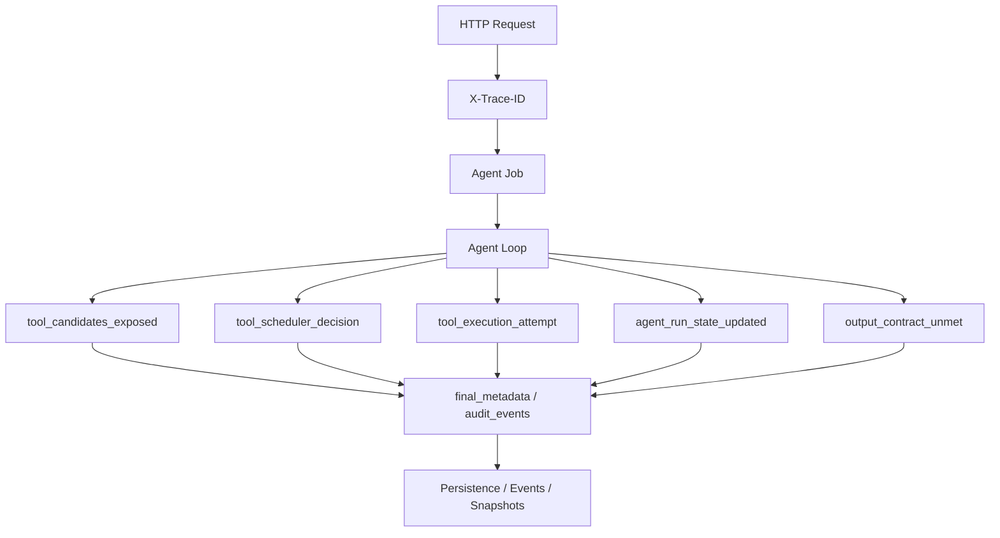

# 19-Audit Events 和可观测性

## 这一层解决什么问题

Agent 最大的问题之一是黑盒：模型为什么选这个工具？为什么失败？为什么重复调用？为什么最后 contract 没满足？

我们项目用 audit events、job events、final metadata、trace id 和持久化快照，把 Agent 执行过程拆开记录。它不是完整的插件式 Hook Bus，但足够支撑排查、评测和面试讲解。

可观测性不是“方便看日志”这么简单。对 Agent 系统来说，它决定你能不能把一次失败从黑盒还原成可分析链路。

比如用户说“为什么没生成 PPT”，你不能只回答“模型没做好”。你要能追到：

```text
路由是不是 artifact_generation
有没有暴露 AutoPptxGenerate
模型有没有调用工具
工具有没有执行成功
OutputContract 有没有满足
失败原因是无数据、依赖异常，还是产物校验失败
```

Audit Events 就是把这些节点结构化记录下来。

## 最小模式



## 加上这一层后 Loop 怎么变化

没有可观测性：

```text
Agent 失败 -> 只能看到最终一句话或错误
```

有 audit events：

```text
Agent 每个关键节点 -> 记录结构化事件
最终 metadata -> 可回放工具、状态、失败原因、候选集变化
```

这也是评测和优化的基础。

没有 audit，只能看最终答案好不好；有 audit，才能知道问题出在检索、路由、工具选择、并发调度、citation 还是 contract。

## 我们项目里的真实源码

核心源码：

- `backend/app/observability.py`
- `backend/app/services/agent_jobs.py`
- `backend/app/services/agent_job_persistence.py`
- `agent_runtime/src/tool_system/agent_loop.py`
- `agent_runtime/src/tool_system/scheduler.py`
- `agent_runtime/src/tool_system/execution.py`

HTTP trace：

```text
trace_id_context
X-Trace-ID
current_trace_id()
```

后端 job：

```text
AgentEvent
serialize_event()
final_metadata
usage
tool_call_count
```

Runtime audit：

```text
tool_context.audit_events
```

## 关键事件

| 事件 | 位置 | 说明 |
|---|---|---|
| `tool_candidates_exposed` | `agent_loop.py` | 本轮暴露给模型的工具集合 |
| `tool_scheduler_decision` | `scheduler.py` | 调度器决定 batch、parallel 还是 sequential |
| `parallel_tool_batch_started` | `scheduler.py` | 并行工具批次开始 |
| `parallel_tool_batch_completed` | `scheduler.py` | 并行工具批次结束 |
| `tool_scheduler_ledger_updated` | `scheduler.py` | 工具请求、执行、拒绝统计 |
| `tool_execution_attempt` | `execution.py` | 单次工具执行 attempt、duration、resource_pool |
| `tool_preflight_rejected` | `agent_loop.py` | 工具调用前被拒绝 |
| `tool_discovery_expanded` | `agent_loop.py` | 从 primary 扩展到 fallback |
| `agent_run_state_updated` | `agent_loop.py` | RunState 更新 |
| `output_contract_unmet` | `agent_loop.py` | 模型试图结束但契约未满足 |
| `context_compacted` | persistence 关注 | 上下文压缩快照 |

## final metadata 里能看什么

常见字段包括：

```text
route
model_tier
budget_class
model_override
citations
claims
evidence_status
requirements
task_contract_status
output_contract_status
tool_scheduler_ledger
run_budget
tool_audit
termination_reason
```

这让面试时能回答“你怎么知道 Agent 做了什么”。

## 面试官可能怎么问

### 问：Agent 失败了你怎么排查？

30 秒回答：

> 我会先用 trace_id 找到对应 job，再看 job events、final_metadata、tool audit 和 scheduler ledger。重点看 route 是否正确、暴露了哪些工具、哪些 preflight 被拒绝、工具 outcome_status/reason_code 是什么、是否 output_contract_unmet。

2 分钟展开：

> 比如 PPT 任务失败，我先看 route 是否 artifact_generation，再看是否暴露 AutoPptxGenerate，工具有没有执行，artifact path 是否进入 output contract。如果 RAG 失败，就看 KnowledgeSearch 的 outcome_status、rerank 结果、coverage boundary。如果是并发问题，就看 scheduler ledger 和 resource_pool 是否 saturated。

源码级追问：

> HTTP trace 在 `observability.py`；SSE/job events 在 `agent_jobs.py`；持久化在 `agent_job_persistence.py`；Runtime 里 `tool_context.audit_events` 会被写进 final metadata。工具执行 attempt 在 `execution.py` 里记录。

### 问：你们有类似 Claude Code hooks 的机制吗？

30 秒回答：

> 没有做完整插件式 Hook Bus，但有结构化 audit events。它们覆盖工具候选集、调度、preflight、执行、fallback、contract 和 context compact，能满足观测和审计。

继续追问：

> 如果后续要做 Hook Bus，可以在这些 audit event 边界上扩展，例如 before_tool_call、after_tool_result、on_contract_unmet、on_context_compact。

### 问：线上怎么统计失败原因？

30 秒回答：

> 按 job status、output_contract_status、ToolResult outcome_status、reason_code、tool_scheduler_ledger 和 termination_reason 聚合。

## 容易踩坑

- 不要说我们已经有完整分布式 tracing 系统；当前更准确的说法是 trace id + job events + audit metadata。
- 不要只说“看日志”，要说结构化事件和 final metadata。
- 不要把 audit events 当成业务状态源，它主要用于观测和排查。

## 本层小结

Audit Events 让 Agent 从黑盒变成可解释执行过程。面试时这是生产化能力的关键证据。
