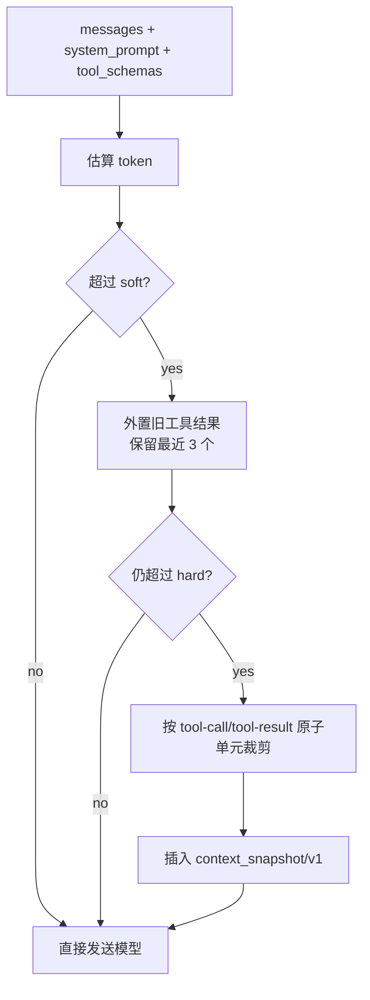

# 20-Context Compact 上下文压缩

## 这一层解决什么问题

Agent Loop 会不断追加工具调用和工具结果。RAG chunk、SQL rows、Web 内容、图表产物 metadata 都可能很长。如果不压缩，上下文很快超限，或者把大量 token 浪费在旧 observation 上。

Context Compact 解决的是：在不破坏工具调用配对关系的前提下，把旧工具结果外置、压缩或裁剪。

这里最重要的不是“省 token”，而是“在省 token 的同时不破坏 Agent transcript”。

工具调用消息和工具结果消息有配对关系。如果随便截断，会出现：

| 错误压缩方式 | 后果 |
|---|---|
| 删除 tool_use 但保留 tool_result | provider 可能拒绝请求 |
| 删除 citation 对应原文 | 最终答案无法追溯 |
| 删除最近 observation | 模型忘记刚刚发生什么 |
| 只按字符长度裁剪 | 破坏 JSON、工具块或多轮语义 |

所以 Context Compact 要按原子单元处理，而不是简单 `messages[-N:]`。

## 最小模式



## 加上这一层后 Loop 怎么变化

没有 Context Compact：

```text
工具结果越积越多 -> prompt 超长 -> 模型成本升高或请求失败
```

有 Context Compact：

```text
模型调用前估算 token
超过 soft 阈值先外置旧工具结果
超过 hard 阈值按原子单元裁剪
保留 citation ids、关键数值和任务摘要
```

这是一种分层压缩策略：

```text
soft 阈值：尽量外置旧工具结果，保留结构
hard 阈值：再按原子消息单元裁剪
最后插入 snapshot：告诉模型哪些内容被压缩
```

这样既控制成本，也尽量保留任务连续性。

## 我们项目里的真实源码

核心源码：

- `agent_runtime/src/context_system/budget.py`
- `agent_runtime/src/token_estimation.py`
- `agent_runtime/src/compact_service/messages.py`
- `backend/app/services/agent_job_persistence.py`

主函数：

```text
prepare_messages_with_budget(messages, system_prompt, tool_schemas)
```

返回：

```text
ContextBudgetResult:
  messages
  before_tokens
  after_tokens
  compacted
  hard_limit_reached
  dropped_units
```

## 关键参数

| 参数 | 默认值 | 说明 |
|---|---:|---|
| `CLAWD_CONTEXT_WINDOW_TOKENS` | `120000` | 上下文窗口预算 |
| `CLAWD_CONTEXT_RESERVED_OUTPUT_TOKENS` | `8000` | 给模型输出预留 |
| `CLAWD_CONTEXT_SOFT_RATIO` | `0.72` | soft 阈值比例 |
| `CLAWD_CONTEXT_HARD_RATIO` | `0.90` | hard 阈值比例 |
| `keep_recent` | `3` | 最近 3 个工具结果保留原文 |

实际 soft/hard 会扣掉 reserve：

```text
soft = window * 0.72 - reserve
hard = window * 0.90 - reserve
```

## 外置旧工具结果

`_externalize_old_tool_results()` 会找到旧的 tool result：

- `role == "tool"` 的消息
- Anthropic content block 里的 `type == "tool_result"`

旧结果会替换成 marker：

```text
[Externalized old tool result; sha256=...; citation_ids=1,2]
```

这样模型知道这里曾经有工具结果，也能保留 citation id 线索，但不用再携带全文。

## 原子裁剪为什么重要

工具调用消息和工具结果消息必须成对处理。如果只截断一半，provider 可能报错，模型也会看到没有结果的 tool call。

所以 `_atomic_units()` 会把：

```text
assistant tool_call
+ following tool_result messages
```

视为一个原子单元。裁剪时整个单元保留或丢弃。

## context_snapshot/v1 保存什么

当必须丢弃旧单元时，会插入自动快照：

```text
schema: context_snapshot/v1
task_goals
confirmed_facts
pending_questions
tool_state.dropped_atomic_units
evidence_ids
critical_values
constraints
```

这不是完整记忆，而是让模型继续任务时不完全失去方向。

## 面试官可能怎么问

### 问：Agent 上下文越来越长怎么办？

30 秒回答：

> 我们在模型调用前做 context budget。超过 soft 阈值会外置旧工具结果，只保留 sha 和 citation ids；如果仍超过 hard 阈值，会按 tool-call/tool-result 原子单元裁剪，并插入 context_snapshot/v1。

2 分钟展开：

> 关键是不能简单截断字符串。Agent 消息里有工具调用和工具结果配对关系，破坏后 provider 格式会错。所以我们先保留最近 3 个工具结果，把旧结果外置为 marker；还不够时再按原子单元裁剪。裁剪时保留任务目标、证据 id 和关键数值，完整证据仍在 final metadata 和持久化层。

源码级追问：

> 入口是 `context_system/budget.py` 的 `prepare_messages_with_budget()`。它会计算 `before_tokens`，先 `_externalize_old_tool_results()`，再 `_atomic_units()` 和 `_snapshot_text()`。

### 问：为什么只保留最近 3 个工具结果？

30 秒回答：

> 最近工具结果最可能影响下一步决策；更早结果保留全文成本高，所以外置成 marker，同时保留 citation ids 供最终引用修复和证据链使用。

### 问：压缩会不会导致模型忘记事实？

30 秒回答：

> 有风险，所以压缩不是简单删除。它会保留 citation ids、critical values 和 task goals。完整证据仍在 Runtime metadata 和持久化层，最终答案还会做 citation repair。

## 容易踩坑

- 不要把 context compact 说成长记忆，它是上下文预算控制。
- 不要说所有旧信息都保留，实际旧工具结果被外置或裁剪。
- 不要忽略 tool-call/tool-result 原子性，这是 Agent 消息压缩的关键。

## 本层小结

Context Compact 让长任务能继续跑，但它不是魔法。它通过外置、原子裁剪和快照，在成本、格式正确性和信息保留之间做工程折中。
