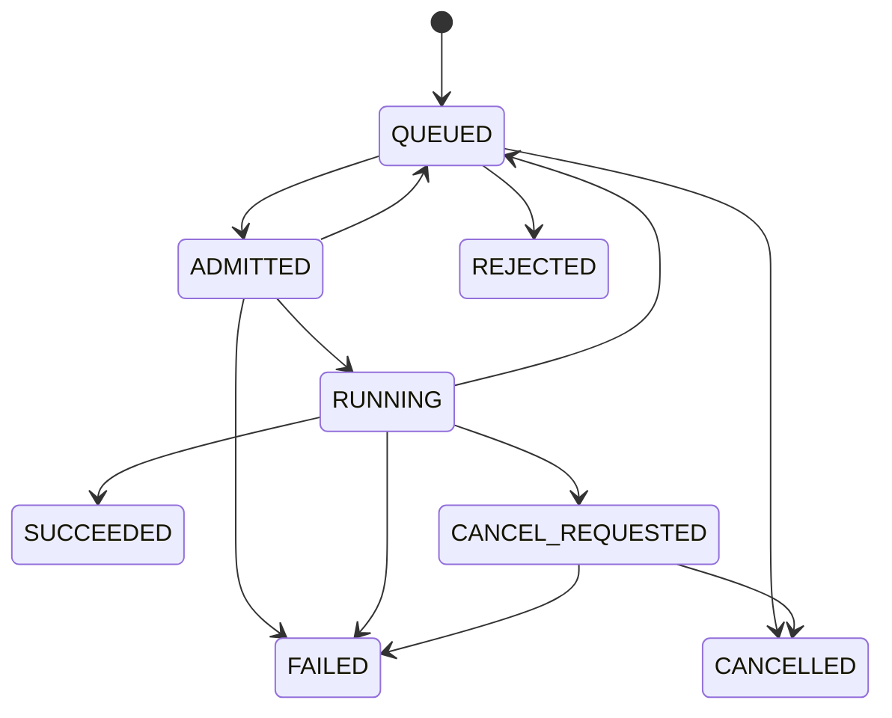

# 22-Backend Job 生命周期

## 这一层解决什么问题

Agent 任务可能排队、运行、取消、失败、重试和恢复。没有明确状态机，任务很容易出现重复执行、状态覆盖、失败后无法解释等问题。

Backend Job 生命周期解决的是：一次 Agent 请求在后端如何被可靠管理。

这层不是普通 CRUD 状态字段，而是生产 Agent 的可靠性边界。

Agent Job 和普通 HTTP 请求不一样：

| 普通请求 | Agent Job |
|---|---|
| 通常几百毫秒到几秒 | 可能几十秒甚至更久 |
| 一次服务调用 | 多轮模型、多工具、多事件 |
| 失败后直接返回错误 | 需要恢复、解释、审计 |
| 不一定需要排队 | 需要多用户公平调度 |

所以后端必须把一次用户请求变成可管理的 job，而不是让 HTTP 连接直接承载整个执行生命周期。

## 最小模式



## 加上这一层后 Loop 怎么变化

没有 Job 生命周期：

```text
请求进来 -> 执行 -> 成功/失败
```

有 Job 生命周期：

```text
QUEUED -> ADMITTED -> RUNNING -> terminal
```

中间每个状态都能被持久化、恢复和审计。

状态机的价值有三个：

1. 防止重复执行：同一个 session 或同一个 execution token 不应该并发写结果。
2. 防止状态倒退：旧 worker 不能覆盖新执行状态。
3. 支持恢复和审计：任务卡在 QUEUED、ADMITTED 还是 RUNNING，排查方向完全不同。

所以 `ADMITTED` 这种中间状态看起来复杂，但它能把“被调度选中”和“真正开始执行”分开，避免队列和 worker 之间的竞态。

## 我们项目里的真实源码

核心源码：

- `backend/app/services/agent_jobs_types.py`
- `backend/app/services/agent_jobs.py`
- `backend/app/services/agent_job_persistence.py`
- `backend/app/services/agent_job_dispatch.py`
- `backend/app/services/agent_job_locks.py`

状态定义：

```text
JobStatus.QUEUED
JobStatus.ADMITTED
JobStatus.RUNNING
JobStatus.CANCEL_REQUESTED
JobStatus.SUCCEEDED
JobStatus.FAILED
JobStatus.CANCELLED
JobStatus.REJECTED
```

合法状态转换在：

```text
ALLOWED_JOB_TRANSITIONS
ensure_job_transition()
```

## 创建 Job 时做了什么

`AgentJobService.create_job()` 会处理：

```text
max_pending_jobs
max_pending_per_user
prompt
session_id
tenant_id / user_id
role_ids_snapshot
data_scope_snapshot
allowed_tools_snapshot
auth_context_version
trace_id
estimated_cost
max_turns
idempotency_key
```

其中 `estimated_cost` 来自：

```text
estimate_agent_job_route(prompt)
```

它会影响 DRR 调度。

## 为什么需要 ADMITTED

`ADMITTED` 表示调度器已经选中这个 job，并且准备投递给 worker，但它还没有真正进入 Runtime 执行。

这一步会做：

- 获取 session lock
- 设置 execution token
- 增加 attempt_count
- 写 dispatch lease
- stage dispatch
- enqueue dispatch backend

如果投递失败，会按 attempt_count 决定重试或失败。

## RUNNING 阶段做什么

worker 执行 `_execute_job()`：

```text
async with self._model_sem:
  transition RUNNING
  start heartbeat
  run proxy executor
  collect final_text / usage / tool_calls / final_metadata
  transition SUCCEEDED or FAILED
```

注意：如果 Runtime 返回：

```text
final_metadata["output_contract_status"] == "unmet"
```

后端会把 job 标记为 `FAILED`，不是成功。

## 关键参数

| 参数 | 默认值 | 说明 |
|---|---:|---|
| `AGENT_MAX_PENDING_JOBS` | `5000` | 全局 pending 上限 |
| `AGENT_MAX_PENDING_PER_USER` | `20` | 单用户 pending 上限 |
| `AGENT_WORKER_CONCURRENCY` | `8` | worker 并发 |
| `AGENT_JOB_MAX_ATTEMPTS` | `3` | 最大尝试次数 |
| `AGENT_JOB_DEFAULT_MAX_TURNS` | `24` | 默认 Agent 最大回合 |
| `AGENT_DISPATCH_LEASE_TTL_MS` | `30000` | dispatch 租约 |
| `AGENT_SESSION_LOCK_TTL_MS` | `120000` | session lock TTL |

## 面试官可能怎么问

### 问：Agent 任务在后端有哪些状态？

30 秒回答：

> 核心状态是 QUEUED、ADMITTED、RUNNING 和终态 SUCCEEDED/FAILED/CANCELLED/REJECTED。中间还有 CANCEL_REQUESTED。状态转换有白名单，非法转换会被拒绝。

2 分钟展开：

> QUEUED 表示任务已入队；ADMITTED 表示调度器已拿到 session lock 并投递 dispatch；RUNNING 表示 worker 正在调用 Runtime。成功后进入 SUCCEEDED；如果输出契约未满足、执行异常或租约超限，就进入 FAILED 或重新 QUEUED 重试。这样任务可以可靠恢复，而不是一个 HTTP 请求断了就丢。

源码级追问：

> 状态机在 `agent_jobs_types.py` 的 `ALLOWED_JOB_TRANSITIONS`。执行逻辑在 `agent_jobs.py` 的 `_schedule_once()` 和 `_execute_job()`。持久化在 `agent_job_persistence.py`。

### 问：为什么 output contract unmet 要标记 FAILED？

30 秒回答：

> 因为用户要求的任务没有真正完成。比如要 PPT 但没生成文件，不能因为模型返回了一段文字就算成功。

### 问：怎么防止任务重复执行？

30 秒回答：

> 用 session lock、execution token、fencing token、dispatch lease 和状态机共同控制。同一个 session 不能并发跑多个 job，旧 token 不能覆盖新执行。

## 容易踩坑

- 不要把 ADMITTED 说成已经执行完成，它只是被调度投递。
- 不要忽略 output contract 对后端最终状态的影响。
- 不要说 memory backend 就能生产多实例可靠，生产应使用 Redis/MySQL。

## 本层小结

Backend Job 生命周期是 Agent 生产化的骨架。它让长任务可排队、可取消、可恢复、可审计。
