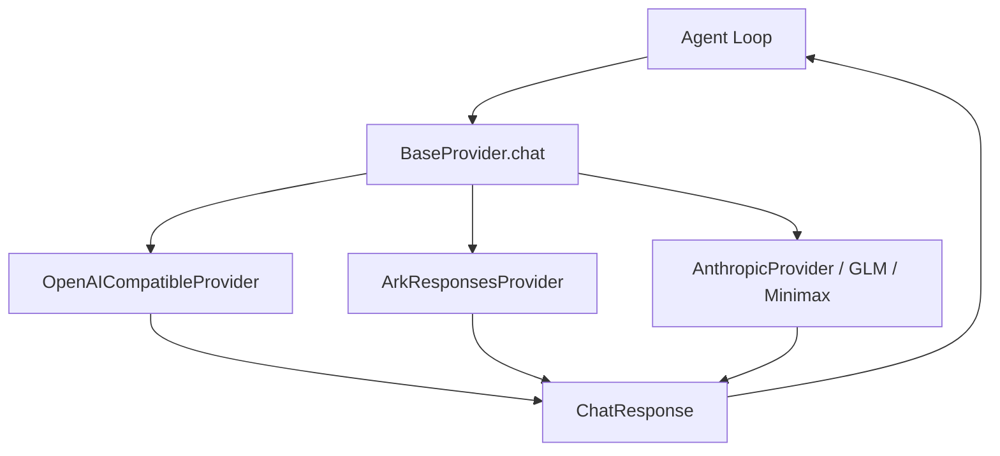

# 24-Provider 抽象和模型兼容

## 这一层解决什么问题

不同模型厂商的接口不一样：OpenAI-compatible 是 chat completions + tool_calls，Ark Responses 是 input items + function_call，Anthropic/Minimax 又有自己的格式。

Agent Loop 如果直接依赖某个厂商格式，后续换模型会很痛苦。所以项目做了 Provider 抽象，把不同模型统一成 `ChatResponse`。

Provider 抽象解决的是模型接口差异对 Agent Loop 的污染问题。

Agent Loop 真正关心的只有四件事：

```text
模型文本输出是什么
有没有 tool_use
token usage 是多少
finish_reason 是什么
```

但不同厂商在这些事情上的表达完全不同。如果让主循环直接处理厂商格式，后果是：

| 问题 | 后果 |
|---|---|
| tool call 格式散落在主循环 | 换模型容易改坏 Agent Loop |
| usage 字段不统一 | 成本统计和 RunBudget 不稳定 |
| streaming 事件格式不统一 | 前端事件和审计难统一 |
| 强制 tool_choice 能力不同 | 路由策略无法通用 |

Provider 层就是把这些差异收敛到边界上。

## 最小模式



## 加上这一层后 Loop 怎么变化

没有 Provider 抽象：

```text
Agent Loop 到处判断 OpenAI/Ark/Anthropic 的消息格式
```

有 Provider 抽象：

```text
Agent Loop 只调用 provider.chat(...)
Provider 负责格式转换
返回统一 ChatResponse
```

这样做的算法工程意义是：Agent Loop 的状态机保持稳定，模型厂商只是执行后端。

```text
Agent Loop 不关心 Ark/OpenAI/GLM 怎么表示 tool call
Agent Loop 只关心统一的 response.tool_uses
```

这让模型路由、成本控制、工具调度、citation 和 contract 不需要跟着模型厂商一起重写。

## 我们项目里的真实源码

核心源码：

- `agent_runtime/src/providers/base.py`
- `agent_runtime/src/providers/openai_compatible.py`
- `agent_runtime/src/providers/ark_responses_provider.py`
- `agent_runtime/src/providers/openai_provider.py`
- `agent_runtime/src/providers/glm_provider.py`
- `agent_runtime/src/providers/minimax_provider.py`
- `agent_runtime/src/providers/anthropic_provider.py`
- `agent_runtime/src/providers/__init__.py`
- `agent_runtime/src/config.py`

统一返回结构：

```python
@dataclass
class ChatResponse:
    content: str
    model: str
    usage: dict[str, Any]
    finish_reason: str
    reasoning_content: Optional[str] = None
    tool_uses: Optional[list[dict[str, Any]]] = None
```

Agent Loop 只关心：

```text
response.content
response.tool_uses
response.usage
response.finish_reason
```

## OpenAI-compatible 怎么适配工具

`OpenAICompatibleProvider` 会把 Anthropic 风格工具 schema 转成 OpenAI function tools：

```text
{
  "type": "function",
  "function": {
    "name": ...,
    "description": ...,
    "parameters": input_schema
  }
}
```

模型返回的：

```text
choice.message.tool_calls
```

会被解析成 Runtime 统一格式：

```text
tool_uses = [
  {
    "id": tc.id,
    "name": tc.function.name,
    "input": json.loads(tc.function.arguments)
  }
]
```

## Ark Responses 怎么适配工具

`ArkResponsesProvider` 使用 Responses API：

- system message 转 `instructions`
- user/assistant message 转 input items
- tool result 转 `function_call_output`
- assistant tool call 转 `function_call`

返回时遍历 `response.output`：

```text
item.type == "function_call"
```

解析成统一 `tool_uses`。

重要边界：

```text
tool_choice_modes = frozenset()
```

代码注释说明当前 Doubao Responses 部署拒绝 required 和 explicit function-choice，所以 Runtime 不能强依赖 tool_choice，而是用候选工具收窄和 prompt 策略控制。

## 模型配置

默认 Provider 信息在：

```text
agent_runtime/src/providers/__init__.py
```

包括：

- `anthropic`
- `openai`
- `ark`
- `ark_responses`
- `glm`
- `minimax`

配置读取：

```text
CLAWD_DEFAULT_PROVIDER
ARK_API_KEY
OPENAI_API_KEY
ANTHROPIC_API_KEY
GLM_API_KEY / ZHIPUAI_API_KEY
MINIMAX_API_KEY
```

## 面试官可能怎么问

### 问：你们怎么兼容不同大模型？

30 秒回答：

> Agent Loop 不直接绑定厂商接口，而是依赖 BaseProvider 和统一的 ChatResponse。不同 provider 负责把内部 messages/tools 转成各自 API 格式，再把返回结果统一成 content、usage、finish_reason 和 tool_uses。

2 分钟展开：

> 比如 OpenAI-compatible provider 会把工具 schema 转成 function tools，把 tool_calls 解析成 Runtime 的 tool_uses；Ark Responses provider 会把 system message 拆成 instructions，把工具结果转成 function_call_output，再把 response.output 里的 function_call 转成 tool_uses。这样主循环不用知道具体厂商格式。

源码级追问：

> 抽象在 `providers/base.py`，统一返回是 `ChatResponse`。OpenAI-compatible 适配在 `openai_compatible.py`，Ark Responses 适配在 `ark_responses_provider.py`。Provider 注册和默认模型在 `providers/__init__.py`。

### 问：换模型需要改 Agent Loop 吗？

30 秒回答：

> 正常不需要。只要新 provider 实现 BaseProvider 的 `chat()`、`chat_stream()`，并返回统一 ChatResponse，就能接入。

### 问：不同模型 tool_choice 支持不一样怎么办？

30 秒回答：

> Provider 用 `tool_choice_modes` 声明自己支持哪些模式。Runtime 调用 `format_tool_choice()`，如果返回 None，就退回候选集收窄和 prompt guidance。

## 容易踩坑

- 不要说所有 provider 都支持强制 tool_choice。Ark Responses 当前代码明确不支持。
- 不要把 OpenAI function schema 和 Runtime tool schema 混为一谈，Provider 层会转换。
- 不要说模型路由等于 provider 路由。model_tier 只是策略层，实际模型还要看配置。

## 本层小结

Provider 抽象让 Agent Loop 稳定，模型厂商差异被封装在适配层。面试时这是工程成熟度的体现。
