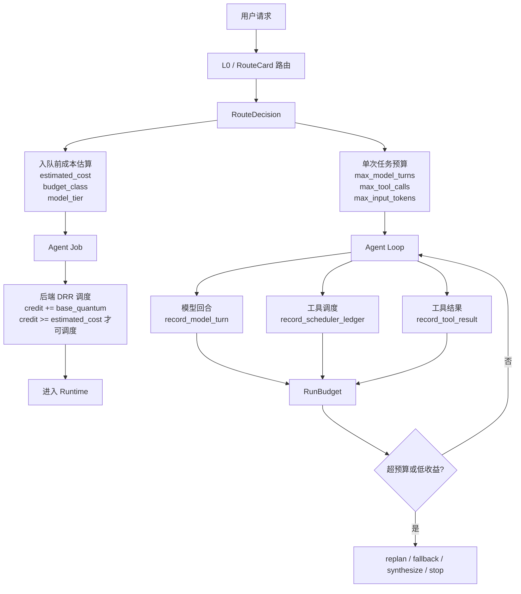

# 25-成本控制闭环

## 这一层解决什么问题

Agent 的成本不是只来自模型 token。它还来自：

- 任务排队和并发占用
- 模型回合数
- 工具调用次数
- RAG 检索和 rerank 延迟
- SQL/Web/Knowledge/Artifact 资源池占用
- 无数据、重复调用、失败重试造成的空转

所以“成本控制闭环”不能画成一条线。它在项目里分成三层：

1. **请求入队前：路由估价**  
   判断任务大概有多贵，用什么预算、什么模型 tier、最多多少轮。

2. **后端调度时：公平调度**  
   用 estimated_cost 影响 DRR 调度，避免高成本任务和小查询完全等价。

3. **单次运行中：RunBudget 监督**  
   记录 token、工具调用和低收益动作，发现空转就 replan/fallback/停止。

这三层连起来，才叫成本控制闭环。

## 正确的总图



## 这张图到底是什么意思

它不是说 `RouteDecision` 直接控制所有成本，而是说成本控制分阶段发生：

| 阶段 | 控制点 | 控制什么 |
|---|---|---|
| 入队前 | `RouteDecision.estimated_cost` | 这个 job 在队列里大概有多重 |
| 调度时 | DRR credit | 多用户/多队列之间怎么公平执行 |
| 进 Runtime 前 | `budget_class` limits | 这个任务最多多少模型轮、工具调用、输入 token |
| 执行中 | `RunBudget` | 实际用了多少 token、工具、低收益动作 |
| 失败/空转时 | replan/fallback/synthesize/stop | 避免继续烧钱 |

所以它不是一个“省钱模块”，而是一组贯穿生命周期的约束。

## 第一层：路由估价

源码：

- `agent_runtime/src/routing_decision.py`
- `backend/app/services/agent_routing.py`

`RouteDecision` 会输出：

```text
route
model_tier
budget_class
estimated_cost
max_model_turns
max_tool_calls
max_input_tokens
preferred_tools
fallback_tools
```

例如：

| route | estimated_cost | budget_class | model_tier | 为什么 |
|---|---:|---|---|---|
| deterministic vehicle_spec | 1 | lookup | cheap | 单实体参数查询，确定性工具 |
| manual_qa | 2 | normal | standard | RAG 问答，通常少量知识检索 |
| trend_analysis | 4 | analysis | standard | 需要多证据、多工具分析 |
| artifact_generation | 8 | artifact | strong | PPT/图表要规划、取数、生成产物 |

注意这里的 `estimated_cost` 不是人民币，也不是 token 数。它是一个调度权重，用来告诉队列：这个任务比普通 lookup 更重。

## 第二层：budget_class 限制单次任务上限

源码：

```text
_limits_for_budget()
```

真实默认值：

| budget_class | max_model_turns | max_tool_calls | max_input_tokens |
|---|---:|---:|---:|
| `lookup` | 4 | 6 | 32,000 |
| `normal` | 6 | 10 | 48,000 |
| `analysis` | 10 | 18 | 96,000 |
| `artifact` | 16 | 32 | 160,000 |

这解决的是：不同任务不应该用同样上限。

举例：

- 查“某车型轴距”不应该允许 32 次工具调用。
- 生成 6 页 PPT 如果只给 2 个工具调用，很可能不够。
- 趋势分析需要比普通 RAG 问答更高 token 和工具预算。

## 第三层：模型 Tier

`model_tier` 是策略层：

```text
cheap
standard
strong
```

它的作用是告诉 Runtime：

```text
这个任务应该用哪个级别的模型
```

但真实模型是否切换，取决于环境变量：

```text
CLAWD_MODEL_TIER_CHEAP_MODEL
CLAWD_MODEL_TIER_STANDARD_MODEL
CLAWD_MODEL_TIER_STRONG_MODEL
```

源码：

```text
_model_override_for_tier(model_tier)
```

如果没有配置这些变量，就使用当前 provider 默认模型。

这一点必须讲清楚：**我们不是多模型投票系统，也不是自动 benchmark 选模型；当前是 route-based tier + env override。**

## 第四层：后端 DRR 公平调度

源码：

- `backend/app/services/agent_jobs.py`
- `_select_next_candidate()`

关键参数：

| 参数 | 默认值 |
|---|---:|
| `AGENT_DRR_BASE_QUANTUM` | 4 |
| `AGENT_DRR_MAX_CREDIT` | 32 |
| `estimated_cost` | 来自 RouteDecision |

调度逻辑简化后是：

```python
credit[queue_key] = min(max_credit, credit[queue_key] + base_quantum)

if credit[queue_key] < job.estimated_cost:
    跳过这个队列，下一轮再累计 credit
else:
    选中这个 job
    credit[queue_key] -= estimated_cost
```

为什么要这样？

如果没有 estimated_cost，PPT 任务和参数查询在调度层看起来一样。一个用户连续提交大报告任务，可能挤压其他人的简单查询。

DRR 的意义是：

- 小任务 cost 低，更容易快速调度
- 大任务 cost 高，需要更多 credit
- 不同 queue_key 轮转，避免某个用户/队列长期霸占

它控制的是**系统并发公平性**，不是单次任务内部 token。

## 第五层：RunBudget 运行中监督

源码：

- `agent_runtime/src/tool_system/run_budget.py`
- `agent_runtime/src/tool_system/agent_loop.py`

`RunBudget` 记录实际执行过程：

```text
input_tokens
output_tokens
model_turns
tool_requested
tool_dispatched
tool_rejected
low_yield_actions
tokens_after_last_progress
```

默认限制：

| 字段 | 默认值 |
|---|---:|
| `max_input_tokens` | 240,000 |
| `max_output_tokens` | 24,000 |
| `max_tokens_after_progress` | 80,000 |
| `max_low_yield_actions` | 3 |

### 低收益是什么

这些工具状态会被认为有低收益风险：

```text
NO_DATA
INVALID_INPUT
CAPABILITY_MISMATCH
DATA_COVERAGE_INSUFFICIENT
PERMISSION_DENIED
APPROVAL_REQUIRED
DEPENDENCY_UNHEALTHY
TRANSIENT_FAILURE
PERMANENT_FAILURE
TIMEOUT
```

不是说出现一次就失败，而是连续出现说明 Agent 可能在空转。

### made_progress 为什么重要

`record_tool_result(result, made_progress=...)` 会区分：

- 工具虽然成功，但没有推进 requirement，也可能不是有效进展
- 工具带来新 evidence 或满足 requirement，才重置低收益计数

如果 made_progress：

```text
low_yield_actions = 0
tokens_at_last_progress = total_tokens
```

如果 low-yield 且没有进展：

```text
low_yield_actions += 1
```

## RunBudget 触发后做什么

`should_degrade()` 会返回：

```text
input_token_budget_exceeded
output_token_budget_exceeded
tokens_after_last_progress_exceeded
low_yield_tool_actions_exceeded
```

Agent Loop 不是简单崩溃，而是把这个信号变成：

- audit event：`run_budget_degrade_recommended`
- 触发 `progress_stop_reason`
- 如果没有硬 output contract，可以 `synthesize_from_evidence`
- 如果有 output contract，不能随便文本结束，必须继续满足 contract 或 blocked

所以成本控制和上一章 contract 是连在一起的：

```text
普通问答低收益 -> 可以基于已有证据边界化回答
PPT contract 未满足 -> 不能随便回答文字，必须生成产物或 blocked
```

## 举例 1：车辆参数查询

用户：

```text
理想 L9 轴距是多少？
```

路由：

```text
vehicle_spec / lookup / cost=1
```

预期：

- 尽量走 deterministic 或 SubjectsAttributeLookup
- 不需要 WebSearch
- 不需要 RAG 大量召回
- 不需要 strong model

成本控制作用：

```text
用低预算快速返回结构化 citation
```

## 举例 2：趋势分析

用户：

```text
分析 800V 高压平台在新能源车里的趋势
```

路由：

```text
trend_analysis / analysis / cost=4
```

预期：

- 可能要 KnowledgeSearch
- 可能要结构化数据统计
- 可能要 WebFetch
- 需要多证据合成

成本控制作用：

```text
给更高 turns/tools/token
但仍限制 10/18/96000
```

## 举例 3：PPT 生成

用户：

```text
生成 6 页悬架系统调研 PPT
```

路由：

```text
artifact_generation / artifact / cost=8 / strong
```

成本控制不是为了让它便宜到不能完成，而是：

- 承认它比普通问答贵
- 给足 artifact 预算
- 在后端调度里让它按高 cost 消耗 credit
- 运行中如果资料覆盖不足，避免无限查
- contract 未满足时不能假成功

## 面试官可能怎么问

### 问：你们怎么控制 Agent 成本？

30 秒回答：

> 我们分三层控制。第一层是路由估价，RouteDecision 给出 estimated_cost、budget_class 和 model_tier；第二层是后端 DRR 调度，用 estimated_cost 影响多用户公平性；第三层是 Runtime 的 RunBudget，记录 token、工具调用和低收益动作，发现空转就 replan、fallback、基于已有证据回答或停止。

2 分钟展开：

> 比如车辆参数查询 cost=1，走 lookup 预算；趋势分析 cost=4，走 analysis 预算；PPT 生成 cost=8，走 artifact 预算和 strong tier。后端调度时，高 cost job 要积累更多 credit 才能被调度，避免大任务挤压小任务。进入 Runtime 后，RunBudget 会记录模型 token、工具 requested/dispatched/rejected、low_yield_actions。如果连续 no_data、timeout、coverage insufficient，就触发恢复策略，避免继续空转。

源码级追问：

> 路由在 `routing_decision.py`，预算表在 `_limits_for_budget()`；后端 DRR 在 `agent_jobs.py` 的 `_select_next_candidate()`，用 `base_quantum`、`max_credit` 和 `estimated_cost`；运行预算在 `run_budget.py`，`should_degrade()` 会返回具体原因。

### 问：你那个成本控制图是什么意思？

30 秒回答：

> 图里不是一条线，而是三条闭环：请求入队前估价，后端调度时做公平控制，Runtime 执行中监控实际 token 和低收益动作。它们分别控制“任务多重”“什么时候跑”“跑的时候是否空转”。

### 问：estimated_cost 是 token 吗？

30 秒回答：

> 不是。它是调度权重，表示任务相对成本。真正 token 使用由 provider usage 和 RunBudget 记录。

### 问：budget_class 的 max_input_tokens 和 RunBudget 的 max_input_tokens 是一回事吗？

30 秒回答：

> 不是完全一回事。`budget_class` 是路由策略给当前任务的计划上限；RunBudget 是运行期账本和保护阈值，记录实际 token 和低收益。两者属于不同层级。

### 问：低收益工具调用会直接失败吗？

30 秒回答：

> 不会一次失败。RunBudget 累积 low_yield_actions，到阈值后给 Agent Loop 一个 degrade signal。然后根据是否有 output contract，决定合成已有证据、fallback、replan 或 blocked。

## 容易踩坑

- 不要说 `estimated_cost` 是实际花费，它是调度权重。
- 不要把 DRR 说成 token 控制，它控制队列公平。
- 不要把 RunBudget 说成路由器，它是运行期账本和熔断信号。
- 不要说成本控制就是降级。对 artifact 任务，成本控制也可能是“给足预算但防止空转”。
- 不要说 cheap/standard/strong 已经自动多模型投票。它只是 tier，实际模型由 env override 决定。

## 本层小结

成本控制闭环不是一个模块，而是三层协作：RouteDecision 估价，Backend DRR 公平调度，RunBudget 监控执行空转。真正讲清楚这三层，面试官才会觉得这是工程设计，不是硬凑概念。

