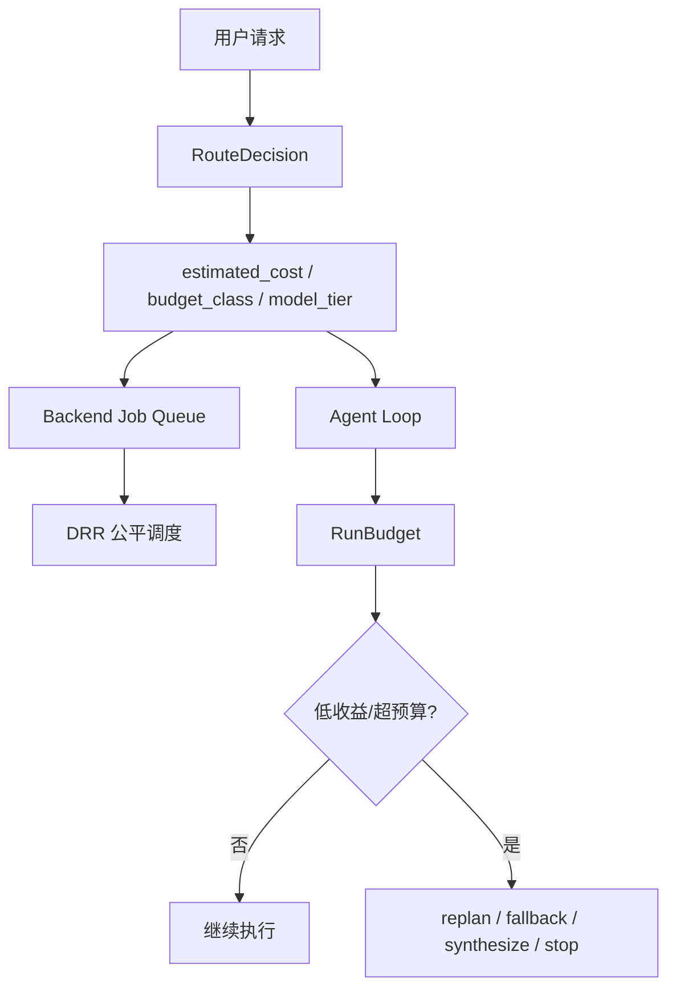

# 25-成本控制闭环

## 这一层解决什么问题

Agent 很容易成本失控：模型多轮思考、工具重复调用、RAG 大量召回、PPT 任务多步生成。如果所有任务都用同一个模型、同样工具、同样预算，既贵又不稳定。

成本控制闭环把路由、预算、模型 tier、调度成本和运行期低收益停止串起来。

## 最小模式



## 加上这一层后 Loop 怎么变化

没有成本控制：

```text
所有任务同样模型
所有任务同样工具上限
模型可能重复调用工具直到超时
```

有成本控制：

```text
路由前置估算任务成本
不同 budget_class 限制 turns/tools/tokens
后端 DRR 用 estimated_cost 做公平调度
运行中 RunBudget 记录 token 和低收益动作
达到阈值触发恢复或停止
```

## 我们项目里的真实源码

路由成本：

- `agent_runtime/src/routing_decision.py`
- `backend/app/services/agent_routing.py`

运行预算：

- `agent_runtime/src/tool_system/run_budget.py`
- `agent_runtime/src/tool_system/agent_loop.py`

后端调度：

- `backend/app/services/agent_jobs.py`

## RouteDecision 输出什么

`RouteDecision` 包含：

```text
route
confidence
execution_path
model_tier
tool_profile
budget_class
estimated_cost
max_model_turns
max_tool_calls
max_input_tokens
preferred_tools
fallback_tools
reason_codes
```

后端创建 job 时会调用：

```text
estimate_agent_job_route(prompt)
```

并把：

```text
estimated_cost
budget_class
model_tier
```

用于 job metadata 和调度。

## 预算等级

`_limits_for_budget()` 的真实默认值：

| budget_class | max_model_turns | max_tool_calls | max_input_tokens |
|---|---:|---:|---:|
| `lookup` | 4 | 6 | 32,000 |
| `normal` | 6 | 10 | 48,000 |
| `analysis` | 10 | 18 | 96,000 |
| `artifact` | 16 | 32 | 160,000 |

典型 route：

| route | budget_class | model_tier | estimated_cost |
|---|---|---|---:|
| deterministic vehicle_spec | lookup | cheap | 1 |
| vehicle_spec agent route | lookup | standard | 1 |
| manual_qa | normal | standard | 2 |
| trend_analysis | analysis | standard | 4 |
| artifact_generation | artifact | strong | 8 |
| general | normal | cheap | 2 |

## 模型 Tier 怎么落地

`model_tier` 本身只是策略标签：

```text
cheap
standard
strong
```

实际是否切模型取决于环境变量：

```text
CLAWD_MODEL_TIER_CHEAP_MODEL
CLAWD_MODEL_TIER_STANDARD_MODEL
CLAWD_MODEL_TIER_STRONG_MODEL
```

如果没有设置，Runtime 使用 provider 默认模型。

这点面试要讲清楚：当前不是多模型投票系统，而是 route-based tier + env override。

## RunBudget 记录什么

`RunBudget` 记录：

```text
input_tokens
output_tokens
model_turns
tool_requested
tool_dispatched
tool_rejected
low_yield_actions
tokens_after_last_progress
```

默认限制：

| 字段 | 默认值 |
|---|---:|
| `max_input_tokens` | 240,000 |
| `max_output_tokens` | 24,000 |
| `max_tokens_after_progress` | 80,000 |
| `max_low_yield_actions` | 3 |

低收益状态包括：

```text
NO_DATA
INVALID_INPUT
CAPABILITY_MISMATCH
DATA_COVERAGE_INSUFFICIENT
PERMISSION_DENIED
APPROVAL_REQUIRED
DEPENDENCY_UNHEALTHY
TRANSIENT_FAILURE
PERMANENT_FAILURE
TIMEOUT
```

## 后端 DRR 如何用成本

`AgentJobService` 中：

```text
base_quantum = 4
max_credit = 32
estimated_cost
```

调度器会给不同 queue_key 增加 credit，只有 credit 足够支付 job 的 estimated_cost 才调度。这样 artifact_generation 这种高成本任务不会和 lookup 小任务完全等价。

## 面试官可能怎么问

### 问：你们怎么控制 Agent 成本？

30 秒回答：

> 我们做了前置路由和运行期预算两层控制。前置 RouteDecision 给出 budget_class、model_tier、estimated_cost 和最大 turns/tools/tokens；运行中 RunBudget 记录 token、工具调用和低收益动作，达到阈值会触发 replan、fallback、合成已有证据或停止。

2 分钟展开：

> 比如车辆参数查询走 lookup budget，最多 4 个模型回合、6 个工具调用；趋势分析走 analysis，预算更高；PPT 生成走 artifact，model_tier 是 strong，预算也最高。后端调度还会用 estimated_cost 做 DRR 公平调度，防止高成本任务占满队列。执行中如果工具一直 no_data 或 timeout，会计入 low-yield，避免空转。

源码级追问：

> 路由在 `routing_decision.py`，预算限制在 `_limits_for_budget()`；运行期预算在 `run_budget.py`；后端 DRR 在 `agent_jobs.py` 的 `_select_next_candidate()`，用 `base_quantum`、`max_credit` 和 `estimated_cost` 控制调度。

### 问：cheap/standard/strong 是真实模型吗？

30 秒回答：

> 它们是模型 tier 策略标签。真实模型通过 `CLAWD_MODEL_TIER_*_MODEL` 环境变量绑定；如果没设置，就使用当前 provider 默认模型。

### 问：低收益工具调用怎么处理？

30 秒回答：

> RunBudget 会把 no_data、invalid_input、coverage insufficient、permission denied、timeout 等计为 low-yield。连续达到阈值后，Runtime 会建议 degrade，并触发 replan、fallback 或停止。

## 容易踩坑

- 不要说这是多模型投票。不是。
- 不要说成本控制只靠最大轮数。还有 route cost、DRR、RunBudget、低收益停止。
- 不要把 RunBudget 的 240k token 默认和 route 的 max_input_tokens 混淆：前者是运行预算类，后者是路由策略限制。

## 本层小结

成本控制不是一个 if 判断，而是贯穿任务生命周期的闭环：路由估价、预算分级、模型 tier、调度成本、运行期 token/工具账本和低收益停止。

