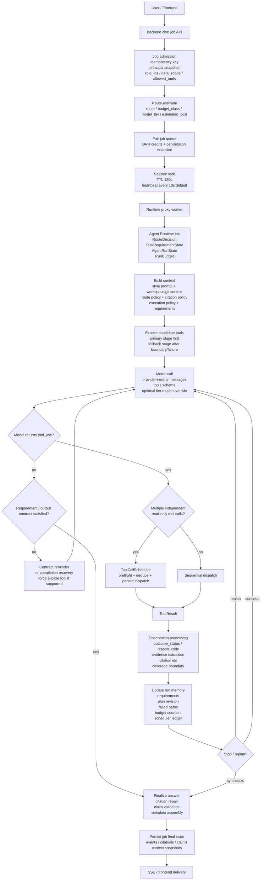

# 1. Real Agent Loop

## Key Runtime Facts

| Area | Actual implementation |
|---|---|
| Main loop | `run_agent_loop()` performs route decision, context build, model call, tool handling, observation update, contract check, finalization. |
| Route-driven tool exposure | Non-general routes start with preferred tools; fallback tools are exposed after output contract unmet, capability mismatch, data coverage insufficient, dependency unhealthy, or permission boundary. |
| Completion gate | Final text is accepted only when `TaskRequirementState` and output contract are satisfied; artifact tasks require actual generated files. |
| Tool result protocol | Every tool result carries `outcome_status`, `reason_code`, `retryable`, diagnostics, and evidence/citation metadata when available. |
| Safety controls | Tool execution fuse defaults to `24`; duplicate tool calls/results are fingerprinted; repeated failures disable low-yield tools for the current run. |
| Planning | Multi-step tasks use model-authored `TodoWrite`; runtime stores plan revision and progress but does not hard-code a domain workflow. |
| Citation behavior | Evidence is registered into numbered citations; final answers are repaired if citation ids are invalid or structured SQL values are underused. |

## Interview-Safe Summary

The project implements a production-style agent loop: route first, expose the smallest useful tool surface, call the model, execute eligible independent read-only tools in parallel, feed compact observations back, update task state and budgets, then only finalize after the output contract and evidence requirements are satisfied.

