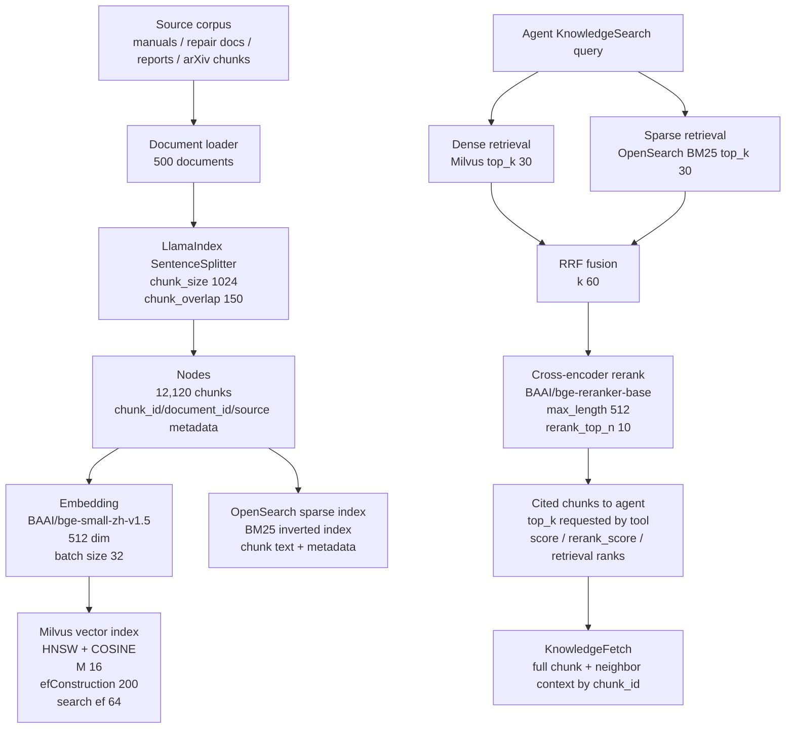

# 2. Agentic RAG Pipeline

## Key Parameters

| Layer | Current choice |
|---|---|
| RAG provider | `llamaindex-agentic-rag` |
| Chunking | LlamaIndex `SentenceSplitter`, `RAG_CHUNK_SIZE=1024`, `RAG_CHUNK_OVERLAP=150` |
| Corpus size | `500` documents, `12,120` chunks in the current local index |
| Embedding provider | HuggingFace local embedding by default |
| Embedding model | `BAAI/bge-small-zh-v1.5`, `RAG_EMBEDDING_DIM=512`, `RAG_EMBED_BATCH_SIZE=32` |
| Dense vector DB | Milvus, collection `subjects_agent_chunks` |
| Dense index | HNSW, COSINE, `M=16`, `efConstruction=200`, search `ef=64` |
| Sparse index | OpenSearch BM25 inverted index, index `subjects-agent-chunks` |
| Hybrid retrieval | Dense top 30 + sparse top 30, Reciprocal Rank Fusion `RRF_K=60` |
| Rerank | `BAAI/bge-reranker-base` cross-encoder, `RAG_RERANK_TOP_N=10`, `RAG_RERANK_MAX_LENGTH=512`, fp16 enabled by default |
| Tool boundary | Agent calls `KnowledgeSearch` and `KnowledgeFetch`; RAG is exposed as tools, not hidden prompt stuffing. |

## Evaluation Snapshot

The latest local pilot retrieval eval used 10 curated queries over the 500-document corpus:

| Metric | Result |
|---|---:|
| HitRate@1 | 0.90 |
| HitRate@10 | 1.00 |
| MRR@10 | 0.9167 |
| p50 latency | about 2.94s |
| p95 latency | about 3.21s |

This is a pilot smoke eval, not a full benchmark. A stronger evaluation set should include query expansion, hard negatives, answer faithfulness checks, citation correctness, and scenario-level agent task success.

