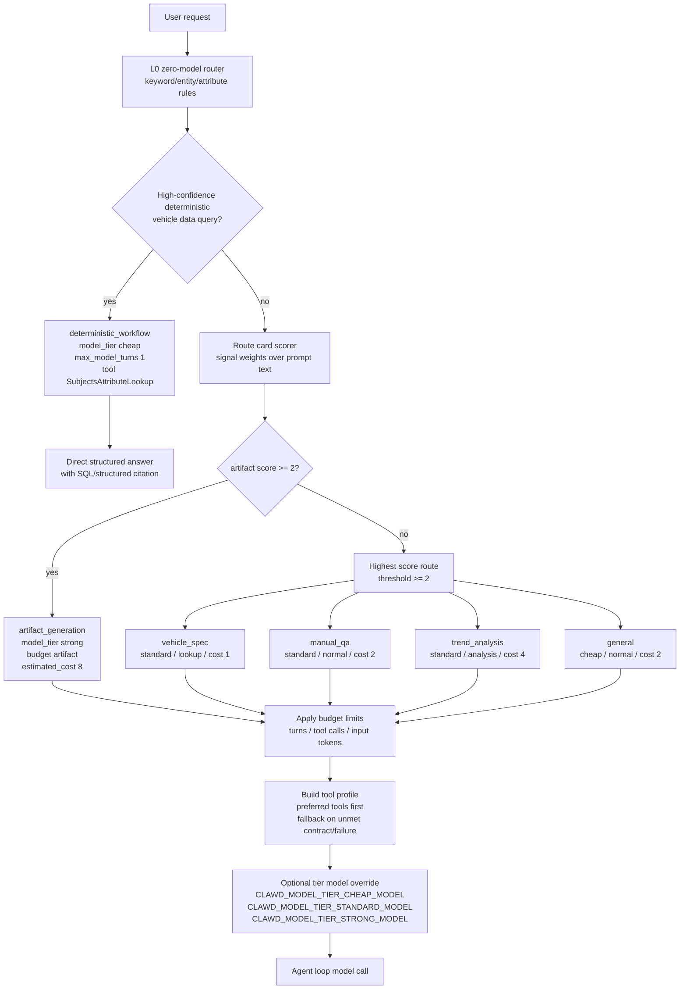

# 3. Model Routing Strategy

## Route Cards And Limits

| Route | Main signals | Model tier | Budget | Cost | Limits | Preferred tools |
|---|---|---:|---:|---:|---|---|
| `vehicle_spec` deterministic | known vehicle attributes + entity/cohort/stat shape | `cheap` | `lookup` | `1` | turns `1`, calls `max(1, attribute_count)`, input tokens `0` | `SubjectsAttributeLookup` |
| `vehicle_spec` agent route | `车长`, `轴距`, `指导价`, `续航`, `配置`, `参数`, `对比`, `竞品` | `standard` | `lookup` | `1` | turns `4`, calls `6`, input tokens `32,000` | `SubjectsAttributeLookup`, `SubjectsAttributeStats`, `SubjectsDataCatalogSearch`, `SubjectsSqlQuery` |
| `manual_qa` | `用户手册`, `说明书`, `使用限制`, `遥控泊车`, `ADAS`, `NOA`, `ACC` | `standard` | `normal` | `2` | turns `6`, calls `10`, input tokens `48,000` | `KnowledgeSearch`, `KnowledgeFetch` |
| `trend_analysis` | `趋势`, `市场`, `调研`, `分析`, `洞察`, `渗透率`, `竞争`, `策略` | `standard` | `analysis` | `4` | turns `10`, calls `18`, input tokens `96,000` | Knowledge + Subjects SQL/stat tools |
| `artifact_generation` | `ppt`, `pptx`, `幻灯片`, `图表`, `导出`, `报告`, `可视化` | `strong` | `artifact` | `8` | turns `16`, calls `32`, input tokens `160,000` | `AutoChartGenerate`, `AutoPptxGenerate`, SQL/catalog tools, Knowledge tools |
| `general` | no route signal | `cheap` | `normal` | `2` | turns `6`, calls `8`, input tokens `32,000` | Full/fallback tool surface based on runtime eligibility |
| `no_tool_explanation` | explanation-only L0 path | `cheap` | `lookup` | `1` | turns `2`, calls `0`, input tokens `16,000` | no tool required |

## Concrete Policy Details

| Detail | Value |
|---|---|
| Policy version | `2026-07-18-v1` by default, override via `CLAWD_ROUTE_POLICY_VERSION` |
| Scoring threshold | Best route score must be at least `2.0`; artifact route wins early when artifact score is at least `2.0` |
| Confidence | `min(0.95, confidence_base + score / 20)`, route card base defaults to `0.64` |
| Tier override | Runtime only changes the actual model if the env var for the tier is set; otherwise it uses the provider default model. |
| Provider default examples | `ark_responses` defaults to `doubao-seed-evolving`; `ark` defaults to `deepseek-v4-flash-260425`; other providers are configured through `agent_runtime/src/providers/__init__.py`. |

## Important Boundary

The routing strategy chooses route, budget, candidate tools, and optional model override. It is not a separate multi-model voting system. The actual provider call still goes through the configured provider unless a `CLAWD_MODEL_TIER_*_MODEL` override is present.

