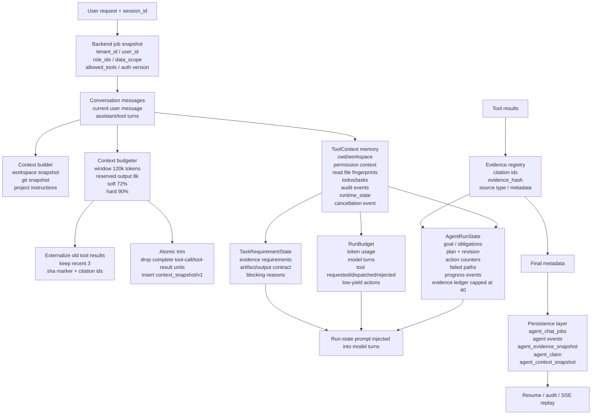

# 5. Actual Memory Design

## What Counts As Memory In This Project

| Memory layer | Purpose | Implementation |
|---|---|---|
| Conversation memory | Keeps current turn history and tool observations for the model. | `Conversation`, OpenAI-format messages, compacted before model calls. |
| Runtime context memory | Stores operational state needed by tools. | `ToolContext`: permissions, cwd, file read fingerprints, todos, tasks, audit events, runtime state, cancellation. |
| Plan memory | Persists the model-authored execution plan across turns. | `AgentRunState.plan`, `plan_revision`, `TodoWrite` updates. |
| Progress memory | Prevents loops and repeated bad actions. | action count, consecutive failures, no-progress count, failed path fingerprints, duplicate result fingerprints. |
| Evidence memory | Keeps a compact durable ledger for grounding and citation repair. | `AgentRunState.evidence_ledger`, capped at `40`; final metadata keeps full citations. |
| Budget memory | Tracks cost and low-yield behavior. | `RunBudget`: input/output tokens, model turns, scheduler ledger, low-yield actions. |
| Contract memory | Tracks whether the task is actually complete. | `TaskRequirementState` + output contract for artifact/structured outputs. |
| Persistence memory | Supports audit, resume, status polling, and SSE replay. | job/event persistence plus evidence, claim, and context snapshot tables. |

## Context Compaction Defaults

| Parameter | Default |
|---|---:|
| `CLAWD_CONTEXT_WINDOW_TOKENS` | `120000` |
| `CLAWD_CONTEXT_RESERVED_OUTPUT_TOKENS` | `8000` |
| `CLAWD_CONTEXT_SOFT_RATIO` | `0.72` |
| `CLAWD_CONTEXT_HARD_RATIO` | `0.90` |
| Recent tool results kept verbatim | `3` |
| Evidence ledger retained in run state | last `40` evidence items |

## Boundary To State Clearly

This project does not implement a user-profile long-term memory or a separate vectorized personal memory store. The actual memory design is operational: conversation state, compacted context, model-authored plan state, tool/evidence ledger, task contract state, and persisted job/audit snapshots.

